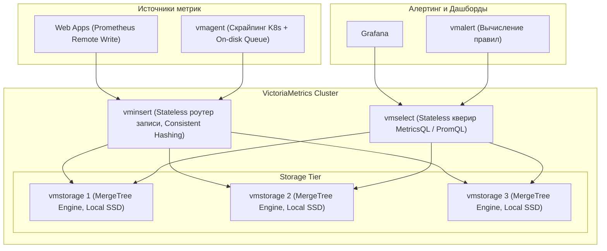
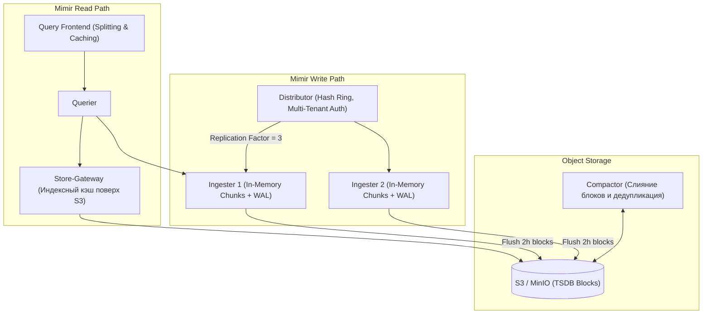

# 🚀 25. High-Scale TSDB: VictoriaMetrics и Grafana Mimir

Когда объем активных временных рядов в инфраструктуре превышает 10-50 миллионов серий, стандартный Prometheus упирается в лимиты масштабирования одного сервера. На этом этапе применяются распределенные TSDB корпоративного уровня: **VictoriaMetrics Cluster** и **Grafana Mimir**.

---

## 🏛️ VictoriaMetrics Cluster: Архитектура и движок хранения

VictoriaMetrics спроектирована с акцентом на экстремальную производительность, минимальное потребление RAM/диска и простоту эксплуатации.



### Ключевые компоненты VictoriaMetrics
1. **`vmstorage`:** Хранит необработанные данные и индексы в собственном формате **MergeTree** (подобно ClickHouse). Сжимает сэмплы до **1.5 — 2.5 байт на точку** (в 3-5 раз эффективнее Prometheus).
2. **`vminsert`:** Принимает данные по протоколам Prometheus Remote Write, InfluxDB, Graphite, OpenTelemetry и хеширует ряды на узлы `vmstorage`.
3. **`vmselect`:** Выполняет запросы PromQL / MetricsQL, параллельно собирая частичные выборки с `vmstorage`.
4. **`vmagent`:** Сверхлегкий агент сбора метрик, способный буферизировать гигабайты данных на локальном диске при сетевой недоступности бэкенда.

---

## 🏛️ Grafana Mimir: Архитектура масштабирования до миллиарда серий

Grafana Mimir (развитие проекта Cortex) — это модульная микросервисная TSDB, использующая дешевые объектные хранилища (S3, GCS, Azure Blob) в качестве основного долговременного бэкенда.



---

## ⚖️ Битва титанов: Сравнение VictoriaMetrics и Grafana Mimir

| Параметр | VictoriaMetrics Cluster | Grafana Mimir |
| :--- | :--- | :--- |
| **Сложность архитектуры** | 🟢 Низкая (3 бинарника: insert, select, storage) | 🔴 Высокая (10+ микросервисов, Consul/Memberlist) |
| **Хранилище данных** | 🟡 Блочные диски (NVMe/SSD на vmstorage) | 🟢 Объектное хранилище (S3/GCS/MinIO) |
| **Потребление RAM / CPU** | 🟢 Экстремально низкое (до 7-10 раз ниже Prometheus) | 🟡 Среднее (требует достаточного Ingester RAM) |
| **Язык запросов** | 🟢 PromQL + расширенный **MetricsQL** | 🟢 100% чистый PromQL |
| **Мультиарендность (Multi-tenancy)** | 🟢 По URL пути (`/insert/<account_id>/prometheus`) | 🟢 По HTTP заголовку (`X-Scope-OrgID`) |
| **Резервное копирование** | 🟢 Утилита `vmbackup` без остановки базы | 🟢 Встроено за счет версионирования в S3 |

---

## 🚀 Расширенные возможности MetricsQL (VictoriaMetrics)

MetricsQL расширяет стандартный PromQL удобными функциями для SRE-инженеров:

```promql
# 1. Заполнение пропусков предыдущим значением (Keep Last Value)
keep_last_value(rate(http_requests_total[5m]))

# 2. Скользящее среднее rate за окном (Subquery без тяжелого синтаксиса)
rate_over_time(http_requests_total[1h])

# 3. Доля ошибок за один элегантный вызов
share_le_over_time(http_request_duration_seconds[1h], 0.5) # Доля запросов быстрее 500ms
```

---

## 📦 Production Конфигурация: Развертывание VictoriaMetrics Cluster в Kubernetes

```yaml
# vmcluster-production.yaml (VictoriaMetrics Operator CRD)
apiVersion: operator.victoriametrics.net/v1beta1
kind: VMCluster
metadata:
  name: vmcluster-prod
  namespace: monitoring
spec:
  retentionPeriod: "12" # Срок хранения 12 месяцев
  
  vmstorage:
    replicaCount: 3
    resources:
      limits:
        cpu: "8000m"
        memory: "16Gi"
      requests:
        cpu: "2000m"
        memory: "8Gi"
    storage:
      volumeClaimTemplate:
        spec:
          storageClassName: "local-nvme"
          resources:
            requests:
              storage: 1000Gi

  vminsert:
    replicaCount: 2
    extraArgs:
      maxConcurrentInserts: "10000"
    resources:
      requests:
        cpu: "1000m"
        memory: "2Gi"

  vmselect:
    replicaCount: 2
    cacheMountPath: "/cache"
    extraArgs:
      search.maxQueryDuration: "30s"
      search.maxQueueDuration: "10s"
    resources:
      requests:
        cpu: "2000m"
        memory: "4Gi"
```

---

## 🔧 Диагностика и разрешение проблем (Troubleshooting)

### Сценарий 1: Ошибка "Slow Ingestion Rate" / Рост очередей в `vmagent`
- **Симптом:** Метрики приходят с задержкой, локальный дисковый буфер `vmagent` на нодах начинает расти.
- **Причина:** Узлы `vmstorage` не справляются с записью из-за перегрузки IOPS дисковой подсистемы.
- **Решение:**
  - Увеличьте число реплик `vmstorage` в кластере.
  - Настройте флаг `-insert.maxQueueDuration` в `vminsert` и проверьте дисковые задержки через `iostat -xz 1`.

### Сценарий 2: Mimir Ingester Out of Memory (OOMKilled)
- **Симптом:** Ингестеры Mimir падают при перезапуске, не успевая завершить Replay WAL.
- **Причина:** Слишком большой объем серий удерживается в оперативной памяти перед сбросом в S3.
- **Решение:**
  - Уменьшите `max_chunk_age` до 1h.
  - Увеличьте лимиты RAM пода Ingester и добавьте горизонтальное масштабирование реплик.

---

## 🧠 Проверь себя

1. За счет каких архитектурных решений движок MergeTree в VictoriaMetrics потребляет в разы меньше RAM, чем классический TSDB Prometheus?
2. В чем разница в организации долговременного хранения между VictoriaMetrics Cluster (блочные диски) и Grafana Mimir (S3 бакеты)?
3. Какую роль играет `vmagent` при сетевых сбоях между удаленными Kubernetes кластерами и центральным хранилищем?
4. Как функция MetricsQL `keep_last_value()` помогает бороться с разрывами графиков при редких скрайпах?
5. Что происходит при падении одного узла `vmstorage` в кластере VictoriaMetrics без включенной репликации?
