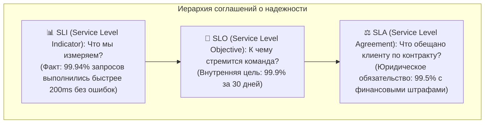
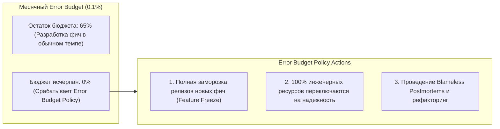
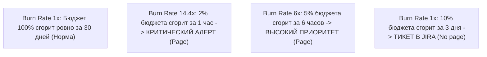

# 🎯 26. SRE Фундамент: SLI, SLO, SLA и Error Budgets

Методология **Site Reliability Engineering (SRE)**, зародившаяся в Google, переводит концепцию надежности программных систем из субъективных споров в плоскость точных математических метрик и баланса между скоростью поставки фич (Velocity) и стабильностью инфраструктуры (Reliability).

---

## 🏛️ Триада надежности: SLI, SLO, SLA



### Различия между SLI, SLO и SLA

| Уровень | Определение | Аудитория | Последствия нарушения |
| :--- | :--- | :--- | :--- |
| **`SLI`** | Количественный показатель качества сервиса в реальном времени. | SRE, Инженеры | Нет (это просто метрика) |
| **`SLO`** | Внутренняя целевая планка надежности, согласованная с Product Owner. | Разработка, SRE, Бизнес | Заморозка релизов, фокус на техдолге |
| **`SLA`** | Официальный договор с внешними клиентами сервиса. | Юристы, Клиенты, Менеджмент | Финансовые компенсации, штрафы, потеря репутации |

> [!NOTE]
> Всегда держите $SLO > SLA$ (например, $SLO = 99.9\%$, а $SLA = 99.5\%$). Этот зазор дает команде время среагировать и починить проблему до наступления юридических и финансовых санкций.

---

## 🧮 Бюджет ошибок (Error Budget) и политика реагирования

**Error Budget (Бюджет ошибок)** — это допустимый объем ненадежности сервиса:
$$\text{Error Budget} = 100\% - \text{SLO}$$

Для $SLO = 99.9\%$ при 10 000 000 запросов в месяц:
- Допустимо ровно **10 000 сбойных запросов** ($0.1\%$).
- Допустимое суммарное время простоя в месяц: **43.8 минуты**.



---

## 🔥 Мультиоконный алерт скорости сгорания бюджета (Multi-Window Multi-Burn-Rate)

Классические алерты по пороговым значениям (например, `ошибки > 1%`) либо слишком медленно реагируют на масштабные аварии, либо создают огромное количество ложного шума. 

Стандарт **Google SRE Workbook** предлагает контролировать скорость сгорания бюджета ошибок (**Burn Rate — BR**).



### Матрица окон и порогов сгорания бюджета (SLO 99.9%)

| Severity | % Сгорания бюджета | Burn Rate | Длинное окно | Короткое окно | Действие |
| :--- | :--- | :--- | :--- | :--- | :--- |
| **SEV1** | $2\%$ за 1 час | **14.4** | 1 час | 5 минут | Срочный пейджинг On-Call (ночь) |
| **SEV2** | $5\%$ за 6 часов | **6.0** | 6 часов | 30 минут | Пейджинг On-Call (день) |
| **SEV3** | $10\%$ за 24 часа | **3.0** | 24 часа | 2 часа | Создание тикета дежурному |
| **SEV4** | $10\%$ за 3 дня | **1.0** | 3 дня | 6 часов | Анализ на дейли-митинге |

---

## ⚙️ Production Конфигурация: Multi-Burn-Rate Prometheus Rules

```yaml
# /etc/prometheus/rules/slo_burn_rate_alerts.yaml
groups:
  - name: slo_api_availability_burn_rate
    rules:
      # Recording Rules: Скорость ошибок на разных окнах
      - record: job:http_requests_error:rate5m
        expr: sum(rate(http_requests_total{job="payment-api", status=~"5.."}[5m])) / sum(rate(http_requests_total{job="payment-api"}[5m]))

      - record: job:http_requests_error:rate1h
        expr: sum(rate(http_requests_total{job="payment-api", status=~"5.."}[1h])) / sum(rate(http_requests_total{job="payment-api"}[1h]))

      - record: job:http_requests_error:rate6h
        expr: sum(rate(http_requests_total{job="payment-api", status=~"5.."}[6h])) / sum(rate(http_requests_total{job="payment-api"}[6h]))

      # Alerting Rule 1: Критический сбой (SEV1: Burn Rate 14.4x, 1h/5m)
      - alert: ErrorBudgetFastBurn
        expr: (job:http_requests_error:rate1h > (14.4 * 0.001)) and (job:http_requests_error:rate5m > (14.4 * 0.001))
        for: 2m
        labels:
          severity: critical
          slo: api_availability
        annotations:
          summary: "Критическая скорость сгорания Error Budget в сервисе payment-api"
          description: "Сервис сжигает 2% бюджета ошибок за 1 час (Burn Rate: 14.4x). При сохранении темпа месячный бюджет будет полностью исчерпан через 2 суток."

      # Alerting Rule 2: Затяжная деградация (SEV2: Burn Rate 6x, 6h/30m)
      - alert: ErrorBudgetSlowBurn
        expr: (job:http_requests_error:rate6h > (6.0 * 0.001)) and (job:http_requests_error:rate5m > (6.0 * 0.001))
        for: 15m
        labels:
          severity: warning
          slo: api_availability
        annotations:
          summary: "Повышенная скорость сгорания Error Budget в сервисе payment-api"
          description: "Сервис сжигает 5% бюджета ошибок за 6 часов (Burn Rate: 6x)."
```

---

## 🔧 Диагностика и разрешение проблем (Troubleshooting)

### Сценарий 1: Алерт Burn Rate срабатывает при минимальном ночном трафике
- **Симптом:** Ночью при 5 запросах в минуту 1 упавший запрос вызывает `Error Rate = 20%` и будит дежурного.
- **Причина:** Низкая статистическая мощность выборки (Low Traffic Bias).
- **Решение:**
  Добавьте минимальный абсолютный порог RPS трафика в условие правила:
  ```promql
  (job:http_requests_error:rate1h > (14.4 * 0.001)) 
  and 
  (sum(rate(http_requests_total{job="payment-api"}[1h])) > 10) # Минимум 10 rps
  ```

---

## 🧠 Проверь себя

1. В чем принципиальная разница между внутренним SLO и юридическим SLA?
2. Почему при SLO 99.9% и месячном объеме 10 млн запросов 15 000 ошибок приводят к полному исчерпанию Error Budget?
3. Зачем в Google Multi-Window Burn Rate алертах обязательно объединяются короткое (5m) и длинное (1h) окна?
4. Что должна предпринимать команда разработки согласно Error Budget Policy при 100% исчерпании бюджета?
5. Как защитить алерты скорости сгорания бюджета от ложных срабатываний в периоды низкого ночного трафика?
