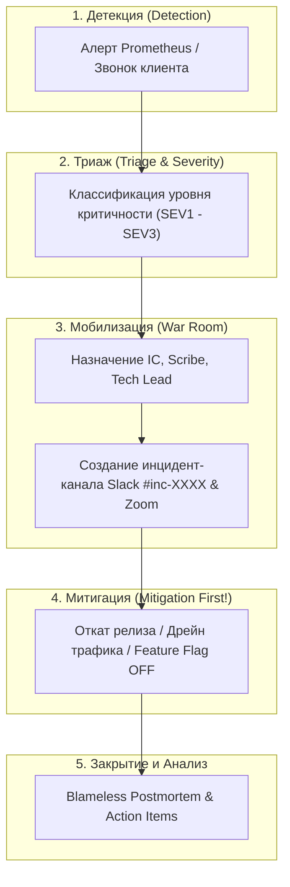
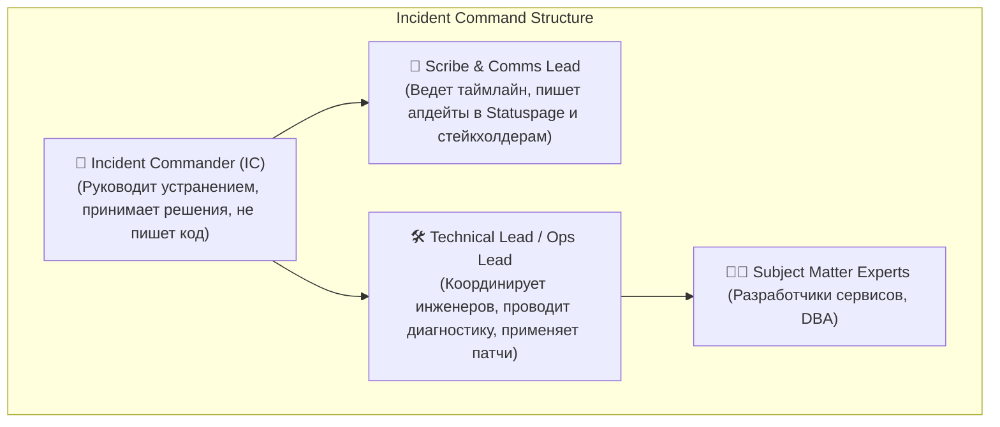
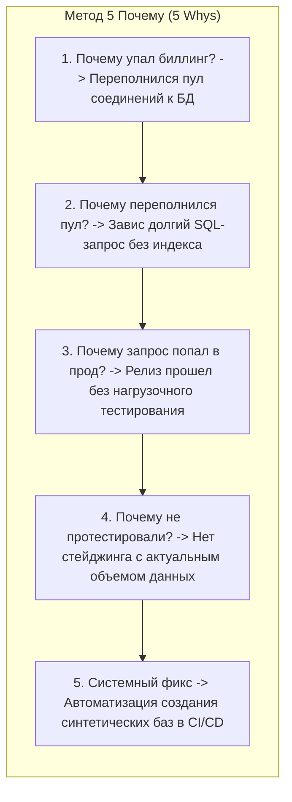

# 🚒 27. Incident Management: Процессы, Роли и Blameless Postmortems

Управление инцидентами (Incident Management) — это структурированный процесс реагирования на критические сбои в производственной среде, минимизирующий время простоя (MTTR), устраняющий хаос в коммуникациях и обеспечивающий непрерывное улучшение надежности систем.

---

## 🏛️ Жизненный цикл инцидента (Incident Lifecycle)



---

## 📊 Матрица классификации критичности инцидентов (Severity Matrix)

| Уровень | Определение | Примеры | SLA реакции | Коммуникация |
| :--- | :--- | :--- | :--- | :--- |
| **`SEV1`** (Критический) | Полный отказ ключевой функциональности бизнеса, прямые финансовые потери. | Платежный шлюз недоступен; база данных не отвечает; утечка данных. | $< 5$ минут (24/7) | Обновление Statuspage каждые 15-20 минут |
| **`SEV2`** (Высокий) | Существенная деградация сервиса, потеря резервирования, замедление $p99 > 3\times$. | Оформление заказов работает медленно; отказал один датацентр из трех. | $< 15$ минут | Обновление статуса каждые 30-45 минут |
| **`SEV3`** (Средний) | Локальный сбой, затрагивающий малую часть пользователей; есть Workaround. | Ошибка в экспорте аналитического отчета в PDF; сбой во внутреннем админ-интерфейсе. | $< 2$ часов (раб. время) | Обсуждение в рабочем чате команды |

---

## 🎖️ Роли в Incident Command System (ICS)

Во время ликвидации аварии распределение обязанностей исключает дублирование усилий и панику:



### Главный принцип SRE: Сначала митигация, потом расследование (Mitigate First!)
> **Цель инцидент-команды — остановить кровотечение, а не выяснять идеальную первопричину.**
> Если сервис упал после релиза — немедленно **откатывайте релиз**, а не пытайтесь дебажить живой прод.

---

## 📝 Культура и шаблон Blameless Postmortem (Безупречный разбор)

**Blameless-культура** основывается на аксиоме: *ошибки людей — это следствие несовершенства архитектуры, инструментов и процессов, а не злого умысла*. Поиск «виновного» приводит к сокрытию инцидентов и повторению катастроф.



### Production Шаблон Postmortem документа

```markdown
# 📋 Postmortem: Инцидент INC-10492 (Массовые 500 ошибки на Checkout)

**Дата:** 2026-09-02  
**Статус:** Resolved  
**Severity:** SEV1  
**Incident Commander:** @alex.sre  
**Scribe:** @elena.pm  
**Продолжительность простоя:** 28 минут (14:12 UTC — 14:40 UTC)  
**Влияние на пользователей:** Не удалось завершить ~4 200 транзакций. Ущерб ~$64 000.  

---

### ⏱️ Хронология событий (Timeline в UTC)
- **14:08** — Деплой версии `v2.14.0` сервиса `order-service`.
- **14:12** — Срабатывание Prometheus Multi-Burn-Rate алерта `ErrorBudgetFastBurn`.
- **14:15** — On-Call инженер подтверждает SEV1 и инициирует War Room в Zoom.
- **14:18** — Назначен IC, опубликован первый публичный статус на status.corp.com.
- **14:24** — IC принимает решение об экстренном откате (Rollback) до версии `v2.13.9`.
- **14:35** — Откат завершен, поды перезапущены.
- **14:40** — Уровень ошибок снизился до 0.01%. Инцидент переведен в статус Mitigated.

---

### 🔍 Первопричина (Root Cause)
Новая миграция базы данных добавила блокировку таблицы `orders` (`EXCLUSIVE LOCK`) при создании внешнего ключа, что заблокировало все параллельные транзакции на запись и вызвало каскадное исчерпание пула соединений HikariCP.

---

### 🎯 Корректирующие действия (Action Items — SMART)
| Действие | Тип | Ответственный | Срок | Задача |
| :--- | :--- | :--- | :--- | :--- |
| Внедрить `strong_migrations` линтер в CI/CD для запрета опасных DDL | Prevention | @vlad.dev | 2026-09-09 | PROJ-8812 |
| Настроить лимит времени выполнения миграций `lock_timeout = 2s` | Mitigation | @dmitry.dba | 2026-09-05 | PROJ-8815 |
| Добавить дашборд блокировок PostgreSQL в Grafana | Observability| @alex.sre | 2026-09-07 | PROJ-8819 |
```

---

## 🔧 Диагностика и разрешение проблем (Troubleshooting)

### Сценарий: Хаос и шум в инцидент-канале (Incident Channel Noise)
- **Симптом:** В чате инцидента 30 человек одновременно предлагают несогласованные гипотезы, IC теряет контроль.
- **Решение:**
  1. IC объявляет строгий регламент: *«Всем тишина в канале. В чат пишут только назначенные лиды направлений»*.
  2. Все параллельные обсуждения выносятся в отдельные треды (Threads).
  3. Каждые 15 минут IC публикует закрепленное статус-сообщение (SitRep: Situation Report).

---

## 🧠 Проверь себя

1. Чем принципиально отличаются обязанности Incident Commander от Technical Lead?
2. Почему попытка немедленно найти первопричину (Root Cause) прямо во время аварии считается грубой антипаттерн-ошибкой?
3. Какие три ключевых атрибута обязан содержать каждый Action Item в постмортеме?
4. Как методика «5 Почему» помогает докопаться до системных пробелов в процессах и архитектуре?
5. Почему формулировка «Инцидент произошел из-за невнимательности инженера Иванова» категорически недопустима в Blameless Postmortem?
