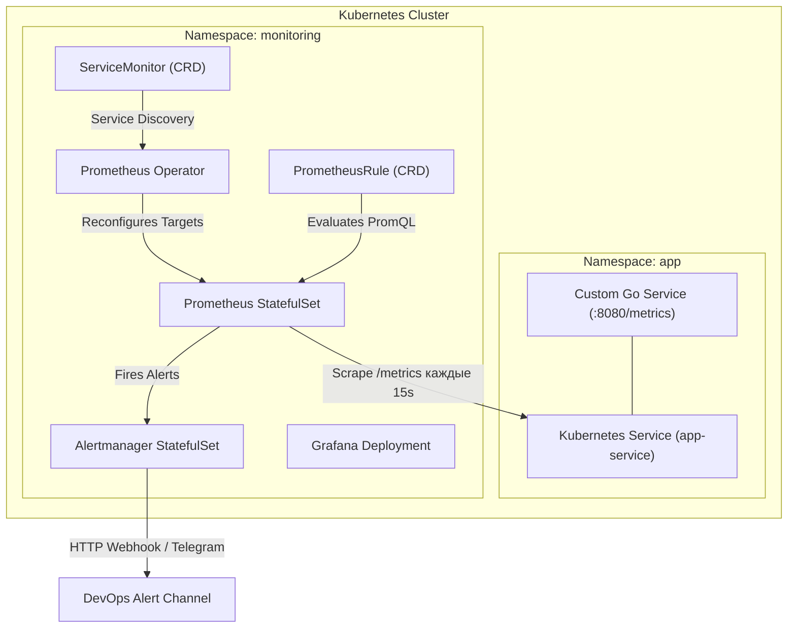

# 🧪 28. Практический лаб: kube-prometheus-stack, Exporters и ServiceMonitors

В этой практической лабораторной работе мы развернем полноценный стек мониторинга на базе **kube-prometheus-stack**, разработаем собственный микросервис на Go с экспортом RED-метрик, настроим CRD `ServiceMonitor`, напишем `PrometheusRule` и организуем сквозную проверку доставки алертов.

---

## 🏛️ Схема лабораторного стенда



---

## 🚀 Шаг 1: Развертывание `kube-prometheus-stack` через Helm

```bash
# 1. Добавление репозитория Helm
helm repo add prometheus-community https://prometheus-community.github.io/helm-charts
helm repo update

# 2. Создание файла values-override.yaml
cat << 'EOF' > /tmp/prom-values.yaml
prometheus:
  prometheusSpec:
    scrapeInterval: "15s"
    evaluationInterval: "15s"
    retention: "14d"
    serviceMonitorSelectorNilUsesHelmValues: false
    podMonitorSelectorNilUsesHelmValues: false
    ruleSelectorNilUsesHelmValues: false
    resources:
      requests:
        cpu: "500m"
        memory: "1Gi"
      limits:
        cpu: "2000m"
        memory: "4Gi"
    storageSpec:
      volumeClaimTemplate:
        spec:
          accessModes: ["ReadWriteOnce"]
          resources:
            requests:
              storage: 50Gi

alertmanager:
  alertmanagerSpec:
    replicas: 2
EOF

# 3. Установка чарта в неймспейс monitoring
helm upgrade --install kube-prom prometheus-community/kube-prometheus-stack \
  --namespace monitoring --create-namespace \
  -f /tmp/prom-values.yaml
```

---

## 💻 Шаг 2: Создание микросервиса на Go с Prometheus SDK

Создадим легковесный сервис, экспортирующий `Counter`, `Histogram` и `Gauge`:

```go
// main.go
package main

import (
	"math/rand"
	"net/http"
	"time"

	"github.com/prometheus/client_golang/prometheus"
	"github.com/prometheus/client_golang/prometheus/promhttp"
)

var (
	// 1. Counter: Общее число HTTP запросов
	httpRequestsTotal = prometheus.NewCounterVec(
		prometheus.CounterOpts{
			Name: "http_requests_total",
			Help: "Общее количество входящих HTTP запросов",
		},
		[]string{"method", "handler", "status"},
	)

	// 2. Histogram: Задержка выполнения запросов
	httpRequestDuration = prometheus.NewHistogramVec(
		prometheus.HistogramOpts{
			Name:    "http_request_duration_seconds",
			Help:    "Гистограмма задержки обработки запросов",
			Buckets: []float64{0.01, 0.05, 0.1, 0.25, 0.5, 1.0, 2.5},
		},
		[]string{"method", "handler"},
	)

	// 3. Gauge: Количество активных очередей задач
	activeTasksGauge = prometheus.NewGauge(
		prometheus.GaugeOpts{
			Name: "app_active_tasks_count",
			Help: "Текущее количество обрабатываемых фоновых задач",
		},
	)
)

func init() {
	prometheus.MustRegister(httpRequestsTotal)
	prometheus.MustRegister(httpRequestDuration)
	prometheus.MustRegister(activeTasksGauge)
}

func main() {
	http.HandleFunc("/api/v1/order", func(w http.ResponseWriter, r *http.Request) {
		start := time.Now()
		activeTasksGauge.Inc()
		defer activeTasksGauge.Dec()

		// Имитация задержки обработки
		sleepTime := time.Duration(rand.Intn(300)) * time.Millisecond
		time.Sleep(sleepTime)

		status := "200"
		if rand.Float64() < 0.15 { // 15% ошибок для тестирования алертинга
			status = "500"
			w.WriteHeader(http.StatusInternalServerError)
			w.Write([]byte(`{"error": "internal_error"}`))
		} else {
			w.WriteHeader(http.StatusOK)
			w.Write([]byte(`{"status": "order_created"}`))
		}

		duration := time.Since(start).Seconds()
		httpRequestsTotal.WithLabelValues(r.Method, "/api/v1/order", status).Inc()
		httpRequestDuration.WithLabelValues(r.Method, "/api/v1/order").Observe(duration)
	})

	// Эндпоинт для скрайпинга метрик
	http.Handle("/metrics", promhttp.Handler())

	println("Сервер запущен на :8080...")
	http.ListenAndServe(":8080", nil)
}
```

---

## 📦 Шаг 3: Манифесты Kubernetes для приложения

```yaml
# app-deployment.yaml
apiVersion: apps/v1
kind: Deployment
metadata:
  name: order-service
  namespace: default
  labels:
    app: order-service
spec:
  replicas: 2
  selector:
    matchLabels:
      app: order-service
  template:
    metadata:
      labels:
        app: order-service
    spec:
      containers:
      - name: order-service
        image: ghcr.io/demo/order-service:1.0.0
        ports:
        - name: http-metrics
          containerPort: 8080
---
apiVersion: v1
kind: Service
metadata:
  name: order-service
  namespace: default
  labels:
    app: order-service
spec:
  ports:
  - name: http-metrics
    port: 8080
    targetPort: http-metrics
  selector:
    app: order-service
```

---

## 🎯 Шаг 4: Настройка CRD `ServiceMonitor` и `PrometheusRule`

### 1. ServiceMonitor для сбора метрик с приложения

```yaml
# servicemonitor.yaml
apiVersion: monitoring.coreos.com/v1
kind: ServiceMonitor
metadata:
  name: order-service-monitor
  namespace: default
  labels:
    release: kube-prom
spec:
  selector:
    matchLabels:
      app: order-service
  endpoints:
  - port: http-metrics
    path: /metrics
    interval: 10s
    metricRelabelings:
      # Защита от высокой кардинальности: удаление временных меток
      - action: labeldrop
        regex: "(pod_template_hash)"
```

### 2. PrometheusRule: Правила алертинга

```yaml
# rules.yaml
apiVersion: monitoring.coreos.com/v1
kind: PrometheusRule
metadata:
  name: order-service-rules
  namespace: default
  labels:
    release: kube-prom
spec:
  groups:
  - name: order_service_alerts
    rules:
    - alert: OrderServiceHighFailureRate
      expr: |
        (
          sum(rate(http_requests_total{handler="/api/v1/order", status="500"}[2m]))
          /
          sum(rate(http_requests_total{handler="/api/v1/order"}[2m]))
        ) * 100 > 10
      for: 1m
      labels:
        severity: critical
        team: backend
      annotations:
        summary: "Высокий уровень ошибок в сервисе заказов"
        description: "Сервис {{ $labels.app }} генерирует {{ $value | printf \"%.2f\" }}% пятисотых ответов."
```

---

## ⚡ Шаг 5: Проверка и генерация синтетической нагрузки

```bash
# 1. Применяем все манифесты
kubectl apply -f app-deployment.yaml
kubectl apply -f servicemonitor.yaml
kubectl apply -f rules.yaml

# 2. Проверяем, что Prometheus Operator обнаружил таргеты
kubectl port-forward -n monitoring svc/kube-prom-kube-prome-prometheus 9090:9090 &
curl -s http://localhost:9090/api/v1/targets | jq '.data.activeTargets[] | select(.labels.app=="order-service")'

# 3. Запуск генератора нагрузки для вызова алерта
kubectl run load-generator --rm -i --tty --image=curlimages/curl -- /bin/sh -c '
while true; do
  curl -s http://order-service.default.svc:8080/api/v1/order > /dev/null
  sleep 0.05
done'

# 4. Проверка срабатывания алерта в Alertmanager
curl -s http://localhost:9090/api/v1/alerts | jq '.data.alerts[] | select(.labels.alertname=="OrderServiceHighFailureRate")'
```

---

## 🔧 Диагностика и разрешение проблем (Troubleshooting)

### Сценарий 1: Таргет отсутствует в списке Prometheus Targets
- **Симптом:** `ServiceMonitor` применен, но в Prometheus Web UI эндпоинт отсутствует.
- **Причина:** Несовпадение селекторов `serviceMonitorSelector` в спецификации инстанса Prometheus или имени порта `port: http-metrics`.
- **Решение:**
  1. Убедитесь, что `port` в `ServiceMonitor` в точности соответствует `name: http-metrics` в `Service`.
  2. Проверьте логи оператора:
     ```bash
     kubectl logs -n monitoring -l app=kube-prometheus-stack-operator
     ```

---

## 🧠 Проверь себя

1. Каким образом `Prometheus Operator` находит созданные объекты `ServiceMonitor` в кластере?
2. В чем разница между `metricRelabelings` (применяется к сэмплам метрик) и `relabelings` (применяется к метаданным таргета)?
3. Зачем в Go SDK перед регистрацией гистограммы обязательно настраивать кастомные корзины (`Buckets`)?
4. Что произойдет, если метрика `http_requests_total` не возвращает ни одной ошибки за интервал: как функция division `/` обработает деление на ноль?
5. Как с помощью `kubectl` убедиться, что CRD `PrometheusRule` успешно скомпилирован и загружен в Prometheus?
