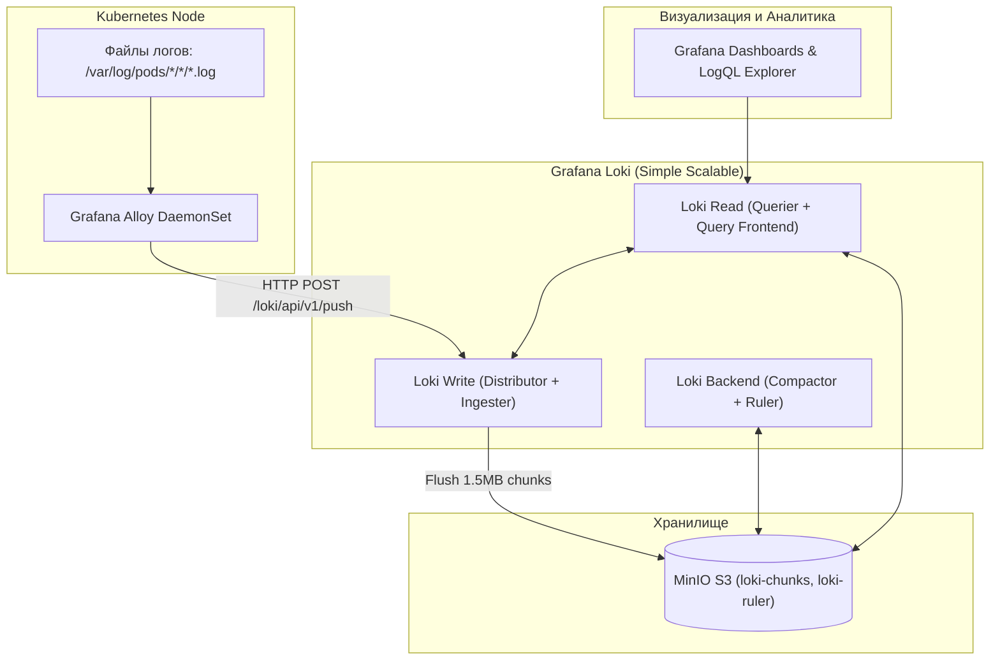

# 🧪 29. Практический лаб: Loki + Grafana Alloy и LogQL Аналитика

В этой лабораторной работе мы развернем масштабируемый стек сбора логов на базе **Grafana Loki** с хранением чанков в **MinIO (S3)**, настроим **Grafana Alloy** в качестве агента сбора логов контейнеров Kubernetes и построим аналитический дашборд с извлечением метрик из логов через **LogQL**.

---

## 🏛️ Схема лабораторного пайплайна логов



---

## 🚀 Шаг 1: Развертывание MinIO и Grafana Loki через Helm

```bash
# 1. Добавление репозиториев
helm repo add grafana https://grafana.github.io/helm-charts
helm repo add minio https://charts.min.io/
helm repo update

# 2. Установка локального S3 Object Storage (MinIO)
helm upgrade --install minio minio/minio \
  --namespace storage --create-namespace \
  --set rootUser=admin,rootPassword=StrongPassword123 \
  --set defaultBuckets=loki-chunks

# 3. Конфигурация Loki (loki-values.yaml)
cat << 'EOF' > /tmp/loki-values.yaml
deploymentMode: SimpleScalable

loki:
  auth_enabled: false
  commonConfig:
    replication_factor: 1
  schemaConfig:
    configs:
      - from: 2024-01-01
        store: tsdb
        object_store: s3
        schema: v13
        index:
          prefix: loki_index_
          period: 24h
  storage:
    type: s3
    s3:
      endpoint: minio.storage.svc:9000
      bucketnames: loki-chunks
      accessKeyId: admin
      secretAccessKey: StrongPassword123
      s3ForcePathStyle: true
      insecure: true

write:
  replicas: 2
read:
  replicas: 2
backend:
  replicas: 1
EOF

# 4. Установка Loki
helm upgrade --install loki grafana/loki \
  --namespace monitoring \
  -f /tmp/loki-values.yaml
```

---

## 🧩 Шаг 2: Настройка Grafana Alloy DaemonSet для сбора логов

Конфигурируем пайплайн Alloy для обнаружения подов, фильтрации мусора и парсинга structured metadata:

```yaml
# alloy-daemonset-config.yaml
apiVersion: v1
kind: ConfigMap
metadata:
  name: alloy-config
  namespace: monitoring
data:
  config.alloy: |
    // 1. Поиск всех подов на текущей ноде
    discovery.kubernetes "pods" {
      role = "pod"
    }

    // 2. Обогащение лейблами Kubernetes
    discovery.relabel "k8s_logs" {
      targets = discovery.kubernetes.pods.targets

      rule {
        source_labels = ["__meta_kubernetes_namespace"]
        target_label  = "namespace"
      }
      rule {
        source_labels = ["__meta_kubernetes_pod_name"]
        target_label  = "pod"
      }
      rule {
        source_labels = ["__meta_kubernetes_pod_container_name"]
        target_label  = "container"
      }
      rule {
        source_labels = ["__meta_kubernetes_pod_label_app"]
        target_label  = "app"
      }
      // Путь к файлу лога на ноде
      rule {
        source_labels = ["__meta_kubernetes_pod_uid", "__meta_kubernetes_pod_container_name"]
        target_label  = "__path__"
        separator     = "/"
        replacement   = "/var/log/pods/*$1/*.log"
      }
    }

    // 3. Чтение файлов логов с диска
    loki.source.file "pods" {
      targets    = discovery.relabel.k8s_logs.output
      forward_to = [loki.process.clean_and_parse.receiver]
    }

    // 4. Пайплайн предобработки логов
    loki.process "clean_and_parse" {
      // Отбрасывание логов проверок жизнеспособности (Noise Reduction)
      stage.drop {
        expression = ".*(kube-probe|healthz|readyz).*"
      }

      // Извлечение временных меток в формате CRI/Docker
      stage.cri {}

      forward_to = [loki.write.loki_gateway.receiver]
    }

    // 5. Отправка в Loki Gateway
    loki.write "loki_gateway" {
      endpoint {
        url = "http://loki-gateway.monitoring.svc:80/loki/api/v1/push"
      }
    }
```

---

## 🎯 Шаг 3: Генератор синтетических JSON-логов

Развернем приложение, генерирующее реалистичные структурированные логи веб-сервиса:

```yaml
# app-log-emitter.yaml
apiVersion: apps/v1
kind: Deployment
metadata:
  name: billing-api
  namespace: default
  labels:
    app: billing-api
spec:
  replicas: 2
  selector:
    matchLabels:
      app: billing-api
  template:
    metadata:
      labels:
        app: billing-api
    spec:
      containers:
      - name: emitter
        image: bash:5.2
        command: ["/usr/local/bin/bash", "-c"]
        args:
        - |
          methods=("GET" "POST" "DELETE")
          uris=("/api/v1/charge" "/api/v1/refund" "/api/v1/customer")
          statuses=(200 200 200 201 400 401 500 503)
          while true; do
            m=${methods[$RANDOM % ${#methods[@]}]}
            u=${uris[$RANDOM % ${#uris[@]}]}
            s=${statuses[$RANDOM % ${#statuses[@]}]}
            lat=$(awk -v min=20 -v max=800 'BEGIN{srand(); print (min+rand()*(max-min))/1000}')
            echo "{\"timestamp\":\"$(date -u +"%Y-%m-%dT%H:%M:%SZ")\",\"level\":\"$([ $s -ge 500 ] && echo "ERROR" || echo "INFO")\",\"method\":\"$m\",\"uri\":\"$u\",\"status\":$s,\"duration_seconds\":$lat,\"user_id\":$((1000 + RANDOM % 50))}"
            sleep 0.2
          done
```

---

## 🔍 Шаг 4: Аналитические запросы LogQL в Grafana

```logql
# 1. Вычисление RPS входящих запросов по URI
sum by (uri) (
  rate({app="billing-api"} | json [1m])
)

# 2. Процент ошибок (Error Rate %) в секунду
(
  sum(rate({app="billing-api"} | json | status >= 500 [2m]))
  /
  sum(rate({app="billing-api"} [2m]))
) * 100

# 3. 95-й процентиль задержки выполнения (в секундах) из JSON поля duration_seconds
quantile_over_time(0.95,
  {app="billing-api"}
  | json
  | unwrap duration_seconds
  [5m]
) by (uri)

# 4. Топ-5 пользователей, получивших больше всего ошибок 4xx
topk(5,
  sum by (user_id) (
    count_over_time({app="billing-api"} | json | status >= 400 and status < 500 [10m])
  )
)
```

---

## 🚨 Шаг 5: Настройка Alerting Rule поверх логов через Loki Ruler

```yaml
# loki-alerting-rule.yaml
apiVersion: v1
kind: ConfigMap
metadata:
  name: loki-rules
  namespace: monitoring
data:
  alerts.yaml: |
    groups:
      - name: log_based_alerts
        rules:
          - alert: High5xxRateInLogs
            expr: |
              (
                sum(rate({app="billing-api"} | json | status >= 500 [5m]))
                /
                sum(rate({app="billing-api"} [5m]))
              ) * 100 > 5
            for: 2m
            labels:
              severity: critical
              team: backend
            annotations:
              summary: "Высокий уровень 5xx ошибок в логах billing-api"
              description: "Доля ошибок составляет {{ $value | printf \"%.2f\" }}% за последние 5 минут."
```

---

## 🔧 Диагностика и разрешение проблем (Troubleshooting)

### Сценарий 1: Логи не появляются в Loki (Query returns empty result)
- **Симптом:** Grafana Explore показывает `No data returned`.
- **Диагностика:**
  ```bash
  # 1. Проверяем статус логов в Alloy DaemonSet
  kubectl logs -n monitoring -l app.kubernetes.io/name=alloy --tail=50
  
  # 2. Проверяем прием логов в Loki Write поде
  kubectl logs -n monitoring -l app.kubernetes.io/component=write --tail=50
  ```
- **Причина:** Несовпадение маски пути к логам `__path__` в ConfigMap Alloy (`/var/log/pods/...`).
- **Решение:** Проверьте фактическую структуру директорий на ноде K8s с помощью `kubectl debug node/<node-name>`.

---

## 🧠 Проверь себя

1. Почему архитектурный режим Loki `SimpleScalable` проще в эксплуатации, чем полный `Microservices`, но значительно надежнее монолитного `SingleBinary`?
2. Для чего в пайплайне Alloy используется блок `stage.cri`?
3. Каким образом функция `unwrap` в LogQL позволяет строить графики перцентилей без предварительного создания гистограмм в приложении?
4. Почему отбрасывание health check логов на этапе агента (`stage.drop`) критически экономит сетевой трафик и объем в S3?
5. Как настроить алерт в Loki Ruler на появление ключевого слова `panic: runtime error` в логах?
