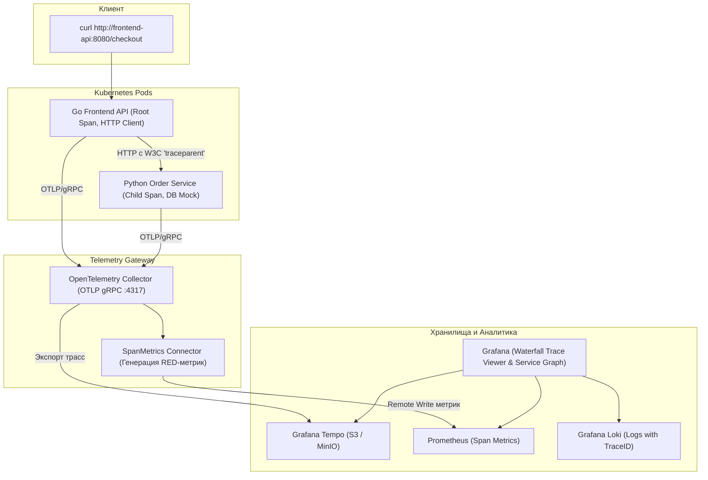

```mermaid
gantt
    title Распределенный водопад спанов в Grafana Tempo
    dateFormat X
    axisFormat %L ms

    section Frontend API
    POST /checkout (Root Span)       :0, 220
    HandleCheckout                   :10, 210

    section Order Backend
    POST /process                    :30, 190
    ExecuteDatabaseInsert (Child)    :50, 180
```

# 🧪 30. Практический лаб: OpenTelemetry SDK, OTel Collector и Tempo

В этой лабораторной работе мы построим законченный конвейер распределенной трассировки: развернем **Grafana Tempo** с хранением в S3, настроим шлюз **OpenTelemetry Collector**, инструментируем два микросервиса на **Go** и **Python** с автоматической передачей **W3C Trace Context**, сгенерируем спан-метрики и настроим бесшовную навигацию между трассами, логами и метриками в **Grafana**.

---

## 🏛️ Схема лабораторного стенда распределенной трассировки



---

## 🚀 Шаг 1: Развертывание Grafana Tempo через Helm

```bash
# 1. Файл tempo-values.yaml с настройкой MinIO S3 бэкенда
cat << 'EOF' > /tmp/tempo-values.yaml
tempo:
  storage:
    trace:
      backend: s3
      s3:
        endpoint: minio.storage.svc:9000
        bucket: tempo-traces
        access_key: admin
        secret_key: StrongPassword123
        insecure: true
      parquet:
        bloom_filter:
          fp_rate: 0.05
  metricsGenerator:
    enabled: true
    remoteWriteUrl: "http://kube-prom-kube-prome-prometheus.monitoring.svc:9090/api/v1/write"
EOF

# 2. Установка Tempo
helm upgrade --install tempo grafana/tempo \
  --namespace monitoring \
  -f /tmp/tempo-values.yaml
```

---

## 🔭 Шаг 2: Развертывание OpenTelemetry Collector

```yaml
# otel-collector.yaml
apiVersion: v1
kind: ConfigMap
metadata:
  name: otel-collector-config
  namespace: monitoring
data:
  config.yaml: |
    receivers:
      otlp:
        protocols:
          grpc:
            endpoint: 0.0.0.0:4317
          http:
            endpoint: 0.0.0.0:4318

    processors:
      memory_limiter:
        check_interval: 1s
        limit_percentage: 75
        spike_limit_percentage: 20
      batch:
        send_batch_size: 4096
        timeout: 500ms

    connectors:
      # Автоматическая генерация Prometheus метрик из трасс
      spanmetrics:
        histogram:
          explicit:
            buckets: [10ms, 50ms, 100ms, 250ms, 500ms, 1s, 2s]
        dimensions:
          - name: http.status_code
          - name: http.method

    exporters:
      otlp/tempo:
        endpoint: tempo.monitoring.svc:4317
        tls:
          insecure: true
      prometheusremotewrite:
        endpoint: "http://kube-prom-kube-prome-prometheus.monitoring.svc:9090/api/v1/write"

    service:
      pipelines:
        traces:
          receivers: [otlp]
          processors: [memory_limiter, batch]
          exporters: [otlp/tempo, spanmetrics]
        metrics:
          receivers: [spanmetrics]
          processors: [memory_limiter, batch]
          exporters: [prometheusremotewrite]
```

---

## 💻 Шаг 3: Инструментация сервисов (Go и Python)

### 1. Frontend API на Go (Генерация Root Span и проброс контекста)

```go
// go-frontend/main.go
package main

import (
	"context"
	"fmt"
	"net/http"
	"os"

	"go.opentelemetry.io/contrib/instrumentation/net/http/otelhttp"
	"go.opentelemetry.io/otel"
	"go.opentelemetry.io/otel/attribute"
	"go.opentelemetry.io/otel/exporters/otlp/otlptrace/otlptracegrpc"
	"go.opentelemetry.io/otel/propagation"
	"go.opentelemetry.io/otel/sdk/resource"
	sdktrace "go.opentelemetry.io/otel/sdk/trace"
	semconv "go.opentelemetry.io/otel/semconv/v1.24.0"
)

func initTracer(ctx context.Context) (*sdktrace.TracerProvider, error) {
	exporter, err := otlptracegrpc.New(ctx,
		otlptracegrpc.WithInsecure(),
		otlptracegrpc.WithEndpoint(os.Getenv("OTEL_EXPORTER_OTLP_ENDPOINT")),
	)
	if err != nil {
		return nil, err
	}

	tp := sdktrace.NewTracerProvider(
		sdktrace.WithBatcher(exporter),
		sdktrace.WithResource(resource.NewWithAttributes(
			semconv.SchemaURL,
			semconv.ServiceName("frontend-api"),
			semconv.DeploymentEnvironment("production"),
		)),
	)
	otel.SetTracerProvider(tp)
	otel.SetTextMapPropagator(propagation.NewCompositeTextMapPropagator(
		propagation.TraceContext{},
		propagation.Baggage{},
	))
	return tp, nil
}

func main() {
	ctx := context.Background()
	tp, _ := initTracer(ctx)
	defer tp.Shutdown(ctx)

	client := http.Client{Transport: otelhttp.NewTransport(http.DefaultTransport)}

	handler := http.HandlerFunc(func(w http.ResponseWriter, r *http.Request) {
		ctx := r.Context()
		tracer := otel.Tracer("frontend-api")
		_, span := tracer.Start(ctx, "HandleCheckout")
		defer span.End()

		span.SetAttributes(attribute.String("customer.tier", "vip"))

		// Вызов бэкенд сервиса Python с автоматической инъекцией traceparent
		backendURL := "http://order-backend.default.svc:5000/process"
		req, _ := http.NewRequestWithContext(ctx, "POST", backendURL, nil)
		resp, err := client.Do(req)
		if err != nil {
			span.RecordError(err)
			w.WriteHeader(http.StatusBadGateway)
			return
		}
		defer resp.Body.Close()

		w.WriteHeader(http.StatusOK)
		fmt.Fprintf(w, `{"status":"checkout_completed"}`)
	})

	http.Handle("/checkout", otelhttp.NewHandler(handler, "POST /checkout"))
	http.ListenAndServe(":8080", nil)
}
```

### 2. Order Service на Python (Извлечение контекста и запись Child Span)

```python
# python-backend/app.py
import os
import time
import random
from flask import Flask, request, jsonify
from opentelemetry import trace
from opentelemetry.sdk.trace import TracerProvider
from opentelemetry.sdk.trace.export import BatchSpanProcessor
from opentelemetry.exporter.otlp.proto.grpc.trace_exporter import OTLPSpanExporter
from opentelemetry.sdk.resources import Resource
from opentelemetry.instrumentation.flask import FlaskInstrumentor
from opentelemetry.propagate import extract

app = Flask(__name__)

# Инициализация OTel SDK
resource = Resource.create({"service.name": "order-backend", "deployment.environment": "production"})
provider = TracerProvider(resource=resource)
processor = BatchSpanProcessor(OTLPSpanExporter(
    endpoint=os.getenv("OTEL_EXPORTER_OTLP_ENDPOINT", "otel-collector.monitoring.svc:4317"),
    insecure=True
))
provider.add_span_processor(processor)
trace.set_tracer_provider(provider)
FlaskInstrumentor().instrument_app(app)

tracer = trace.get_tracer("order-backend")

@app.route("/process", methods=["POST"])
def process():
    # Автоматическое связывание с Trace Context
    with tracer.start_as_current_span("ExecuteDatabaseInsert") as span:
        delay = random.uniform(0.05, 0.25)
        time.sleep(delay)
        span.set_attribute("db.system", "postgresql")
        span.set_attribute("db.statement", "INSERT INTO orders (id, amount) VALUES ($1, $2)")
        
        if random.random() < 0.10: # 10% сбоев БД
            span.set_status(trace.StatusCode.ERROR, "Database connection timeout")
            return jsonify({"error": "db_timeout"}), 500
            
    return jsonify({"result": "order_persisted"})

if __name__ == "__main__":
    app.run(host="0.0.0.0", port=5000)
```

---

## 📊 Шаг 4: Настройка Grafana Trace-to-Logs и Trace-to-Metrics

В Grafana перейдите в **Connections -> Data sources -> Tempo** и сконфигурируйте интеграции:

1. **Trace to Logs (Loki):**
   - Data source: `Loki`
   - Tags: `app` или `service.name`
   - Query: `{app="${__tags}"} |= "${__trace.id}"`
2. **Trace to Metrics (Prometheus):**
   - Data source: `Prometheus`
   - Query: `sum(rate(traces_spanmetrics_latency_bucket{service_name="${__service.name}"}[$__rate_interval]))`
3. **Service Graph:**
   - Включите **Service Graph** и укажите Prometheus как источник метрик.

---

## 🔍 Шаг 5: Проверка и визуализация водопада спанов

```bash
# 1. Отправка тестового запроса
kubectl run trace-tester --rm -i --tty --image=curlimages/curl -- \
  curl -s -X POST http://frontend-api.default.svc:8080/checkout

# 2. Поиск трасс в Grafana Explore (TraceQL)
# Запрос в Grafana Tempo:
# { .http.status_code >= 500 && duration > 100ms }
```



---

## 🔧 Диагностика и разрешение проблем (Troubleshooting)

### Сценарий 1: Трейсы не доходят до Tempo (Zero Spans Ingested)
- **Симптом:** В Grafana Tempo поиск по TraceQL пуст.
- **Диагностика:**
  ```bash
  # 1. Проверяем логи OTel Collector
  kubectl logs -n monitoring -l app=otel-collector --tail=50
  
  # 2. Проверяем внутренние счетчики экспортера
  curl -s http://localhost:8888/metrics | grep otelcol_exporter_sent_spans
  ```
- **Причина:** Неверно указан OTLP endpoint (например, `http://` в gRPC экспортере или закрытый порт 4317).
- **Решение:** Для gRPC адрес должен указываться в формате `tempo.monitoring.svc:4317` (без схемы `http://`).

---

## 🧠 Проверь себя

1. Каким образом `otel.SetTextMapPropagator` обеспечивает сквозную передачу `traceparent` при межсервисных HTTP-вызовах?
2. Что делает коннектор `spanmetrics` в OTel Collector и почему это избавляет от необходимости вручную писать код сбора RED-метрик в микросервисах?
3. В чем разница между Span Attribute (статические метаданные) и Span Event (точка во времени со своими атрибутами)?
4. Как в Grafana настроить клик по SpanID, чтобы автоматически открылись соответствующие строки логов в Loki?
5. Что происходит со спанами, если OTel Collector временно недоступен: сбрасывает ли их `BatchSpanProcessor` в приложении?
