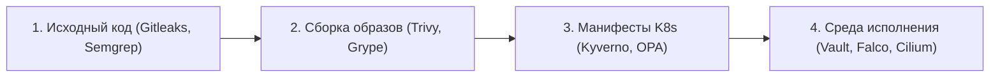
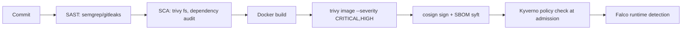

# 🔒 01. DevSecOps: HashiCorp Vault, SOPS, Trivy, Kyverno

## 🛡️ Стек DevSecOps (Shift-Left Security)

Безопасность должна внедряться на всех этапах цикла поставки:



---

## 🔍 Сканирование уязвимостей с помощью Trivy

```bash
# Сканирование файловой системы на утечки секретов и уязвимости пакетов
trivy fs --severity HIGH,CRITICAL .

# Сканирование Docker-образа с блокировкой билда (exit-code 1)
trivy image --exit-code 1 --severity CRITICAL registry.company.com/app:v1.0.0

# Сканирование Terraform манифестов на ошибки конфигурации (Misconfigurations)
trivy config ./terraform/
```

---

## 🔐 Управление секретами в GitOps: Mozilla SOPS

**SOPS** позволяет шифровать только значения полей в YAML-файлах (оставляя ключи открытыми), что позволяет безопасно хранить файлы в публичных и приватных Git-репозиториях.

```bash
# 1. Генерация ключа Age
age-keygen -o age.key

# 2. Шифрование Kubernetes Secret манифеста
sops --encrypt --age $(cat age.key | grep "public key" | awk '{print $4}') secret.yaml > secret.enc.yaml

# 3. Редактирование зашифрованного файла на лету
sops secret.enc.yaml

# 4. Расшифровка в CI/CD
sops --decrypt secret.enc.yaml | kubectl apply -f -
```

---

## 🏦 HashiCorp Vault и External Secrets Operator (ESO)

Вместо ручного создания секретов в Kubernetes, **External Secrets Operator (ESO)** безопасно синхронизирует секреты из HashiCorp Vault или AWS Secrets Manager напрямую в стандартные `Secret` Kubernetes.

```yaml
# 1. Настройка подключения к Vault
apiVersion: external-secrets.io/v1beta1
kind: SecretStore
metadata:
  name: vault-backend
  namespace: production
spec:
  provider:
    vault:
      server: "https://vault.company.internal"
      path: "secret"
      version: "v2"
      auth:
        kubernetes:
          mountPath: "kubernetes"
          role: "production-app-role"
---
# 2. Автоматическое создание Kubernetes Secret из ключей Vault
apiVersion: external-secrets.io/v1beta1
kind: ExternalSecret
metadata:
  name: app-database-credentials
  namespace: production
spec:
  refreshInterval: "1h" # Ротация секретов каждый час
  secretStoreRef:
    name: vault-backend
    kind: SecretStore
  target:
    name: db-secret-k8s # Имя итогового secret в Kubernetes
  data:
    - secretKey: DB_PASSWORD
      remoteRef:
        key: production/database
        property: password
```

---

## 📜 Политики безопасности в кластере (Kyverno)

Манифест Kyverno для запрета запуска контейнеров от пользователя `root`:

```yaml
apiVersion: kyverno.io/v1
kind: ClusterPolicy
metadata:
  name: require-run-as-non-root
spec:
  validationFailureAction: Enforce # Жестко отклонять деплой (или Audit для логов)
  rules:
    - name: check-runAsNonRoot
      match:
        any:
          - resources:
              kinds:
                - Pod
      validate:
        message: "Безопасность: Контейнеры обязаны запускаться с параметром runAsNonRoot: true"
        pattern:
          spec:
            containers:
              - securityContext:
                  runAsNonRoot: true
```

---

## 🔬 Deep Dive: shift-left security pipeline



### Kyverno: запрет всего, разрешение по списку

```yaml
apiVersion: kyverno.io/v1
kind: ClusterPolicy
metadata:
  name: require-signed-images-and-limits
spec:
  validationFailureAction: Enforce
  rules:
    - name: verify-image-signatures
      match: { resources: { kinds: [Pod] } }
      verifyImages:
      - attestors:
        - entries:
          - keyless:
              subject: https://github.com/org/*
              issuer: https://token.actions.githubusercontent.com
    - name: require-resource-limits
      validate:
        pattern:
          spec:
            containers:
            - resources:
                limits: { memory: "?*", cpu: "?*" }
```

### Gitleaks в pre-commit: секреты не должны даже коммититься

```bash
gitleaks protect --staged          # локально перед push
gitleaks detect --source . --report-format sarif  # в CI
```

!!! danger «Утечка случилась?»
    1. **Rotация ключа немедленно** (не ждите чистки истории). 2. Аудит использования через CloudTrail/access logs. 3. Чистка истории `git filter-repo`. 4. Post-mortem без поиска виноватых.

---

<!-- enriched:v1 -->

## 🧨 Типовые грабли Production

| Симптом | Причина | Быстрое решение |
| :--- | :--- | :--- |
| Алерты не приходят / приходят пачкой | `group_wait`/`repeat_interval` настроены вслепую | Разобрать routing tree на бумаге, тест через `amtool` |
| Дашборд врет относительно реальности | Стейтмент без фильтра по job/instance | Проверить label matching, добавить legend format |
| Рост кардинальности метрик убивает Prometheus | user_id/path в labels | Ограничить cardinality, relabel drop |
| Логи «исчезают» | retention/индекс ротация | Проверить ILM/compactor настройки и объем hot-хранилища |

!!! warning «Сначала SLI, потом дашборды»
    Дашборд без определенного SLO — это арт. Определите SLI (какие запросы считаем хорошими), цель (99.9%), error budget — и только затем рисуйте панели.

## 🧪 Hands-on Lab

```bash
trivy fs --severity CRITICAL,HIGH --no-progress . | tail -15 && gitleaks detect --no-git -q && echo OK || echo LEAKS FOUND; \
syft packages dir:. -o cyclonedx-json=sbom.json 2>/dev/null && ls -la sbom.json || true
```

## ✅ Чек-лист зрелости темы

- [ ] Есть golden signals на каждый сервис (latency/traffic/errors/saturation)
- [ ] Алерты actionable: каждый требует действия, а не просто информирует
- [ ] Настроены inhibition rules: падение ноды глушит её дочерние алерты
- [ ] Runbook ссылка внутри каждого алерта
- [ ] Проведен учение: симулировали инцидент, проверили доставку нотификаций
