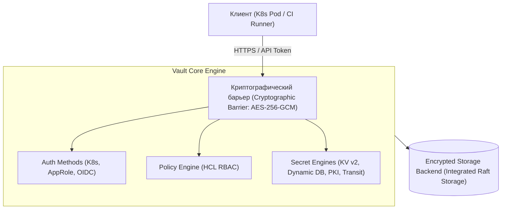
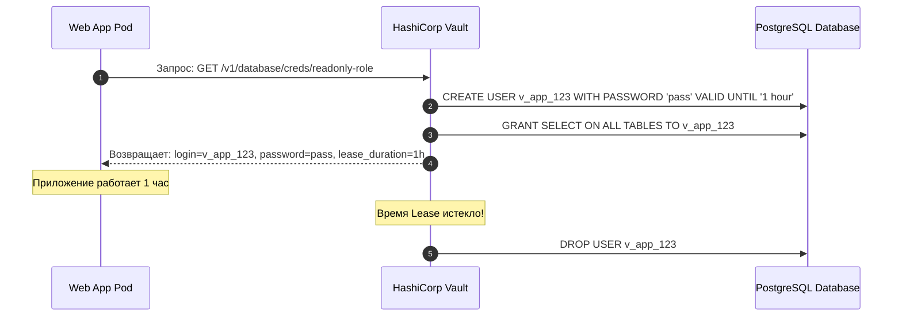
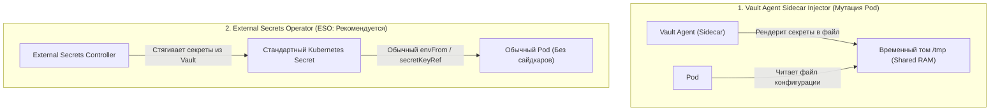
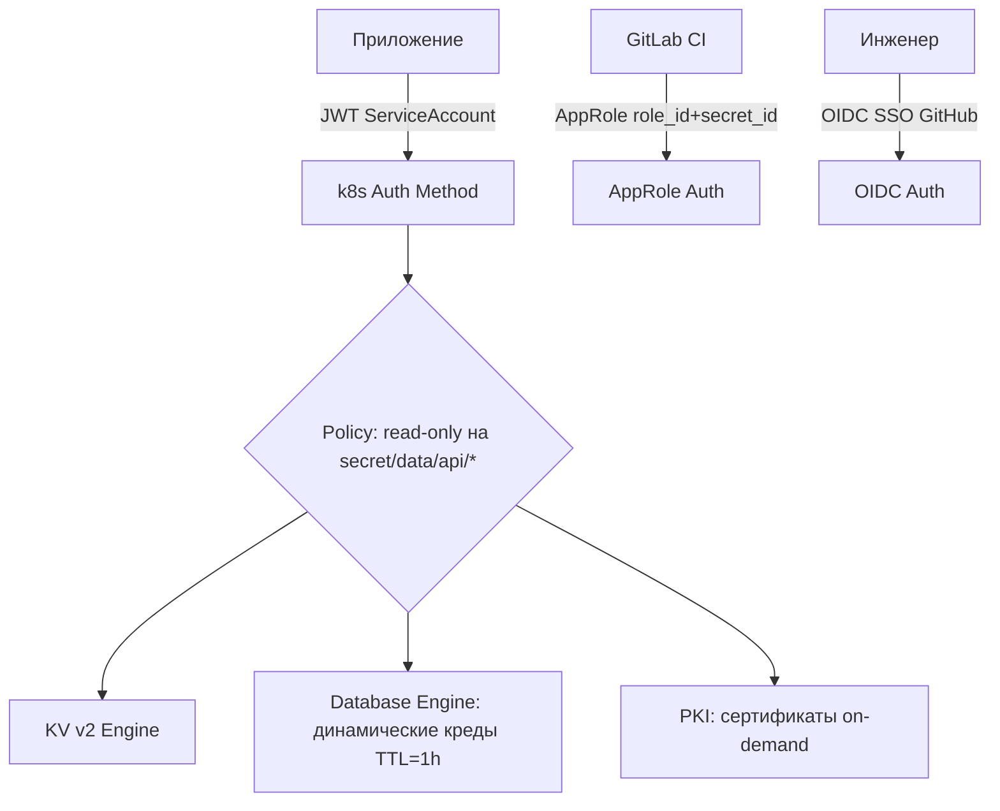

# 🔐 03. HashiCorp Vault: Архитектура, Динамические секреты и PKI

## 🏛️ Архитектура HashiCorp Vault

HashiCorp Vault — централизованное хранилище и менеджер жизненного цикла секретов (паролей, токенов, X.509 сертификатов, ключей шифрования).



---

## 🗝️ Расшифровка хранилища: Shamir's Secret Sharing против Auto-Unseal

При старте Vault находится в запечатанном (`Sealed`) состоянии: мастер-ключ в памяти отсутствует.
1. **Shamir's Secret Sharing (По умолчанию):** Мастер-ключ разбивается на $N$ частей (например, 5 ключей). Для распечатывания (`Unseal`) требуется ввести порог $K$ ключей (например, 3 из 5 разными инженерами).
2. **Auto-Unseal (Production Cloud):** Автоматическая расшифровка мастер-ключа через KMS облака (AWS KMS, GCP Cloud KMS, Azure Key Vault) или внешний Vault Transit.

---

## ⚡ Динамические секреты для баз данных (Dynamic DB Secrets)

Вместо постоянного логина и пароля в конфигах, Vault генерирует **уникального временного пользователя БД** для каждого инстанса приложения с автоматическим удалением после истечения срока жизни (TTL):



---

## 📜 Собственный Центр Сертификации: PKI Secrets Engine

Vault способен генерировать TLS/mTLS сертификаты за миллисекунды:

```bash
# 1. Включение движка PKI
vault secrets enable pki
vault secrets tune -max-lease-ttl=87600h pki

# 2. Создание корневого сертификата CA (Root CA)
vault write -field=certificate pki/root/generate/internal \
    common_name="Company Internal Root CA" \
    ttl=87600h > root_ca.crt

# 3. Настройка роли для генерации сертификатов домена
vault write pki/roles/web-services \
    allowed_domains="company.internal" \
    allow_subdomains=true \
    max_ttl="720h"

# 4. Выпуск сертификата на лету для сервиса:
vault write pki/issue/web-services common_name="api.company.internal" ttl="24h"
```

---

## ☸️ Доставка секретов в Kubernetes: Injector против ESO



---

## 🔬 Deep Dive: пути аутентификации и динамические секреты



### Динамическая БД-креда: пароль живет час и уничтожается сам

```bash
vault secrets enable database
vault write database/config/postgres \
  plugin_name=postgresql-database-plugin \
  allowed_roles="api-role" connection_url="postgresql://{{username}}:{{password}}@db:5432/app"

vault write database/roles/api-role \
  db_name=postgres creation_statements="CREATE ROLE \"{{name}}\" WITH LOGIN PASSWORD '{{password}}' VALID UNTIL '{{expiration}}'; GRANT SELECT ON ALL TABLES..." \
  default_ttl=1h max_ttl=24h

vault read database/creds/api-role    # каждый вызов = новый юзер в БД
```

### Auto-unseal и disaster recovery

```bash
vault operator raft snapshot save backup.snap       # регулярный бэкап!
vault operator raft snapshot restore backup.snap

# Transit engine: шифрование как сервис (ключи вообще не покидают Vault)
echo -n 'sensitive' | vault write transit/encrypt/orders plaintext=- | jq -r .data.ciphertext
vault write transit/decrypt/orders ciphertext='vault:v1:...' 
```

!!! warning «Vault упал — приложения?»
    Кэшируйте токены (Agent/Auto-Auth), используйте `max_lease_ttl` > времени восстановления Vault, и помните: unseal требует кворума ключей (или cloud KMS auto-unseal).

---

<!-- enriched:v1 -->

## 🧨 Типовые грабли Production

| Симптом | Причина | Быстрое решение |
| :--- | :--- | :--- |
| Алерты не приходят / приходят пачкой | `group_wait`/`repeat_interval` настроены вслепую | Разобрать routing tree на бумаге, тест через `amtool` |
| Дашборд врет относительно реальности | Стейтмент без фильтра по job/instance | Проверить label matching, добавить legend format |
| Рост кардинальности метрик убивает Prometheus | user_id/path в labels | Ограничить cardinality, relabel drop |
| Логи «исчезают» | retention/индекс ротация | Проверить ILM/compactor настройки и объем hot-хранилища |

!!! warning «Сначала SLI, потом дашборды»
    Дашборд без определенного SLO — это арт. Определите SLI (какие запросы считаем хорошими), цель (99.9%), error budget — и только затем рисуйте панели.

## 🧪 Hands-on Lab

```bash
export VAULT_ADDR=http://127.0.0.1:8200; vault status && vault auth list && \
vault secrets list && vault policy list && vault read sys/health 2>/dev/null | head
```

## ✅ Чек-лист зрелости темы

- [ ] Есть golden signals на каждый сервис (latency/traffic/errors/saturation)

    ??? tip "Как закрыть пункт"
        Четыре сигнала видны на дашборде сервиса: RPS, error ratio, latency p99 (histogram), saturation (очереди/пулы). Собраны provisioning'ом как код ([09.8](../09-observability/08-grafana-dashboards-as-code.md)), а не руками в UI.

- [ ] Алерты actionable: каждый требует действия, а не просто информирует

    ??? tip "Как закрыть пункт"
        Тест правила: «что я сделаю, увидев?» Нет действия → это дашборд-метрика, убрать из пейджера. Пороги — burn-rate относительно SLO ([09.6](../09-observability/06-alertmanager-and-dashboards-mastery.md)). Аудит: % алертов с реальными действиями за месяц.

- [ ] Настроены inhibition rules: падение ноды глушит её дочерние алерты

    ??? tip "Как закрыть пункт"
        equal: [node] связывает NodeDown с сервисными правилами этого узла — один инцидент = один алерт вместо двадцати. Проверка учением: выключить узел, убедиться в единственной нотификации.

- [ ] Runbook ссылка внутри каждого алерта

    ??? tip "Как закрыть пункт"
        annotation runbook_url обязателен (lint правил), ведёт на конкретные команды диагностики, не на главную вики. Шаблон runbook — [13.2](../13-disaster-recovery-and-tools/02-database-backups-and-dr-plan.md).

- [ ] Проведен учение: симулировали инцидент, проверили доставку нотификаций

    ??? tip "Как закрыть пункт"
        Раз в квартал: дрель хаоса → проверить путь правило→AM→канал, замерить MTTA. Заодно проверить silence/amtool и эскалации. Итог учения фиксируется.

---

## 🧭 Что дальше

| Шаг | Материал |
| :--- | :--- |
| 🔬 Закрепить | [Lab 08: Vault в Ansible](../16-guided-labs/08-lab-ansible-molecule.md) |
| 🎤 Проверить себя | [Вопросы: Vault](../14-interview-prep/04-100-devops-interview-questions-bank-part2.md) |
