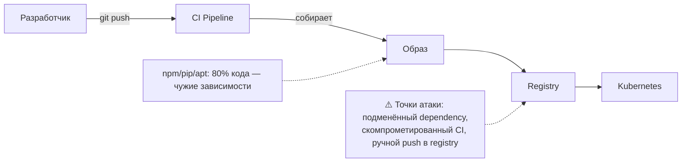

# 🔗 04. Supply Chain Security: SBOM, Подписание Образов и Admission

> Секреты и DevSecOps-процессы — в [01](01-devsecops-and-secrets.md). Здесь — защита цепочки поставки: от сборки образа до запрета неподписанного в кластере.

## ⚙️ Атака через зависимости



Инциденты типа SolarWinds/Log4Shell показали: уязвимость может приехать через транзитивную зависимость, а вредоносный код — через скомпрометированную сборку. Ответ индустрии — **доказуемая происходимость** (provenance): что именно собрано, кем, из какого коммита.

---

## 📝 SBOM: инвентарь состава образов

SBOM (Software Bill of Materials) — машиночитаемый список всех пакетов внутри артефакта.

```bash
# Генерация SBOM (syft)
syft nginx:1.27 -o spdx-json > nginx.spdx.json
syft dir:. -o cyclonedx-json > app.cdx.json      # не только образы — каталоги, файлы

# Прикрепить SBOM к образу в registry (OCI artifact)
syft nginx:1.27 --output spdx-json --file sbom.json
cosign attach sbom --sbom sbom.json nginx:1.27

# Поиск уязвимостей по образу (grype работает поверх того же каталога пакетов)
grype nginx:1.27 --fail-on high
```

Практика:

1. **Каждый релизный образ получает SBOM** автоматически в CI (шаблон ниже).
2. SBOM хранится рядом с образом (attestation) — при новом CVE (как Log4Shell) поиск «где у нас log4j» занимает секунды: `grep -r log4j *.spdx.json`.
3. Форматы: SPDX (экосистема Linux/ГОСТ-friendly) и CycloneDX (devsecops-ориентированный). Выбрать один корпоративно.

---

## ✍️ Cosign: подпись образов ключами/ключлесс

### Keyless (рекомендуется): подпись идентичностью OIDC

```bash
# В CI (GitLab/GitHub) — подпись от identity пайплайна, ключей нет вообще
cosign sign --yes "$CI_REGISTRY_IMAGE:$CI_COMMIT_SHA" \
  --certificate-identity-regexp '^https://gitlab.company.local/project/12/.+$' \
  --certificate-oidc-issuer https://gitlab.company.local

# Проверка перед деплоем
cosign verify \
  --certificate-identity-regexp '^https://gitlab\.company\.local/project/.+$' \
  --certificate-oidc-issuer https://gitlab.company.local \
  "$IMAGE"
```

### Ключевая схема (keyed): когда keyless недоступен

```bash
cosign generate-key-pair                    # COSIGN_PASSWORD env; приватный ключ в Vault!
COSIGN_PASSWORD=... cosign sign --key cosign.key image:tag
cosign verify --key cosign.pub image:tag    # pub — свободно раздаётся
```

!!! tip "Подписывайте digest, а не тег"
    `image:v1.2.3` перезаписываем. Подписывать и проверять по digest (`@sha256:...`) — единственный способ гарантировать, что проверяете ровно тот бинарь.

---

## 🛡️ Admission Policy: неподписанное не заходит

Kyverno проверяет подписи прямо на создании пода:

```yaml
apiVersion: kyverno.io/v1
kind: ClusterPolicy
metadata:
  name: verify-image-signatures
spec:
  validationFailureAction: Enforce
  webhookTimeoutSeconds: 30
  rules:
    - name: check-signature
      match:
        any:
          - resources: { kinds: [Pod], namespaces: ["production"] }
      verifyImages:
        - imageReferences: ["registry.company.local/*"]
          attestors:
            - entries:
                - keyless:
                    subject: "https://gitlab.company.local/project/*"
                    issuer: "https://gitlab.company.local"
          mutateDigest: true        # тег -> digest после проверки
```

Аналогично для OPA/Gatekeeper + connaisseur или встроенного `ImageReview`. Режим внедрения:

1. Неделя в режиме аудита (`Audit`) — собираем статистику нарушений.
2. Отчёт владельцам namespace: «ваш деплой заблокируют 14 мая».
3. Переключение на `Enforce`.

---

## 🏭 Полный контур в CI

```yaml
# .gitlab-ci.yml: сборка → скан → SBOM → подпись → деплой
build:
  stage: build
  script:
    - docker build -t "$IMAGE" .
    - docker push "$IMAGE"
    - DIGEST=$(docker inspect --format '{{index .RepoDigests 0}}' "$IMAGE")

scan:
  stage: security
  script:
    - grype "$DIGEST" --fail-on high -o table
    - syft "$DIGEST" -o spdx-json > sbom.json
  artifacts: { paths: [sbom.json] }

sign:
  stage: security
  needs: [scan]
  id_tokens: { SIGSTORE_ID_TOKEN: { aud: sigstore } }
  script:
    - cosign sign --yes "$DIGEST"
    - cosign attest --yes --predicate sbom.json --type spdxjson "$DIGEST"
```

Цепочка гарантирует: в прод попадает только то, что (а) прошло скан без high-CVE, (б) имеет прикреплённый SBOM, (в) подписано конкретным пайплайном. Компрометация любого звена вне этой цепочки ломается admission-политикой.

---

## 🔬 Deep Dive: provenance и SLSA-уровни

SLSA (Supply-chain Levels for Software Artifacts) — шкала зрелости:

| Уровень | Что означает | Что делать у нас |
| :--- | :--- | :--- |
| L0 | Артефакты без происхождения | Сейчас у многих |
| L1 | Задокументированная сборка (скрипты в Git) | CI as code |
| L2 | Hosted build service с подписью provenance | GitLab CI + cosign attest |
| L3 | Изолированные, подписанные билдеры (hermetic) | Runner'ы ephemeral, attestations SLSA |

Проверка attestation:

```bash
cosign verify-attestation --type slsaprovenance \
  --certificate-identity-regexp '...' --certificate-oidc-issuer '...' "$DIGEST"
```

Реалистичная цель для большинства компаний — устойчивое L2: каждый образ подписан, provenance-аттестация прикреплена, admission требует подпись в проде.

---

## 🧨 Типовые грабли Production

| Симптом | Причина | Быстрое решение |
| :--- | :--- | :--- |
| Kyverno блокирует легитимные деплои | Подписывает CI, но деплой тянет base-образы из docker hub | Расширить policy на свой registry только; mirror базовых образов |
| cosign sign падает в CI «unauthenticated» | Нет OIDC-токена у джобы | `id_tokens` (GitLab) / `permissions: id-token: write` (GitHub) |
| SBOM генерится часами на больших образах | Сканирование слоёв с тяжёлыми зависимостями | Кэш syft; SBOM только для release-тегов |
| После включения enforce никто не может задеплоить хотфикс | Экстренный путь не описан | Break-glass процедура: аннотация-исключение + алерт + постмортем |
| Приватный cosign.key утёк с раннера | Key хранили в переменных проекта | Переезд на keyless/OIDC или ключ только в Vault с одноразовой выдачей |
| Grype блокирует всё после нового фида CVE | Fail-on high без базы исключений | VEX/allowlist для неприменимых CVE + процесс их ревью |

## 🧪 Hands-on Lab

```bash
# Локальный полный цикл за 5 минут
docker build -t localhost/demo:dev .
syft localhost/demo:dev -o spdx-json > demo.sbom.json && jq '.packages | length' demo.sbom.json
grype localhost/demo:dev --fail-on critical || echo "есть криты!"

# Keyless-подпись потребует OIDC; локально — keyed:
COSIGN_PASSWORD="" cosign generate-key-pair
COSIGN_PASSWORD="" cosign sign --key cosign.key localhost/demo:dev
COSIGN_PASSWORD="" cosign verify --key cosign.pub localhost/demo:dev

# Kyverno локально в kind: политика в audit-режиме
kubectl apply -f verify-signature.yaml
kubectl get clusterpolicy verify-image-signatures -o jsonpath='{.status}'
```

## ✅ Чек-лист зрелости темы

- [ ] Каждый release-артефакт имеет SBOM, прикреплённый к образу
- [ ] Образы подписаны (keyless preferred), проверка — по digest
- [ ] Admission-политика требует подпись в production (после периода аудита)
- [ ] Сканер уязвимостей блокирует merge/release по порогу, есть процесс исключений (VEX)
- [ ] Ключи подписи (если keyed) в Vault, ротация описана
- [ ] Break-glass путь для экстренных деплоев задокументирован и алертится

---

## 🧭 Что дальше

| Шаг | Материал |
| :--- | :--- |
| 🔬 Закрепить | [Lab 02: sign → registry](../16-guided-labs/02-lab-docker-image-factory.md) |
| 🚑 Симуляции | [Инцидент с неподписанным образом](../17-break-fix/02-incident-simulations-part2.md) |

---

## 🎤 Пять вопросов для повторения

---


## ✅ Проверь себя

> Отвечай вслух до раскрытия ответа. Если «не помню» — вернись к разделу.


**В1. Что такое SBOM и чем форматы SPDX и CycloneDX отличаются по назначению?**

<details><summary>Ответ</summary>

SBOM — машиночитаемый инвентарь всех пакетов артефакта. SPDX — экосистемный стандарт (лицензии, соответствие), CycloneDX — ориентирован на security-сценарии (VEX, уязвимости). Корпоративно выбирается один формат; главное — SBOM прикрепляется к каждому релизному образу, чтобы поиск по CVE занимал секунды.

</details>


**В2. Почему подписывать и проверять образ нужно по digest, а не по тегу?**

<details><summary>Ответ</summary>

Тег мутабелен: docker push того же v1.2.3 перезаписывает содержимое. Digest sha256:... неизменяем — проверка по нему гарантирует, что admission пропускает ровно тот бинарь, который был отсканирован и подписан в CI.

</details>


**В3. Как работает keyless-подпись cosign и откуда берётся доверие без долгоживущего ключа?**

<details><summary>Ответ</summary>

CI получает короткоживущий OIDC-токен от GitLab/GitHub, Sigstore Fulcio выпускает временный сертификат, привязанный к identity пайплайна; подпись и сертификат пишутся в transparency log (Rekor). Проверяющий сверяет issuer и subject сертификата — доверие привязано к идентичности сборки, а не к секрету.

</details>


**В4. Какую роль играет политика Kyverno verifyImages и как её безопасно внедрять?**

<details><summary>Ответ</summary>

На создании пода она проверяет подпись образа и мутирует тег в digest — неподписанное не запускается. Внедрение: неделю в режиме Audit со сбором статистики нарушений, отчёт владельцам namespace, затем Enforce; отдельно описывается break-glass путь для экстренных деплоев.

</details>


**В5. Что такое SLSA и какой уровень зрелости реалистичен для большинства компаний?**

<details><summary>Ответ</summary>

Шкала происхождения артефактов: L0 ничего, L1 сборка задокументирована, L2 hosted build service с подписью provenance, L3 изолированные hermetic-билдеры. Реалистичная цель — устойчивый L2: каждый образ подписан, attestation прикреплена, admission требует подпись в проде.

</details>
