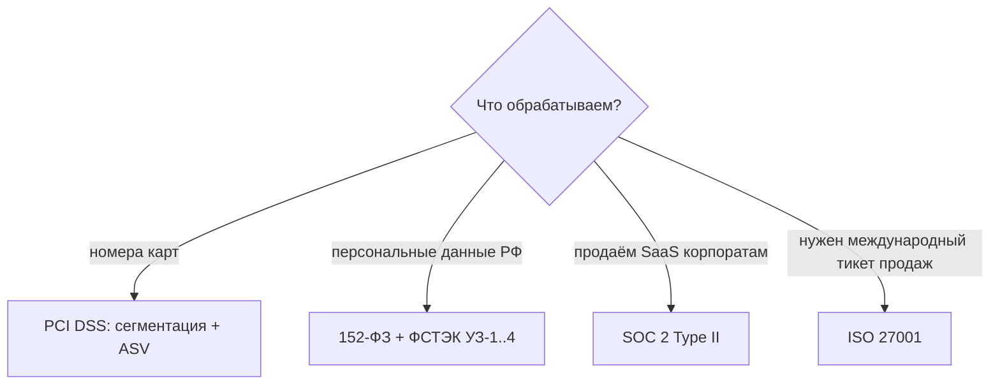

# 📜 05. Compliance: PCI DSS, SOC 2, ISO 27001, 152-ФЗ

## 🗺️ Карта регуляторики: что и когда

| Стандарт | Тип | Кого касается | Что требует от DevOps |
|---|---|---|---|
| **PCI DSS 4.0** | отраслевой (карты) | все, кто хранит/передаёт PAN | сегментация CDE, шифрование, логи, сканы ASV |
| **SOC 2 Type II** | аудит-отчёт (США) | B2B SaaS по требованию клиентов | доказательства контроля за 6–12 мес |
| **ISO 27001** | сертификация | любой бизнес, международный рынок | ISMS, риск-менеджмент, внутренние аудиты |
| **152-ФЗ** | закон РФ | персональные данные россиян | локализация ПДн, уровни защищённости (УЗ), приказы ФСТЭК |
| GDPR | закон ЕС | данные европейцев | DSR-запросы, privacy by design |



## 🔐 Требования PCI DSS глазами платформы

Ключевая идея — **минимизировать CDE** (Cardholder Data Environment): если карты не касаются K8s-кластера, 90% требований не про вас.

```yaml
# Сегментация: CDE изолируется NetworkPolicy на уровне namespace
apiVersion: networking.k8s.io/v1
kind: NetworkPolicy
metadata: { name: cde-default-deny, namespace: payments-cde }
spec:
  podSelector: {}
  policyTypes: [Ingress, Egress]
---
# Egress только к токенизации и БД:
  egress:
    - to: [{ namespaceSelector: { matchLabels: { name: vault } } }]
    - to: [{ podSelector: { matchLabels: { app: tokenization } } }]
```

Технические контролы, за которые отвечает DevOps:

| Требование | Реализация |
|---|---|
| Шифрование в транзите (4.2) | TLS везде, mTLS mesh, TLS 1.2+ |
| Шифрование at rest (3.5) | LUKS/CSI-encryption/KMS-ключи, ротация |
| Логи и мониторинг доступа (10.x) | auditd + K8s audit log → WORM-хранилище ≥12 мес |
| Сканирование уязвимостей (11.3) | Trivy в CI + квартальные ASV-сканы периметра |
| Pen-test (11.4) | ежегодный + после значимых изменений |
| Контроль изменений (6.5) | это ваш git-flow: PR, ревью, approval — документируйте! |

## 🏛️ SOC 2: доказательства вместо разовых проверок

SOC 2 Type II смотрит, что контролы **работали непрерывно**, а не существовали на бумаге. Аудитор запросит:

- Access review: кто имел доступ к прод-системам поквартально (выгрузка из IdP/GitLab).
- Evidence of MFA: политики SSO/IdP.
- Change management: каждый прод-деплой связан с ticket'ом и прошёл ревью.
- Backup restore тесты: отчёты о восстановлении (не «бэкапы есть», а «восстановили 15.03»).
- Incident records: постмортемы с таймлайнами.
- Vulnerability scans: регулярные отчёты + remediation SLA.

Автоматизация сбора evidence (Drata/Vanta/JupiterOne или свой cron): выгрузки из GitLab API, Vault audit log, Kubernetes RBAC diff — чем больше автоматизировано, тем дешевле аудит.

## 🇷🇺 152-ФЗ и ФСТЭК: практические шаги

```text
1. Определить состав ПДн и цели обработки → карта данных
2. Уведомление Роскомнадзора о намерении обрабатывать ПДн
3. Оценить вред и назначить УЗ (уровень защищённости):
   - УЗ-1/УЗ-2: гос. ИСПДн, чувствительные категории
   - УЗ-3/УЗ-4: типичный коммерческий случай (кадры, клиенты)
4. Для УЗ-3+: сертифицированные СЗИ (МВС, секрет-нет), ФСТЭК-приказ 21/31
5. Локализация баз ПДн физически в РФ (266-ФЗ)
```

DevOps-следствия: аудит-логи доступа к ПДн, разграничение ролей, шифрование дисков, регламентные проверки паролей, аттестация/декларирование при работе с гостайной/КИИ (187-ФЗ) — отдельная лига.

## 🔄 Compliance as Code: встроить в пайплайны

```bash
# Политики как код поверх инфры (см. 20.1 OPA/Kyverno):
conftest test k8s/ --policy policy/compliance/     # запрет публичных бакетов, обязательные labels
checkov -d terraform/ --framework pci_dss          # IaC против фреймворка PCI
trivy config .                                     # misconfigurations

# Доказательства собираются автоматически:
gitlab-api export MR approvals → evidence/change-management/
vault audit log → evidence/access/
velero restore test report → evidence/backups/
```

Принцип: каждое требование стандарта должно либо (а) выполняться кодом в CI/CD, либо (б) автоматически генерировать evidence. Ручные Excel-реестры не переживают второй аудит.

## ⚖️ Аудит: чек-лист подготовки

- [ ] Карта данных: где какие данные живут, потоки, третьи лица.
- [ ] Матрица доступов актуальна; увольнения закрывают доступ в день выхода.
- [ ] Все прод-изменения трассируются ticket→MR→pipeline→deploy.
- [ ] Бэкапы: расписание + **тест восстановления** с датой и подписью.
- [ ] Инциденты задокументированы по процессу (см. [09.10 SRE](../09-observability/10-sre-practices-incident-management.md)).
- [ ] Сканирования настроены по расписанию, критичные CVE закрыты в SLA.
- [ ] Договоры с subprocessor'ами (облака) включают обработку ПДн.

## ❓ Пять вопросов для самопроверки

---


## ✅ Проверь себя

> Отвечай вслух до раскрытия ответа. Если «не помню» — вернись к разделу.


**В1. Почему минимизация CDE — главный стратегический ход при PCI DSS?**
<details><summary>Ответ</summary>
Требования применяются к системам, которые могут коснуться данных карт. Токенизация на входе (PAN заменяется токеном сразу) выводит большинство сервисов из CDE: вместо сотен соответствующих систем остаётся пара контуров. Стоимость аудита падает кратно.
</details>

**В2. Чем SOC 2 Type II отличается от Type I для DevOps-команды?**
<details><summary>Ответ</summary>
Type I фиксирует, что контролы ПРОЕКТИРОВАНЫ верно на дату. Type II доказывает их работу за период 6–12 месяцев — нужны исторические evidence: access reviews, логи деплоев, отчёты восстановлений. Готовиться надо заранее автоматизацией, а не собирать артефакты за месяц до аудита.
</details>

**В3. Какой уровень защищённости обычно назначается коммерческой CRM с клиентскими данными?**
<details><summary>Ответ</summary>
Как правило УЗ-4 или УЗ-3 (приказ ФСТЭК №21): зависит от численности субъектов и прав (обычные ПДн vs спецкатегории). Точный выбор — результат оценки вреда; завышение УЗ означает лишние сертифицированные СЗИ и бюджет, занижение — штрафы при проверке.
</details>

**В4. Почему change management из PCI/SOC почти бесплатно закрывается правильным GitFlow?**
<details><summary>Ответ</summary>
Стандарт хочет: изменения авторизованы, протестированы, одобрены вторым лицом, отслеживаемы, откатываемы. Protected branches + MR с approval + green pipeline + тег релиза дают всё это автоматически, а git history служит готовым журналом изменений для аудитора.
</details>

**В5. Что значит compliance-as-code и почему ручные реестры проигрывают?**
<details><summary>Ответ</summary>
Требования выражаются политиками, проверяемыми машиной (conftest/checkov/Kyverno), а evidence генерируется автоматически из систем. Ручной Excel устаревает в день создания, не масштабируется на ежедневные деплои и не выдерживает проверку «покажите, что так было всегда» — машинные политики проверяются на каждый коммит.
</details>

---

*Что дальше:* [01. DevSecOps и секреты](01-devsecops-and-secrets.md) · [04. Supply Chain Security](04-supply-chain-security.md)
