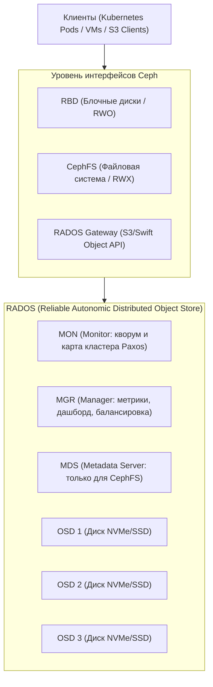

# 🗄️ 01. Распределенное хранилище Ceph и Rook-Ceph в Kubernetes

## 🏛️ Архитектура Ceph: Компоненты и Алгоритм CRUSH

**Ceph** — это программно-определяемое распределенное хранилище (Software-Defined Storage), предоставляющее блочный доступ (RBD), файловую систему (CephFS) и объектное хранилище (S3/RGW).



### Основные демоны:
- **`OSD (Object Storage Daemon)`:** Отвечает за хранение данных на конкретном физическом диске, репликацию, восстановление и проверку целостности (Scrubbing).
- **`MON (Monitor)`:** Поддерживает карты состояния кластера (OSD map, Mon map, PG map). Требует нечетного числа узлов для кворума (3 или 5).
- **`MGR (Manager)`:** Сбор телеметрии, встроенный веб-интерфейс (Ceph Dashboard), интеграция с Prometheus.
- **`MDS (Metadata Server)`:** Хранит метаданные директорий и POSIX-прав для CephFS.
- **Алгоритм CRUSH:** Вычисляет точное местоположение данных по математической формуле без центральной таблицы поиска (детерминированное распределение).

---

## ☸️ Rook-Ceph: Управление Ceph внутри Kubernetes

Rook — это Cloud-Native оператор, автоматизирующий провижининг, настройку, масштабирование и восстановление Ceph-кластера в Kubernetes.

### 1. Манифест `CephBlockPool` и `StorageClass` (RWO - Блочные диски)
```yaml
apiVersion: ceph.rook.io/v1
kind: CephBlockPool
metadata:
  name: replicapool-nvme
  namespace: rook-ceph
spec:
  failureDomain: host # Распределение реплик по разным физическим серверам
  replicated:
    size: 3           # Тройная репликация каждого блока
---
apiVersion: storage.k8s.io/v1
kind: StorageClass
metadata:
  name: rook-ceph-block
provisioner: rook-ceph.rbd.csi.ceph.com
parameters:
  clusterID: rook-ceph
  pool: replicapool-nvme
  imageFormat: "2"
  imageFeatures: layering
  csi.storage.k8s.io/provisioner-secret-name: rook-csi-rbd-provisioner
  csi.storage.k8s.io/provisioner-secret-namespace: rook-ceph
  csi.storage.k8s.io/node-stage-secret-name: rook-csi-rbd-node
  csi.storage.k8s.io/node-stage-secret-namespace: rook-ceph
reclaimPolicy: Delete
allowVolumeExpansion: true # Поддержка изменения размера PVC на лету
```

### 2. Манифест `CephFilesystem` (RWX - Общая файловая система)
```yaml
apiVersion: ceph.rook.io/v1
kind: CephFilesystem
metadata:
  name: myfs
  namespace: rook-ceph
spec:
  metadataPool:
    replicated:
      size: 3
  dataPools:
    - failureDomain: host
      replicated:
        size: 3
  metadataServer:
    activeCount: 1
    activeStandby: true
```

---

## 🛠️ Ceph CLI & Troubleshooting Cheat Sheet

```bash
# Вход в Toolbox-под Rook Ceph
kubectl -n rook-ceph exec -it deploy/rook-ceph-tools -- bash

# 1. Проверка общего здоровья кластера
ceph health detail
ceph status

# 2. Мониторинг утилизации дисков и пулов
ceph df
ceph osd df

# 3. Проверка статуса плейсмент-групп (PG)
ceph pg stat

# 4. Поиск проблемных дисков (OSD)
ceph osd tree | grep -E "down|out"

# 5. Перезапуск зависшего OSD
ceph osd down osd.12
```

> [!WARNING]
> **Критический порог заполнения:** Если кластер Ceph заполняется на $\ge 85\%$ (`nearfull`), он начинает слать предупреждения, а при $\ge 90\%$ (`full`) кластер **полностью блокирует операции записи**, чтобы предотвратить разрушение данных.

---

## 🔬 Deep Dive: пул репликации vs EC и CRUSH-правила

| Характеристика | Replicated (size=3) | Erasure Coding (k=4,m=2) |
| :--- | :--- | :--- |
| Полезная емкость из 6 дисков | 33% | 66% |
| Запись | 3 IO | 6 IO (read-modify-write) |
| Восстановление одного OSD | быстро | тяжело для сети |
| Применение | RBD для VM/подов | холодные данные, RGW архив |

```bash
# Создать EC-пул для объектного хранилища
ceph osd erasure-code-profile set ec42 k=4 m=2 crush-failure-domain=host
ceph osd pool create archive-pool 64 64 erasure ec42

# Наблюдение за восстановлением
ceph -s | grep -E 'rebalanc|recover'
ceph health detail | grep -i slow
```

### Rook: масштабирование и замена диска

```yaml
# storageClassDeviceSet позволяет добавлять ноды декларативно
storageClassDeviceSets:
- name: nvme-set
  count: 3
  portable: true          # PV следует за нодой при переезде кластера
  placement:
    nodeAffinity:
      requiredDuringSchedulingIgnoredDuringExecution:
        nodeSelectorTerms:
        - matchExpressions: [{ key: ceph-osd, operator: In, values: ["true"] }]
```

```bash
# Замена умершего диска: удалить OSD, добавить новый
ceph osd out osd.12 && ceph osd safe-to-destroy osd.12
kubectl -n rook-ceph delete deploy rook-ceph-osd-12
# физически заменить диск → оператор поднимет новый OSD автоматически
```


---

<!-- enriched:v1 -->

## 🧨 Типовые грабли Production

| Симптом | Причина | Быстрое решение |
| :--- | :--- | :--- |
| Кластер «деградирует» без видимых ошибок | Недореплицированные партиции/PG после отказа ноды | Проверить health/ISR/under-replicated до следующего сбоя |
| Латентность растет линейно с данными | Отсутствие партиционирования/индексов | Разбить по времени/ключу, пересмотреть схему |
| Бэкап есть, восстановления нет | Никогда не проверялся restore | Регулярный drill: restore в staging + checksum |
| После failover дубли/потеря данных | Настройки acks/consistency не осознаны | Зафиксировать гарантии записи в SLA сервиса |

!!! danger «Правило бэкапов»
    Бэкап — это не файл на S3, а **проверенный процесс восстановления** с известным RTO. Не проверенный бэкап = отсутствие бэкапа.

## 🧪 Hands-on Lab

```bash
kubectl -n rook-ceph exec deploy/rook-ceph-tools -- ceph -s && \
kubectl -n rook-ceph exec deploy/rook-ceph-tools -- ceph osd tree | head -20 && \
kubectl -n rook-ceph exec deploy/rook-ceph-tools -- ceph df
```

## ✅ Чек-лист зрелости темы

- [ ] Репликация и кворумные настройки осознаны (не дефолт из quickstart)

    ??? tip "Как закрыть пункт"
        Число реплик и фактор синхронной записи выбраны от требования потери данных: RF≥3, write concern/majority или min.insync.replicas=2 для Kafka. Проверка: конфигурация задокументирована комментарием «почему столько», отказ одной реплики не останавливает запись (проверено в стенде).

- [ ] Мониторинг лагов репликации и очередей настроен с алертами

    ??? tip "Как закрыть пункт"
        Метрики: lag вторичек (pg_stat_replication/kafka consumer lag/redis offset), размер очередей, age of oldest message. Алерт при lag > порога N минут. Проверка: остановить реплику — алерт пришёл до того, как заметили люди.

- [ ] Есть проверенный runbook: отказ ноды / полный restore

    ??? tip "Как закрыть пункт"
        Два сценария по шаблону из [13.2]: замена одного узла (шаги + время) и полное восстановление из бэкапа. Runbook проверен руками за последние 90 дней — дата прогона в шапке документа.

- [ ] Ёмкостное планирование: известно, при каком объеме начнутся проблемы

    ??? tip "Как закрыть пункт"
        Знакомы три числа: текущий объём данных/RPS, скорость роста за квартал, предел текущей архитектуры (диск/IOPS/память индексов). Алерт на 70% предела; план масштабирования написан ДО его наступления.

- [ ] Проведено учение по отказу зоны/ноды без потери данных

    ??? tip "Как закрыть пункт"
        Сценарий: выключаем узел/AZ (docker stop / drain), наблюдаем выборы/переключение по часам, сверяем отсутствие потери подтверждённых записей. Результат учения (время, найденные грабли) фиксируется в runbook'е.

---

## 🧭 Что дальше

| Шаг | Материал |
| :--- | :--- |
| 🎤 Проверить себя | [Вопросы: хранилища](../14-interview-prep/04-100-devops-interview-questions-bank-part2.md) |
| ➡️ Дальше | [MinIO/Longhorn](../20-senior-stack/08-storage-s3-etcd-longhorn.md) |
