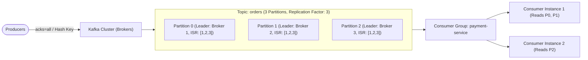
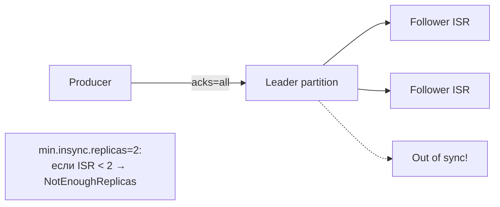

# 📨 02. Распределенный брокер Apache Kafka и Strimzi Operator

## 🏛️ Архитектура Kafka: Брокеры, Топики и Партиции

**Apache Kafka** — распределенный распределенный лог сообщений (Event Streaming Platform), спроектированный для обработки миллионов событий в секунду с миллисекундной задержкой.



### Ключевые термины:
- **Partition (Партиция):** Неизменяемая упорядоченная последовательность сообщений (Append-only log). Единица параллелизма в Kafka.
- **Offset (Смещение):** Уникальный порядковый ID сообщения внутри конкретной партиции.
- **ISR (In-Sync Replicas):** Реплики партиции, которые полностью догнали лидера и не отстают по времени.
- **KRaft (Kafka Raft):** Встроенный протокол консенсуса, полностью заменивший устаревший ZooKeeper начиная с Kafka 3.x/4.x.

---

## 🛡️ Гарантии доставки сообщений (Semantics & Acks)

| Уровень `acks` | Описание | Надежность | Скорость |
| :--- | :--- | :--- | :--- |
| **`acks=0`** | Продюсер не ждет ответа от брокера (Fire-and-forget). | Возможна потеря данных. | Максимальная |
| **`acks=1`** | Продюсер ждет подтверждения только от Лидера партиции. | Потеря при падении лидера до репликации. | Средняя |
| **`acks=all` (`-1`)** | Продюсер ждет записи во все реплики из списка ISR (`min.insync.replicas=2`). | **Максимальная надежность (Zero Data Loss).** | Оптимальная |

---

## ☸️ Развертывание через Strimzi Kafka Operator в K8s

Strimzi — стандартизированный K8s-оператор для управления кластерами Kafka в режиме KRaft.

```yaml
apiVersion: kafka.strimzi.io/v1beta2
kind: KafkaNodePool
metadata:
  name: dual-role
  namespace: kafka
  labels:
    strimzi.io/cluster: production-cluster
spec:
  replicas: 3
  roles:
    - controller # Участвует в кворуме KRaft
    - broker     # Хранит данные и обслуживает клиентов
  storage:
    type: persistent-claim
    size: 200Gi
    class: rook-ceph-block
---
apiVersion: kafka.strimzi.io/v1beta2
kind: Kafka
metadata:
  name: production-cluster
  namespace: kafka
spec:
  kafka:
    version: 3.7.0
    metadataVersion: 3.7-IV4
    listeners:
      - name: plain
        port: 9092
        type: internal
        tls: false
      - name: tls
        port: 9093
        type: internal
        tls: true
    config:
      offsets.topic.replication.factor: 3
      transaction.state.log.replication.factor: 3
      transaction.state.log.min.isr: 2
      default.replication.factor: 3
      min.insync.replicas: 2
  entityOperator:
    topicOperator: {}
    userOperator: {}
```

---

## ⚡ Kafka CLI Cheat Sheet

```bash
# Подключение к поду брокера Kafka
kubectl -n kafka exec -it production-cluster-dual-role-0 -- bash

# 1. Проверка отставания (Consumer Lag) консьюмеров
bin/kafka-consumer-groups.sh --bootstrap-server localhost:9092 \
  --describe --group payment-service

# 2. Список топиков и их конфигурация (Replicas, ISR)
bin/kafka-topics.sh --bootstrap-server localhost:9092 --describe --topic orders

# 3. Сброс Offset консьюмер-группы на самое начало (Replay сообщений)
bin/kafka-consumer-groups.sh --bootstrap-server localhost:9092 \
  --group payment-service \
  --reset-offsets --to-earliest --dry-run --topic orders

# 4. Просмотр сообщений в реальном времени из консоли
bin/kafka-console-consumer.sh --bootstrap-server localhost:9092 \
  --topic orders --from-beginning --max-messages 10
```

---

## 🔬 Deep Dive: гарантии доставки и ISR



| Настройка producer | Гарантия | Цена |
| :--- | :--- | :--- |
| `acks=0` | fire-and-forget, потеря при падении | максимальный throughput |
| `acks=1` | запись в лидер | потеря при падении лидера до репликации |
| `acks=all` + `min.insync.replicas=2` | нет потери при живых 2 репликах | latency выше |

### Rebalance storm: главная боль консьюмеров

Причина — статические члены группы умирают при рестарте пода. Решение — **static membership**:

```yaml
# Strimzi KafkaUser/Consumer
properties: |
  group.instance.id=worker-${HOSTNAME}   # стабильная идентичность
  session.timeout.ms=45000               # терпим рестарт пода без ребаланса
```

```bash
# Диагностика лага консьюмер-группы
kafka-consumer-groups.sh --bootstrap-server localhost:9092 \
  --describe --group orders-service | awk 'NR==1 || $6 > 1000'

# Что внутри топика: офсеты и лидеры
kafka-topics.sh --describe --topic orders --bootstrap-server localhost:9092
```

⚠️ Ключ сообщения определяет партицию → порядок гарантируется только в рамках партиции. Хотите порядок по заказу = ключ `order_id`.


---

<!-- enriched:v1 -->

## 🧨 Типовые грабли Production

| Симптом | Причина | Быстрое решение |
| :--- | :--- | :--- |
| Кластер «деградирует» без видимых ошибок | Недореплицированные партиции/PG после отказа ноды | Проверить health/ISR/under-replicated до следующего сбоя |
| Латентность растет линейно с данными | Отсутствие партиционирования/индексов | Разбить по времени/ключу, пересмотреть схему |
| Бэкап есть, восстановления нет | Никогда не проверялся restore | Регулярный drill: restore в staging + checksum |
| После failover дубли/потеря данных | Настройки acks/consistency не осознаны | Зафиксировать гарантии записи в SLA сервиса |

!!! danger «Правило бэкапов»
    Бэкап — это не файл на S3, а **проверенный процесс восстановления** с известным RTO. Не проверенный бэкап = отсутствие бэкапа.

## 🧪 Hands-on Lab

```bash
kubectl -n kafka get kafka,kafkatopic,kafkauser && \
kubectl -n kafka exec my-cluster-kafka-0 -- \
  bin/kafka-topics.sh --describe --topic orders --bootstrap-server localhost:9092 2>/dev/null | head -8
```

## ✅ Чек-лист зрелости темы

- [ ] Репликация и кворумные настройки осознаны (не дефолт из quickstart)
- [ ] Мониторинг лагов репликации и очередей настроен с алертами
- [ ] Есть проверенный runbook: отказ ноды / полный restore
- [ ] Ёмкостное планирование: известно, при каком объеме начнутся проблемы
- [ ] Проведено учение по отказу зоны/ноды без потери данных
