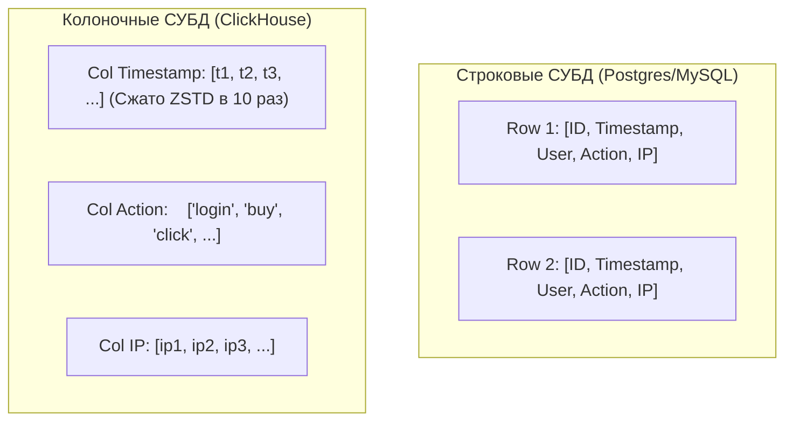

# ⚡ 03. Колоночная СУБД ClickHouse: Архитектура и Эксплуатация

## 📊 Почему ClickHouse так быстр?

**ClickHouse** — высокопроизводительная колоночная аналитическая СУБД (OLAP), способная обрабатывать миллиарды строк в секунду на стандартном оборудовании.



### Архитектурные особенности:
1. **Колоночное хранение:** Запрос `SELECT sum(amount) FROM logs` читает с диска только одну колонку `amount`, полностью игнорируя гигабайты других столбцов.
2. **Векторизованные вычисления:** Обработка данных пакетами через SIMD инструкции процессора (AVX2/AVX-512).
3. **Движки семейства MergeTree:** Фоновое слияние отсортированных кусков данных (Data Parts) по аналогии с LSM-деревьями.

---

## 🏗️ Движки таблиц: Семейство MergeTree

```sql
-- Эталонная таблица для хранения логов с партиционированием и сжатием
CREATE TABLE default.app_logs_local ON CLUSTER production_cluster
(
    timestamp   DateTime64(3, 'UTC') CODEC(DoubleDelta, ZSTD(1)),
    environment LowCardinality(String),
    service     LowCardinality(String),
    level       LowCardinality(String),
    message     String CODEC(ZSTD(3)),
    http_status UInt16,
    duration_ms Float32
)
ENGINE = ReplicatedMergeTree('/clickhouse/tables/{shard}/app_logs', '{replica}')
PARTITION BY toYYYYMM(timestamp)                  -- Партиционирование по месяцам
PRIMARY KEY (environment, service, level)         -- Первичный разреженный индекс
ORDER BY (environment, service, level, timestamp) -- Порядок сортировки на диске
TTL timestamp + INTERVAL 90 DAY;                  -- Авто-удаление логов старше 90 дней
```

---

## ☸️ Altinity ClickHouse Operator в Kubernetes

Манифест `ClickHouseInstallation` для развертывания кластера из 2 шардов с двойной репликацией:

```yaml
apiVersion: "clickhouse.altinity.com/v1"
kind: "ClickHouseInstallation"
metadata:
  name: "logs-clickhouse"
  namespace: "clickhouse"
spec:
  configuration:
    clusters:
      - name: "production_cluster"
        layout:
          shardsCount: 2
          replicasCount: 2
    zookeeper:
      nodes:
        - host: "clickhouse-keeper-0.clickhouse-keeper"
          port: 2181
        - host: "clickhouse-keeper-1.clickhouse-keeper"
          port: 2181
        - host: "clickhouse-keeper-2.clickhouse-keeper"
          port: 2181
  templates:
    volumeClaimTemplates:
      - name: data-volume
        spec:
          accessModes:
            - ReadWriteOnce
          resources:
            requests:
              storage: 500Gi
```

---

## 🛠️ ClickHouse SQL & Диагностика

```sql
-- 1. Топ самых тяжелых запросов в системе за последние 24 часа
SELECT
    user,
    query,
    formatReadableSize(memory_usage) AS mem,
    query_duration_ms / 1000 AS sec,
    read_rows,
    formatReadableSize(read_bytes) AS read_size
FROM system.query_log
WHERE type = 'QueryFinish' AND event_time > now() - INTERVAL 1 DAY
ORDER BY memory_usage DESC
LIMIT 10;

-- 2. Просмотр размера таблиц и степени сжатия на диске
SELECT
    table,
    formatReadableSize(sum(data_compressed_bytes)) AS compressed,
    formatReadableSize(sum(data_uncompressed_bytes)) AS uncompressed,
    round(sum(data_uncompressed_bytes) / sum(data_compressed_bytes), 2) AS ratio
FROM system.parts
WHERE active = 1
GROUP BY table;

-- 3. Проверка отставания репликации
SELECT database, table, is_readonly, absolute_delay, total_replicas, active_replicas
FROM system.replicas;
```

---

## 🔬 Deep Dive: MergeTree семейство и выбор движка

| Движок | Сценарий |
| :--- | :--- |
| `MergeTree` | базовый, одиночный сервер |
| `ReplicatedMergeTree` + ZooKeeper/ClickHouse Keeper | HA, дедупликация вставок |
| `ReplacingMergeTree(ver)` | upsert-подобное поведение при merge |
| `SummingMergeTree` / `AggregatingMergeTree` | предагрегация метрик |
| `Distributed` | шардирование поверх локальных таблиц |

### Почему вставки должны быть большими пачками

Каждая INSERT создает part; фоновый merge их склеивает. Мелкие вставки = «too many parts» exception.

```sql
-- Правильно: батч 10k-1M строк или async_insert
INSERT INTO events FORMAT JSONEachRow { ... }   -- через буферизацию клиента
SET async_insert = 1, wait_for_async_insert = 0;

-- Материализованное представление: агрегат считается на вставке
CREATE MATERIALIZED VIEW mv_hourly ENGINE = SummingMergeTree
ORDER BY (hour, service)
AS SELECT toStartOfHour(ts) AS hour, service,
          count() AS cnt, sum(duration) AS total_dur
   FROM events GROUP BY hour, service;
```

```bash
# Топ тяжелых запросов из system.query_log
clickhouse-client --query "
SELECT query, round(read_rows/1e9,2) AS gb_read, round(elapsed,2) AS sec
FROM system.query_log WHERE type='QueryFinish' AND event_time > now()-3600
ORDER BY gb_read DESC LIMIT 10 FORMAT PrettyCompact"
```

!!! tip «Схема под запросы»
    ORDER BY = главный индекс ClickHouse. Проектируйте его под частые фильтры WHERE (tenant_id, event_date), а не «как удобно».


---

<!-- enriched:v1 -->

## 🧨 Типовые грабли Production

| Симптом | Причина | Быстрое решение |
| :--- | :--- | :--- |
| Кластер «деградирует» без видимых ошибок | Недореплицированные партиции/PG после отказа ноды | Проверить health/ISR/under-replicated до следующего сбоя |
| Латентность растет линейно с данными | Отсутствие партиционирования/индексов | Разбить по времени/ключу, пересмотреть схему |
| Бэкап есть, восстановления нет | Никогда не проверялся restore | Регулярный drill: restore в staging + checksum |
| После failover дубли/потеря данных | Настройки acks/consistency не осознаны | Зафиксировать гарантии записи в SLA сервиса |

!!! danger «Правило бэкапов»
    Бэкап — это не файл на S3, а **проверенный процесс восстановления** с известным RTO. Не проверенный бэкап = отсутствие бэкапа.

## 🧪 Hands-on Lab

```bash
clickhouse-client --query 'SELECT * FROM system.errors ORDER BY last_error_time DESC LIMIT 5 FORMAT Vertical' 2>/dev/null | head -30; \
clickhouse-client --query 'SELECT database,table,sum(rows) FROM system.parts WHERE active GROUP BY database,table ORDER BY 3 DESC LIMIT 5'
```

## ✅ Чек-лист зрелости темы

- [ ] Репликация и кворумные настройки осознаны (не дефолт из quickstart)

    ??? tip "Как закрыть пункт"
        Число реплик и фактор синхронной записи выбраны от требования потери данных: RF≥3, write concern/majority или min.insync.replicas=2 для Kafka. Проверка: конфигурация задокументирована комментарием «почему столько», отказ одной реплики не останавливает запись (проверено в стенде).

- [ ] Мониторинг лагов репликации и очередей настроен с алертами

    ??? tip "Как закрыть пункт"
        Метрики: lag вторичек (pg_stat_replication/kafka consumer lag/redis offset), размер очередей, age of oldest message. Алерт при lag > порога N минут. Проверка: остановить реплику — алерт пришёл до того, как заметили люди.

- [ ] Есть проверенный runbook: отказ ноды / полный restore

    ??? tip "Как закрыть пункт"
        Два сценария по шаблону из [13.2]: замена одного узла (шаги + время) и полное восстановление из бэкапа. Runbook проверен руками за последние 90 дней — дата прогона в шапке документа.

- [ ] Ёмкостное планирование: известно, при каком объеме начнутся проблемы

    ??? tip "Как закрыть пункт"
        Знакомы три числа: текущий объём данных/RPS, скорость роста за квартал, предел текущей архитектуры (диск/IOPS/память индексов). Алерт на 70% предела; план масштабирования написан ДО его наступления.

- [ ] Проведено учение по отказу зоны/ноды без потери данных

    ??? tip "Как закрыть пункт"
        Сценарий: выключаем узел/AZ (docker stop / drain), наблюдаем выборы/переключение по часам, сверяем отсутствие потери подтверждённых записей. Результат учения (время, найденные грабли) фиксируется в runbook'е.

---

## 🧭 Что дальше

| Шаг | Материал |
| :--- | :--- |
| 💪 Практика | [Задачи по ClickHouse](../15-hands-on-practice/02-100-devops-practical-tasks-part2.md) |
| 🎤 Проверить себя | [Вопросы: ClickHouse](../14-interview-prep/04-100-devops-interview-questions-bank-part2.md) |
