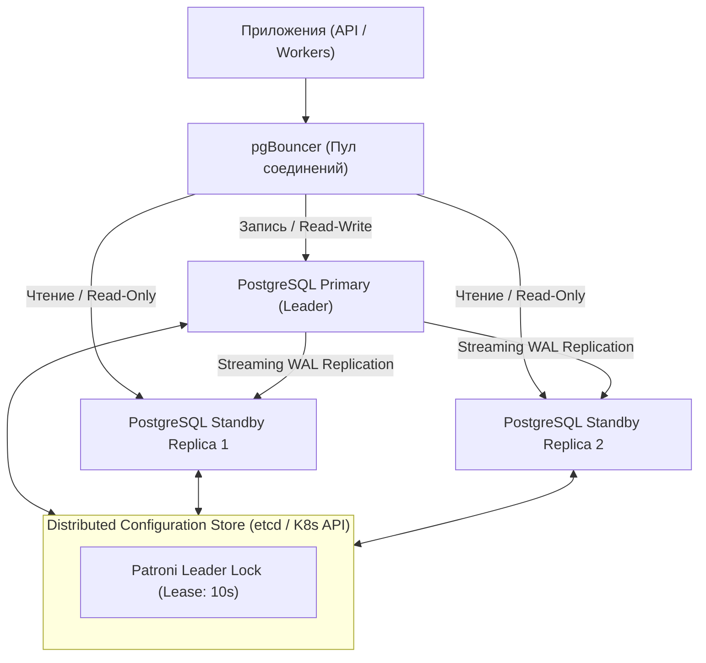
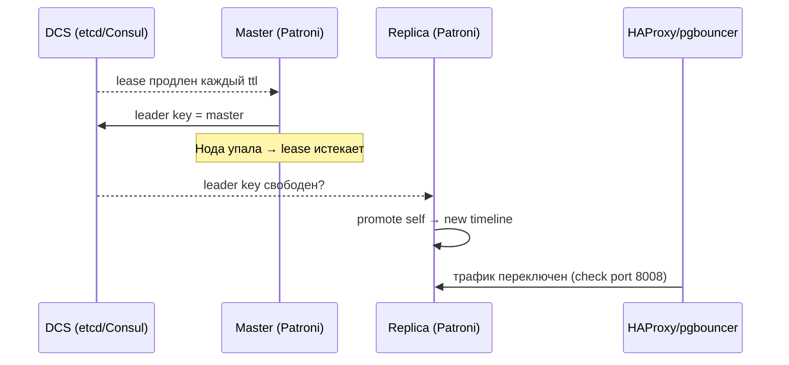

# 🐘 04. PostgreSQL High Availability: Patroni, pgBouncer и CloudNativePG

## 🏛️ Архитектура высокой доступности PostgreSQL

Одиночный экземпляр PostgreSQL не обеспечивает отказоустойчивости. Для HA используется потоковая репликация WAL (Write-Ahead Logging) под управлением **Patroni** и распределенного консенсуса (etcd/Consul).



---

## 🔌 Пул соединений: pgBouncer

PostgreSQL создает отдельный системный процесс на каждое входящее клиентское соединение, потребляя ~5-10 МБ RAM. **pgBouncer** решает проблему масштабирования:

| Режим пула | Как работает | Применение |
| :--- | :--- | :--- |
| **`Session`** | Соединение удерживается клиентом от логина до дисконнекта. | Поддержка любых фич Postgres (LISTEN/NOTIFY, временные таблицы). |
| **`Transaction`** (Рекомендуется) | Соединение берется из пула **только на время выполнения транзакции**. | 10 000 клиентов обслуживаются всего 100 реальными подключениями к БД. |
| **`Statement`** | Соединение берется только на один SQL запрос. | Без транзакций `BEGIN...COMMIT`. |

---

## ☸️ CloudNativePG (CNPG) Operator в Kubernetes

**CloudNativePG** — де-факто отраслевой стандарт запуска HA PostgreSQL в Kubernetes без необходимости вручную администрировать etcd и Patroni:

```yaml
apiVersion: postgresql.cnpg.io/v1
kind: Cluster
metadata:
  name: postgres-ha-prod
  namespace: database
spec:
  instances: 3 # 1 Primary + 2 Standby
  
  # Настройки производительности
  postgresql:
    parameters:
      shared_buffers: "2GB"
      work_mem: "32MB"
      max_connections: "200"
      wal_keep_size: "1024MB"

  # Тома для хранения данных и WAL
  storage:
    size: 100Gi
    storageClass: rook-ceph-block
  walStorage:
    size: 50Gi
    storageClass: rook-ceph-block

  # Автоматический бэкап в S3 (pgBackRest)
  backup:
    barmanObjectStore:
      destinationPath: "s3://company-pg-backups/prod/"
      s3Credentials:
        accessKeyId:
          name: s3-backup-secret
          key: ACCESS_KEY_ID
        secretAccessKey:
          name: s3-backup-secret
          key: SECRET_ACCESS_KEY
      wal:
        compression: gzip
        maxParallel: 4
```

---

## 🛠️ PostgreSQL CLI & Траблшутинг

```sql
-- 1. Проверка статуса потоковой репликации и лага (на Primary)
SELECT 
    client_addr, 
    state, 
    sync_state, 
    pg_wal_lsn_diff(pg_current_wal_lsn(), write_lsn) AS write_lag_bytes,
    pg_wal_lsn_diff(pg_current_wal_lsn(), replay_lsn) AS replay_lag_bytes
FROM pg_stat_replication;

-- 2. Поиск долгих зависших транзакций и блокировок
SELECT 
    pid, 
    now() - xact_start AS duration, 
    query, 
    state 
FROM pg_stat_activity 
WHERE (now() - xact_start) > interval '2 minutes' AND state != 'idle';

-- 3. Принудительное завершение зависшего запроса
SELECT pg_terminate_backend(<PID>);
```

---

## 🔬 Deep Dive: Patroni failover и pgbouncer режимы



### pgBouncer: три режима пула

| Режим | Совместимость | Когда |
| :--- | :--- | :--- |
| session | все фичи | legacy приложения, мало соединений |
| transaction | нельзя `SET`, advisory locks, prepared stmt (до 1.21) | стандарт для веба, 10k клиентов |
| statement | нельзя транзакции | редко, аналитика простыми SELECT |

### CloudNativePG: декларативный HA в K8s

```yaml
apiVersion: postgresql.cnpg.io/v1
kind: Cluster
metadata: { name: app-db }
spec:
  instances: 3
  storage: { size: 50Gi, storageClass: rook-ceph-block }
  backup:
    barmanObjectStore:
      destinationPath: s3://pg-backups/app-db/
      wal: { compression: gzip }
    retentionPolicy: "30d"
  monitoring: { enablePodMonitor: true }
```

```bash
# Проверить топологию и lag реплик
psql -c "SELECT application_name, state, sync_state, replay_lag FROM pg_stat_replication;"
patronictl list          # кто мастер, кто синхронная реплика
patronictl switchover --master app-1 --candidate app-2   # плановое обслуживание
```

⚠️ `synchronous_commit=on` + `synchronous_standby_names` дает zero data loss, но запись блокируется при недоступности синхронной реплики. Осознанно выбирайте между RPO=0 и доступностью.


---

<!-- enriched:v1 -->

## 🧨 Типовые грабли Production

| Симптом | Причина | Быстрое решение |
| :--- | :--- | :--- |
| Кластер «деградирует» без видимых ошибок | Недореплицированные партиции/PG после отказа ноды | Проверить health/ISR/under-replicated до следующего сбоя |
| Латентность растет линейно с данными | Отсутствие партиционирования/индексов | Разбить по времени/ключу, пересмотреть схему |
| Бэкап есть, восстановления нет | Никогда не проверялся restore | Регулярный drill: restore в staging + checksum |
| После failover дубли/потеря данных | Настройки acks/consistency не осознаны | Зафиксировать гарантии записи в SLA сервиса |

!!! danger «Правило бэкапов»
    Бэкап — это не файл на S3, а **проверенный процесс восстановления** с известным RTO. Не проверенный бэкап = отсутствие бэкапа.

## 🧪 Hands-on Lab

```bash
kubectl get cluster -A 2>/dev/null || patronictl list; \
psql -c 'SELECT state, count(*) FROM pg_stat_replication GROUP BY state;' 2>/dev/null; \
psql -c 'SELECT name,setting FROM pg_settings WHERE name IN (\'max_connections\',\'shared_buffers\',\'work_mem\',\'effective_cache_size\');' 2>/dev/null
```

## ✅ Чек-лист зрелости темы

- [ ] Репликация и кворумные настройки осознаны (не дефолт из quickstart)

    ??? tip "Как закрыть пункт"
        Число реплик и фактор синхронной записи выбраны от требования потери данных: RF≥3, write concern/majority или min.insync.replicas=2 для Kafka. Проверка: конфигурация задокументирована комментарием «почему столько», отказ одной реплики не останавливает запись (проверено в стенде).

- [ ] Мониторинг лагов репликации и очередей настроен с алертами

    ??? tip "Как закрыть пункт"
        Метрики: lag вторичек (pg_stat_replication/kafka consumer lag/redis offset), размер очередей, age of oldest message. Алерт при lag > порога N минут. Проверка: остановить реплику — алерт пришёл до того, как заметили люди.

- [ ] Есть проверенный runbook: отказ ноды / полный restore

    ??? tip "Как закрыть пункт"
        Два сценария по шаблону из [13.2]: замена одного узла (шаги + время) и полное восстановление из бэкапа. Runbook проверен руками за последние 90 дней — дата прогона в шапке документа.

- [ ] Ёмкостное планирование: известно, при каком объеме начнутся проблемы

    ??? tip "Как закрыть пункт"
        Знакомы три числа: текущий объём данных/RPS, скорость роста за квартал, предел текущей архитектуры (диск/IOPS/память индексов). Алерт на 70% предела; план масштабирования написан ДО его наступления.

- [ ] Проведено учение по отказу зоны/ноды без потери данных

    ??? tip "Как закрыть пункт"
        Сценарий: выключаем узел/AZ (docker stop / drain), наблюдаем выборы/переключение по часам, сверяем отсутствие потери подтверждённых записей. Результат учения (время, найденные грабли) фиксируется в runbook'е.

---

## 🧭 Что дальше

| Шаг | Материал |
| :--- | :--- |
| ➡️ Дальше | [PITR и DR-план для БД](../13-disaster-recovery-and-tools/02-database-backups-and-dr-plan.md) |
| 🎤 Проверить себя | [Вопросы: PostgreSQL HA](../14-interview-prep/04-100-devops-interview-questions-bank-part2.md) |
