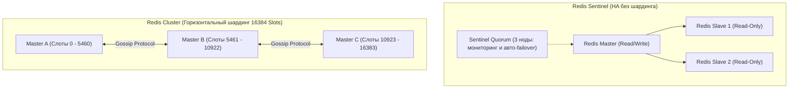

# 🔴 05. Redis: Кэширование, Sentinel и Redis Cluster

## 🧠 Архитектура Redis и Сброс на диск (Persistence)

Redis — это высокопроизводительное In-Memory хранилище структур данных, использующее однопоточный цикл событий (I/O Multiplexing через `epoll`).

### Два механизма сохранения данных на диск:
1. **RDB (Redis Database Snapshot):** Снимки памяти на диск через форк процесса (`BGSAVE`) по интервалу (например, каждые 5 минут). *Плюс: компактность и быстрый старт; Минус: потеря данных между снимками.*
2. **AOF (Append Only File):** Логирование каждой операции записи.
   - `appendfsync always` — надежно, но медленно (дисковый I/O на каждый запрос).
   - `appendfsync everysec` — **рекомендуемый баланс** (потеря максимум 1 секунды данных при сбое).

---

## ⚖️ Redis Sentinel против Redis Cluster



| Характеристика | Redis Sentinel | Redis Cluster |
| :--- | :--- | :--- |
| **Основная цель** | Высокая доступность (Автоматический Failover) | Горизонтальное масштабирование (Шардинг) + HA |
| **Объем данных** | Ограничен объемом RAM **одного** сервера | Распределен по десяткам серверов (Терабайты RAM) |
| **Шардинг** | Нет (вся база на мастере) | Да (16 384 хэш-слота по алгоритму `CRC16(key) % 16384`) |
| **Поддержка клиентами** | Стандартные клиенты | Клиенты с поддержкой умной маршрутизации слотов |

---

## 🧹 Политики вытеснения данных (Eviction Policies)

Когда объем данных достигает `maxmemory`, Redis применяет выбранную политику:
- **`allkeys-lru`:** Удаляет наименее используемые ключи среди **всех** ключей (стандарт для веб-кэша).
- **`volatile-lru`:** Удаляет LRU ключи только среди тех, у кого установлен `TTL` (таймаут жизни).
- **`noeviction`:** Возвращает ошибку `OOM command not allowed` при попытке записи (стандарт для очередей).

---

## ⚡ Redis CLI Cheat Sheet

```bash
# Подключение к Redis с паролем
redis-cli -h 10.0.0.5 -p 6379 -a "MySecretPass"

# 1. Проверка потребления памяти и фрагментации
redis-cli info memory
# mem_fragmentation_ratio > 1.5 указывает на фрагментацию памяти!

# 2. Поиск медленных запросов (Slowlog)
redis-cli slowlog get 10

# 3. Анализ самых больших ключей в памяти (Memory Analyzer)
redis-cli --bigkeys

# 4. Проверка топологии и состояния Redis Cluster
redis-cli -c -h 10.0.0.5 -p 6379 cluster nodes
redis-cli --cluster check 10.0.0.5:6379
```

---

## 🔬 Deep Dive: Redis Cluster slots и когда Sentinel достаточно

| Аспект | Sentinel | Cluster |
| :--- | :--- | :--- |
| Шардирование | нет (один датасет) | 16384 hash slots по нодам |
| Max размер | RAM одной машины | горизонтальный рост |
| Multi-key операции | любые | только ключи одного slot (`{hash_tag}`) |
| Клиенты | обычные + sentinel-aware | cluster-aware обязательны |

```bash
# Resharding: перенести слоты на новую ноду онлайн
redis-cli --cluster reshard 127.0.0.1:7000 \
  --cluster-from <node-id> --cluster-to <new-node-id> \
  --cluster-slots 1000 --cluster-yes

# Hash tags: заставить связанные ключи жить в одном слоте
SET user:{123}:profile ...
SET user:{123}:orders ...

# Big keys: найти ключи-монстры ДО того как они убьют latency
redis-cli --bigkeys -i 0.1
redis-cli memory usage big:key-name
```

### Persistence: RDB vs AOF — что включать

| Опция | Потеря при крахе | CPU/RAM overhead |
| :--- | :--- | :--- |
| Только RDB | до 15 минут (save interval) | низкий, fork COW |
| AOF everysec | ~1 секунда | средний |
| AOF always | ноль | высокая latency каждой записи |
| Оба + репликация | рекомендовано production | — |

⚠️ Fork при RDB-save на 32GB+ инстансе вызывает latency spikes (copy-on-write). Для больших инстансов — AOF + replica для бэкапов.


---

<!-- enriched:v1 -->

## 🧨 Типовые грабли Production

| Симптом | Причина | Быстрое решение |
| :--- | :--- | :--- |
| Кластер «деградирует» без видимых ошибок | Недореплицированные партиции/PG после отказа ноды | Проверить health/ISR/under-replicated до следующего сбоя |
| Латентность растет линейно с данными | Отсутствие партиционирования/индексов | Разбить по времени/ключу, пересмотреть схему |
| Бэкап есть, восстановления нет | Никогда не проверялся restore | Регулярный drill: restore в staging + checksum |
| После failover дубли/потеря данных | Настройки acks/consistency не осознаны | Зафиксировать гарантии записи в SLA сервиса |

!!! danger «Правило бэкапов»
    Бэкап — это не файл на S3, а **проверенный процесс восстановления** с известным RTO. Не проверенный бэкап = отсутствие бэкапа.

## 🧪 Hands-on Lab

```bash
redis-cli info replication | head -15 && redis-cli info stats | grep -E 'instantaneous|evicted' && \
redis-cli --cluster check 127.0.0.1:7000 2>/dev/null | tail -5 || echo 'standalone mode'
```

## ✅ Чек-лист зрелости темы

- [ ] Репликация и кворумные настройки осознаны (не дефолт из quickstart)
- [ ] Мониторинг лагов репликации и очередей настроен с алертами
- [ ] Есть проверенный runbook: отказ ноды / полный restore
- [ ] Ёмкостное планирование: известно, при каком объеме начнутся проблемы
- [ ] Проведено учение по отказу зоны/ноды без потери данных
