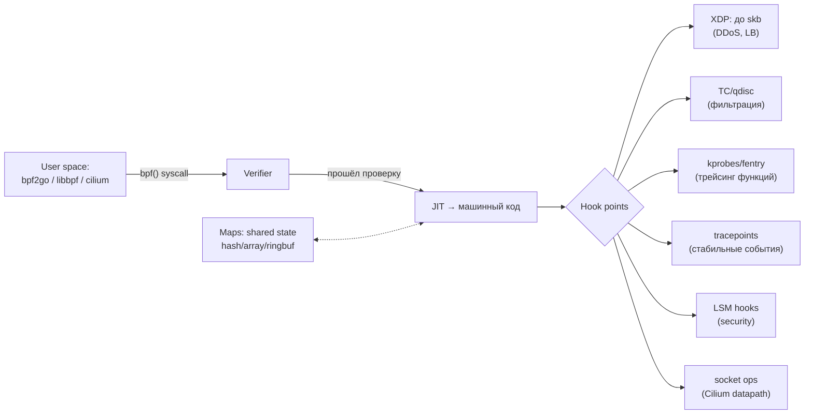

# 🔬 04. eBPF Deep Dive: Архитектура, XDP, bpftrace, Cilium

## 🧠 Что такое eBPF и почему он всё меняет

eBPF — виртуальная машина внутри ядра Linux: верифицируемый (безопасный) JIT-компилируемый байткод, исполняемый на хуках ядра. Это «safe kernel plugins»: без написания модулей ядра, без ребутов.



**Verifier** гарантирует безопасность: нет бесконечных циклов (bounded), нет разыменования мусора (все указатели проверены), ограничение сложности инструкций (~1M), доступ к памяти только после проверки. Программа, не прошедшая проверку, просто не загрузится.

## ⚡ XDP: сетевой пакет до стека

XDP-программа получает пакет **до аллокации skb** — самый ранний и быстрый хук (десятки млн pps на ядро):

```c
/* xdp_drop.c — дропнуть трафик с одного IP */
#include <linux/bpf.h>
#include <bpf/bpf_helpers.h>

struct {
    __uint(type, BPF_MAP_TYPE_HASH);
    __type(key, __u32);
    __type(value, __u8);
    __uint(max_entries, 65536);
} blocklist SEC(".maps");

SEC("xdp")
int xdp_blocklist(struct xdp_md *ctx)
{
    void *data = (void *)(long)ctx->data;
    void *data_end = (void *)(long)ctx->data_end;

    struct ethhdr *eth = data;
    if ((void *)(eth + 1) > data_end) return XDP_PASS;   // bounds check!
    if (eth->h_proto != __constant_htons(ETH_P_IP)) return XDP_PASS;

    struct iphdr *ip = (void *)(eth + 1);
    if ((void *)(ip + 1) > data_end) return XDP_PASS;

    __u8 one = 1;
    if (bpf_map_lookup_elem(&blocklist, &ip->saddr))
        return XDP_DROP;                                  // дроп на линии
    return XDP_PASS;
}
char LICENSE[] SEC("license") = "GPL";
```

Действия: `XDP_PASS` (в стек), `XDP_DROP` (выбросить), `XDP_TX` (отправить обратно тем же интерфейсом — так работает DDoS-фильтрация и Katran-LB), `XDP_REDIRECT` (другому NIC/CPU).

```bash
ip link set dev eth0 xdp obj xdp_drop.o sec xdp     # attach
ip link set dev eth0 xdp off                        # detach
bpftool prog list && bpftool map dump name blocklist
```

Продакшн-примеры: Cloudflare (anti-DDoS), Katran (Facebook L4 LB), Cilium NodePort XDP acceleration.

## 🕵️ bpftrace: трейсинг одной строкой

Наблюдаемость без перекомпиляции ядра/приложений:

```bash
# Кто делает connect() и куда (по процессам):
bpftrace -e 'tracepoint:syscalls:sys_enter_connect { printf("%s pid=%d %s\n",
  comm, pid, str((struct sockaddr_in*)args[1]->sin_addr)); }'

# Латентность read() гистограммой:
bpftrace -e 'tracepoint:syscalls:sys_enter_read /comm=="nginx"/ { @start[tid] = nsecs; }
tracepoint:syscalls:sys_exit_read /@start[tid]/ { @usecs = hist((nsecs - @start[tid])/1000); delete(@start[tid]); }'

# Топ файлов по открытию:
bpftrace -e 'tracepoint:syscalls:sys_enter_openat { @[str(args[0])] = count(); }'

# Слежение за slow TCP retransmits:
bpftrace -e 'kprobe:tcp_retransmit_skb { @[ntop(args[3])] = count(); }'

# OOM-детектив: кто аллоцирует страницы
bpftrace -e 'kprobe:vfs_write { @[comm] = sum(arg2); }'
```

Стабильные интерфейсы для продакшн: **BCC** (Python front-end), **libbpf + CO-RE** (Compile Once Run Everywhere — BTF-типы ядра), **ply**, интеграции в Grafana (ebpf plugin), Parca/Pyroscope (continuous profiling).

## 🕸️ Cilium: eBPF как datapath Kubernetes

Cilium заменяет iptables-цепочки eBPF-картами: Service NAT, NetworkPolicy, load-balancing в одном месте.

```yaml
apiVersion: cilium.io/v2
kind: CiliumNetworkPolicy          # L7-политики: не только IP, но и HTTP/gRPC!
metadata: { name: api-policy }
spec:
  endpointSelector: { matchLabels: { app: api } }
  ingress:
    - fromEndpoints: [{ matchLabels: { app: frontend } }]
      toPorts:
        - ports: [{ port: "8080", protocol: TCP }]
          rules:
            http:
              - method: GET
                path: "/api/v[12]/.*"      # только чтение API
              - method: POST
                path: "/api/v1/orders"
```

```bash
cilium status                                    # здоровье datapath
cilium bpf lb list                               # service NAT таблицы
cilium hubble enable && cilium hubble ui         # flow-observability
hubble observe --from-label app=frontend --to-label app=api
hubble observe --verdict DROPPED --last 20       # что и почему дропнуто
```

Hubble = tcpdump нового поколения: identity-based flows (не IP, а «frontend→api»), L7 видимость, метрики дропов.

### Packet path сравнение

| Этап | kube-proxy (iptables) | Cilium (eBPF) |
|---|---|---|
| Service NAT | линейный обход тысяч правил | O(1) lookup в map |
| Пакет покидает ядро? | да, несколько проходов netfilter | нет (socket-level redirect) |
| Policy enforcement | только L3/L4 | L3/L4/L7 (HTTP-aware) |
| Overhead на правило | растёт с числом сервисов | константный |

## 🛡️ eBPF для безопасности

- **Falco/Tetragon**: runtime security — политики syscall'ов (запрет записи в /etc, exec из tmp). Tetragon фильтрует в ядре → нулевой overhead на нерелевантные события.
- **LSM BPF**: кастомные мандатные проверки без пересборки ядра.
- Профилирование: continuous profiling (Parca) через perf-events eBPF.

```yaml
# Tetragon: запретить exec всего, кроме allowlist
apiVersion: cilium.io/v1alpha1
kind: TracingPolicy
metadata: { name: restrict-exec }
spec:
  podSelector: {}
  kprobes:
    - call: "security_bprm_check"
      syscalls: [{ matchNames: ["execve"] }]
      selectors:
        - matchPIDs:
            - operator: NotIn
              followForks: true
              values: [1000]        # разрешённый UID сервиса
          matchArgs:
            - index: 0
              binary: "not in"
              values: ["/usr/bin/python3", "/app/server"]
          action: Sigkill
```

## ⚠️ Ограничения и грабли

| Грабель | Суть |
|---|---|
| Версии ядра | CO-RE требует BTF (ядро ≥5.x рекомендовано); Ubuntu RHEL старые — боль |
| Verifier errors | непонятные отказы загрузки; нужен `bpf_trace_printk`-дебаг |
| Нет плавного upgrade | программы живут с ядром; обновление ядра = reload всех BPF |
| Windows | eBPF for Windows — отдельная реализация, экосистема моложе |

Диагностика: `bpftool prog show`, `cat /sys/kernel/debug/tracing/trace_pipe`, `BPF_TRACE_PRINTK`.

## ❓ Пять вопросов для самопроверки

---


## ✅ Проверь себя

> Отвечай вслух до раскрытия ответа. Если «не помню» — вернись к разделу.


**В1. Почему eBPF-программа безопасна для ядра?**
<details><summary>Ответ</summary>
Перед загрузкой verifier статически анализирует программу: все пути исполнения конечны (нет бесконечных циклов), доступ к памяти проверен bounds-check'ами, нет произвольных указателей, лимит сложности инструкций. Небезопасная программа отклоняется ДО запуска — в отличие от модуля ядра.
</details>

**В2. Чем XDP_DROP принципиально быстрее iptables DROP?**
<details><summary>Ответ</summary>
XDP обрабатывает пакет сразу после драйвера NIC, до аллокации sk_buff и входа в сетевой стек: решение принимается за несколько наносекунд на карту памяти RX. Iptables работают позже, уже с дорогим skb, и линейным обходом правил — на DDoS-объёмах разница в десятки раз.
</details>

**В3. Что даёт CiliumNetworkPolicy, чего нет у обычной NetworkPolicy?**
<details><summary>Ответ</summary>
L7-семантика: правила по HTTP-методу/пути, gRPC-методам, Kafka-топикам — identity-aware, а не только IP/порт. Плюс FQDN-based egress, DNS-наблюдение, и enforcement в eBPF без роста числа iptables-правил при масштабировании.
</details>

**В4. Зачем нужны maps в eBPF и как они используются между user/kernel space?**
<details><summary>Ответ</summary>
Maps — единственный канал состояния: блоклисты IP (kernel читает, userspace пишет), статистика (счётчики per-CPU), ring buffer событий (kernel публикует → userspace потребляет). Программы бессостоятельны между вызовами; всё состояние живёт в maps.
</details>

**В5. Ваш CNI — Calico на iptables, сервисов стало 5000 и правила тормозят. Как eBPF решает проблему?**
<details><summary>Ответ</summary>
Iptables-подход делает O(N) обход правил на каждый пакет (N ~ сервисов×endpoints). eBPF-datapath (Cilium) заменяет это O(1)-lookup'ами в hash-maps прямо в socket layer: пакеты часто вообще не выходят в сетевой стек (socket redirect). Латентность перестаёт расти с числом сервисов.
</details>

---

*Что дальше:* [02. CNI: Cilium и Calico](02-cni-cilium-and-calico.md) · [06. Путь сетевого пакета](../04-kubernetes/06-k8s-networking-packet-flow.md)
