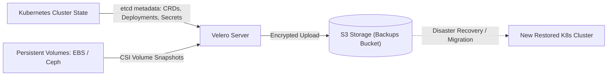
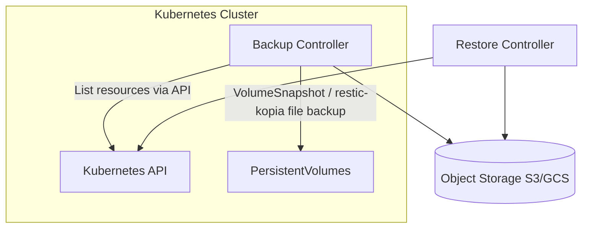

# 🛟 01. Disaster Recovery и бэкапы кластера: Velero

## 🎯 RPO и RTO в Kubernetes

- **RPO (Recovery Point Objective):** Максимально допустимый объем потерянных данных во времени (например, бэкап каждые 4 часа $\to \text{RPO} \le 4\text{h}$).
- **RTO (Recovery Time Objective):** Время, необходимое на полное восстановление работоспособности кластера при аварии.



---

## ⏰ Настройка регулярного расписания бэкапов (Schedule)

Манифест автоматического ежедневного бэкапа production-окружения с хранением 30 дней:

```yaml
apiVersion: velero.io/v1
kind: Schedule
metadata:
  name: daily-production-backup
  namespace: velero
spec:
  schedule: "0 2 * * *" # Каждый день в 02:00 UTC
  template:
    includedNamespaces:
      - production
      - database
    includeClusterResources: true
    snapshotVolumes: true # Снятие CSI снапшотов с дисков PVC
    storageLocation: s3-production-location
    volumeSnapshotLocations:
      - csi-snapshot-location
    ttl: 720h0m0s # Хранить 30 дней (авто-очистка устаревших бэкапов)
```

---

## ⚡ Velero CLI Cheat Sheet

```bash
# 1. Создание ручного бэкапа перед проведением опасных технических работ
velero backup create pre-upgrade-backup \
  --include-namespaces production \
  --wait

# 2. Проверка статуса и прогресса бэкапа
velero backup describe pre-upgrade-backup --details
velero backup logs pre-upgrade-backup

# 3. Полное восстановление неймспейса из бэкапа в случае сбоя
velero restore create --from-backup pre-upgrade-backup

# 4. Восстановление в другой неймспейс (тестирование на stage)
velero restore create \
  --from-backup pre-upgrade-backup \
  --namespace-mappings production:stage-test

# 5. Просмотр всех доступных точек восстановления в S3
velero backup get
```

---

## 🔬 Deep Dive: Velero архитектура и стратегии восстановления



### Что бэкапить и что НЕ бэкапить

| Категория | Бэкап? | Комментарий |
| :--- | :--- | :--- |
| Манифесты workloads | да (или просто Git!) | GitOps часто делает это лишним |
| PVC данные | да, snapshot/file | главное содержимое |
| Secrets | осторожно | зашифрованное хранилище обязательно |
| etcd отдельно | да, отдельным механизмом | `etcdctl snapshot save` — самый быстрый путь полного восстановления |
| CRD + ресурсы операторов | да, но перед restore CRD должны быть | hook ordering |

```bash
# Плановый бэкап с хуками (freeze БД перед снапшотом)
velero backup create nightly \
  --include-namespaces prod \
  --snapshot-volumes --default-volumes-to-fs-backup \
  --wait

velero backup describe nightly --details     # проверить, что реально сохранилось
velero restore create --from-backup nightly \
  --namespace-mappings prod:prod-restored    # восстановление в отдельный NS для проверки!

# Расписание
velero schedule create daily-prod --schedule="0 2 * * *" --include-namespaces prod
```

### RTO/RPO матрица сценариев

| Сценарий | Инструмент | Целевой RTO |
| :--- | :--- | :--- |
| Случайно удален namespace | velero restore | 15 мин |
| Утерян диск/PVC | volume snapshot | 30 мин |
| Полная потеря кластера | IaC recreate + velero + GitOps | 2-4 часа |
| Потеря региона | DR-кластер + DNS failover | часы, тестируется ежеквартально |


---

<!-- enriched:v1 -->

## 🧨 Типовые грабли Production

| Симптом | Причина | Быстрое решение |
| :--- | :--- | :--- |
| Кластер «деградирует» без видимых ошибок | Недореплицированные партиции/PG после отказа ноды | Проверить health/ISR/under-replicated до следующего сбоя |
| Латентность растет линейно с данными | Отсутствие партиционирования/индексов | Разбить по времени/ключу, пересмотреть схему |
| Бэкап есть, восстановления нет | Никогда не проверялся restore | Регулярный drill: restore в staging + checksum |
| После failover дубли/потеря данных | Настройки acks/consistency не осознаны | Зафиксировать гарантии записи в SLA сервиса |

!!! danger «Правило бэкапов»
    Бэкап — это не файл на S3, а **проверенный процесс восстановления** с известным RTO. Не проверенный бэкап = отсутствие бэкапа.

## 🧪 Hands-on Lab

```bash
velero backup-location get && velero backup get | head && \
kubectl get volumesnapshotclasses.velero.io 2>/dev/null; kubectl -n velero logs deploy/velero --tail=15 2>/dev/null | grep -iE 'error|warn' | head -5
```

## ✅ Чек-лист зрелости темы

- [ ] Репликация и кворумные настройки осознаны (не дефолт из quickstart)
- [ ] Мониторинг лагов репликации и очередей настроен с алертами
- [ ] Есть проверенный runbook: отказ ноды / полный restore
- [ ] Ёмкостное планирование: известно, при каком объеме начнутся проблемы
- [ ] Проведено учение по отказу зоны/ноды без потери данных
