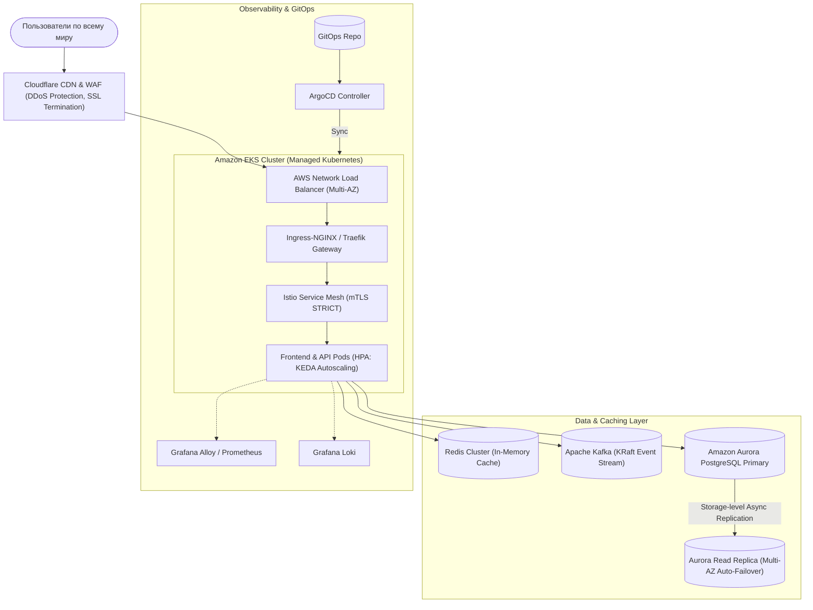
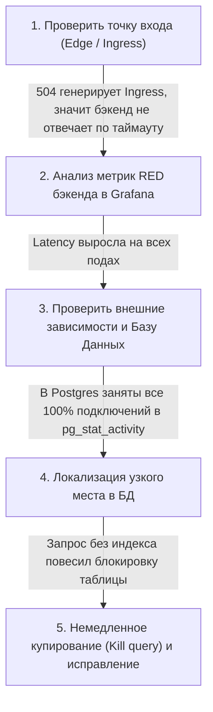
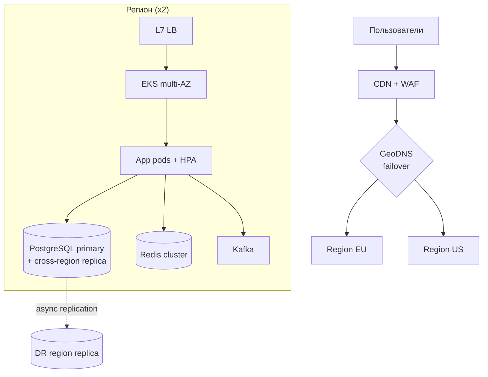

# 🏗️ 02. Архитектурные задачи (System Design) и Разбор инцидентов

## 🗺️ Фреймворк ответа на System Design секциях

При проектировании инфраструктуры используйте последовательный план:
1. **Уточнение требований (Scope & Requirements):** Нагрузка (RPS), объем данных, RPO/RTO, бюджет, Multi-cloud или Single-cloud?
2. **High-Level Архитектура (Диаграмма C4):** DNS, CDN, Edge/WAF, Балансировщики, Оркестратор (K8s), Stateful слой (БД, Кэш, Очереди).
3. **Data Layer (Хранение и репликация):** Шардинг, репликация, консистенция (CAP-теорема), бэкапы.
4. **Безопасность и Observability:** Zero-Trust, mTLS, Vault, Prometheus, Grafana, Distributed Tracing.
5. **Масштабируемость и Отказоустойчивость:** Auto-scaling (HPA, Karpenter/Cluster Autoscaler), Disaster Recovery (Multi-AZ / Multi-Region).

---

## 🏛️ Кейс 1: Проектирование платформы на 50 000 RPS (Multi-AZ & High Availability)



---

## 🚨 Кейс 2: Пошаговый траблшутинг: «Внезапный рост Latency в 10 раз и 504 Gateway Timeout»

Сценарий, который часто дают на live-troubleshooting собеседованиях:



### Чек-лист шагов дежурного инженера:
1. **Проверка Ingress и Балансировщика:** `kubectl logs -n ingress-nginx deploy/ingress-nginx --tail 100` $\to$ Видим `upstream timed out (110: Connection timed out)`.
2. **Проверка метрик CPU Throttling в K8s:** Метрика `rate(container_cpu_cfs_throttled_seconds_total[5m])`. Если процесс троттлится из-за заниженных `resources.limits.cpu`, он перестает отвечать на запросы.
3. **Проверка пула соединений с БД (Connection Pool Exhaustion):** В логах приложения `Timeout waiting for connection from HikariPool / pgx pool`.
4. **Проверка базы данных:**
   ```sql
   -- Ищем блокировки и тяжелые запросы
   SELECT pid, now() - query_start AS duration, query, state 
   FROM pg_stat_activity 
   WHERE state != 'idle' ORDER BY duration DESC LIMIT 5;
   ```
5. **Действие:** Завершить зависший запрос `SELECT pg_terminate_backend(pid)`, временно включить кэширование в Redis и поставить задачу разработчикам на добавление индекса.

---

## 🏗️ Deep Dive: разбор эталона System Design (multi-region SaaS)



### Чек-лист дизайна (что слушает интервьюер)

1. **Числа сначала:** RPS × payload → пропускная способность каждого слоя.
2. **Отказы:** что происходит при смерти AZ? региона? БД? — проговорить явно.
3. **Consistency trade-offs:** synchronous replication = RPO 0, но латентность; async = риск потери последних секунд.
4. **Стоимость:** auto-scaling + spot для stateless; reserved для базы.
5. **Безопасность:** WAF, secrets, network segmentation — хотя бы упомянуть.

### Разбор инцидента: методика post-mortem

| Фаза | Действие | Метрика успеха |
| :--- | :--- | :--- |
| Detection | алерт сработал за минуты | MTTD < 5 мин |
| Mitigation | откат/feature flag off | MTTR < 30 мин |
| Diagnosis | root cause найден | точно, не «починилось само» |
| Prevention | action items в бэклоге с владельцем | выполнены за квартал |

**Пример разбора (DNS outage):**
Symptom: 50% запросов таймаутятся → Impact: checkout недоступен 22 мин, −$15k → Timeline: 14:02 deploy CoreDNS → 14:07 alert → 14:12 rollback → Root cause: NodeLocal DNSCache конфликт версий → Action items: canary на инфра-компонентах, chaos-test DNS.

!!! tip «Что спрашивают дополнительно»
    Всегда будьте готовы углубиться на 3 уровня: «как работает keepalive» → «какие заголовки» → «что если LB между ними». Глубина > широта.


---

<!-- enriched:v1 -->

## 🧨 Типовые грабли Production

| Симптом | Причина | Быстрое решение |
| :--- | :--- | :--- |
| Кластер «деградирует» без видимых ошибок | Недореплицированные партиции/PG после отказа ноды | Проверить health/ISR/under-replicated до следующего сбоя |
| Латентность растет линейно с данными | Отсутствие партиционирования/индексов | Разбить по времени/ключу, пересмотреть схему |
| Бэкап есть, восстановления нет | Никогда не проверялся restore | Регулярный drill: restore в staging + checksum |
| После failover дубли/потеря данных | Настройки acks/consistency не осознаны | Зафиксировать гарантии записи в SLA сервиса |

!!! danger «Правило бэкапов»
    Бэкап — это не файл на S3, а **проверенный процесс восстановления** с известным RTO. Не проверенный бэкап = отсутствие бэкапа.

## 🧪 Hands-on Lab

```bash
# (лаборатория опциональна для этой темы)
```

## ✅ Чек-лист зрелости темы

- [ ] Репликация и кворумные настройки осознаны (не дефолт из quickstart)

    ??? tip "Как закрыть пункт"
        Число реплик и фактор синхронной записи выбраны от требования потери данных: RF≥3, write concern/majority или min.insync.replicas=2 для Kafka. Проверка: конфигурация задокументирована комментарием «почему столько», отказ одной реплики не останавливает запись (проверено в стенде).

- [ ] Мониторинг лагов репликации и очередей настроен с алертами

    ??? tip "Как закрыть пункт"
        Метрики: lag вторичек (pg_stat_replication/kafka consumer lag/redis offset), размер очередей, age of oldest message. Алерт при lag > порога N минут. Проверка: остановить реплику — алерт пришёл до того, как заметили люди.

- [ ] Есть проверенный runbook: отказ ноды / полный restore

    ??? tip "Как закрыть пункт"
        Два сценария по шаблону из [13.2]: замена одного узла (шаги + время) и полное восстановление из бэкапа. Runbook проверен руками за последние 90 дней — дата прогона в шапке документа.

- [ ] Ёмкостное планирование: известно, при каком объеме начнутся проблемы

    ??? tip "Как закрыть пункт"
        Знакомы три числа: текущий объём данных/RPS, скорость роста за квартал, предел текущей архитектуры (диск/IOPS/память индексов). Алерт на 70% предела; план масштабирования написан ДО его наступления.

- [ ] Проведено учение по отказу зоны/ноды без потери данных

    ??? tip "Как закрыть пункт"
        Сценарий: выключаем узел/AZ (docker stop / drain), наблюдаем выборы/переключение по часам, сверяем отсутствие потери подтверждённых записей. Результат учения (время, найденные грабли) фиксируется в runbook'е.

---

## 🧭 Что дальше

| Шаг | Материал |
| :--- | :--- |
| 🚑 Симуляции | [Прогон инцидентов на время](../17-break-fix/01-incident-simulations.md) |
