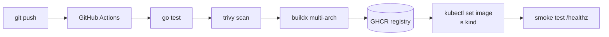

# 🚀 Lab 04: CI/CD пайплайн end-to-end

> **Время:** 90 минут | **Уровень:** Middle | **Нужно:** GitHub аккаунт, Docker, kubectl+kind из Lab 03
> **Результат:** push в main → тесты → образ в GHCR → деплой в kind. Полный цикл как в проде.

## 🧭 Архитектура лабы



---

## 🧪 Часть 1: Репозиторий приложения (10 мин)

```bash
mkdir shop-api && cd shop-api && git init
# Скопируйте main.go/go.mod из Lab 02 или создайте заново
cat > Dockerfile <<'EOF'
FROM golang:1.23-alpine AS b
WORKDIR /src
COPY . .
RUN --mount=type=cache,target=/go/pkg/mod CGO_ENABLED=0 go build -o /srv ./src

FROM gcr.io/distroless/static-debian12:nonroot
COPY --from=b /srv /server
USER nonroot
EXPOSE 8080
ENTRYPOINT ["/server"]
EOF

gh repo create shop-api --public --source=. --push   # или создайте вручную на github.com
```

---

## 🧪 Часть 2: Workflow (30 мин)

```bash
mkdir -p .github/workflows && cat > .github/workflows/ci.yaml <<'EOF'
name: CI/CD

on:
  push: { branches: [main] }
  pull_request: { branches: [main] }

env:
  REGISTRY: ghcr.io
  IMAGE: ghcr.io/${{ github.repository }}

jobs:
  test:
    runs-on: ubuntu-latest
    steps:
      - uses: actions/checkout@v4
      - uses: actions/setup-go@v5
        with: { go-version: "1.23", cache: true }
      - run: go vet ./... && go test ./...

  scan:
    needs: test
    runs-on: ubuntu-latest
    steps:
      - uses: actions/checkout@v4
      - name: Trivy filesystem scan
        uses: aquasecurity/trivy-action@master
        with:
          scan-type: fs
          severity: CRITICAL,HIGH
          exit-code: "1"

  build-push:
    if: github.ref == 'refs/heads/main'
    needs: scan
    permissions: { contents: read, packages: write }
    runs-on: ubuntu-latest
    steps:
      - uses: actions/checkout@v4
      - uses: docker/login-action@v3
        with:
          registry: ${{ env.REGISTRY }}
          username: ${{ github.actor }}
          password: ${{ secrets.GITHUB_TOKEN }}     # встроенный токен, без секретов!
      - uses: docker/build-push-action@v6
        with:
          context: .
          push: true
          tags: |
            ${{ env.IMAGE }}:${{ github.sha }}
            ${{ env.IMAGE }}:latest
          cache-from: type=gha
          cache-to: type=gha,mode=max

  deploy:
    if: github.ref == 'refs/heads/main'
    needs: build-push
    runs-on: ubuntu-latest       # ⚠️ в реале — self-hosted runner внутри сети кластера!
    steps:
      - name: Deploy to kind
        run: |
          echo "${{ secrets.KUBECONFIG_B64 }}" | base64 -d > kc
          export KUBECONFIG=kc
          kubectl -n shop set image deploy/api api=${{ env.IMAGE }}:${{ github.sha }}
          kubectl -n shop rollout status deploy/api --timeout=120s
      - name: Smoke test
        run: |
          sleep 5
          kubectl -n shop get pods -l app=api | grep Running || exit 1
```

**Ключевые идеи, которые проверяют на собеседованиях:**

| Идея | Где здесь |
| :--- | :--- |
| `GITHUB_TOKEN` вместо PAT | права только на свой репо, авто-ротация |
| Scan до build | fail fast, экономия минут билда |
| digest-теги (`github.sha`) | воспроизводимость: какой коммит = какой образ |
| `needs:` DAG | параллельность где можно, порядок где надо |
| deploy отдельным job | легко добавить environment protection (approval) |

---

## 🧪 Часть 3: Секрет для деплоя (15 мин)

```bash
# Экспортируем kubeconfig вашего kind-кластера в секреты GitHub
kind get kubeconfig --name lab3 | base64 -w0 > kc.b64
gh secret set KUBECONFIG_B64 < kc.b64
rm kc.b64   # не оставляем креды на диске!

# Разрешаем GHCR читать образы (для kind pull)
kubectl create secret docker-registry ghcr-pull \
  --docker-server=ghcr.io --docker-username=<ВАШ_GH_USER> \
  --docker-password=<GH_PAT с read:packages> -n shop
kubectl patch serviceaccount default -n shop \
  -p '{"imagePullSecrets":[{"name":"ghcr-pull"}]}'
```

> 💡 kind и ваш докер могут делить образы напрямую: после build-push выполните локально `docker pull ghcr.io/<user>/shop-api:<sha>` — если вы залогинены в GHCR, pull пройдёт.

---

## 🧪 Часть 4: Запуск цикла (15 мин)

```bash
git add -A && git commit -m "feat: initial ci pipeline" && git push
gh run watch        # смотрите живьём все job'ы

# Сломайте тест специально — пайплайн должен остановиться ДО деплоя:
echo 'package src; var x = 1' >> src/broken.go   # синтаксическая ошибка? нет, добавим фейл:
echo 'func TestFail(t *testing.T){ t.Fatal("boom") }' >> src/main_test.go
git add -A && git commit -m "test: intentional failure" && git push
gh run watch        # ❌ test failed → deploy НЕ запустился. Это и есть защита.
git revert HEAD --no-edit && git push   # починили откатом
```

---

## 🧪 Часть 5: Environment protection (10 мин)

На GitHub: **Settings → Environments → New environment `production`** → Required reviewers = вы.
В workflow замените `deploy:` на:

```yaml
  deploy:
    environment: production     # теперь требует ручного approve в UI!
```

Push → в run появится кнопка **Review deployments**. Так работают approvals в проде.

---

## 🎯 Домашнее задание

1. Добавьте job с `golangci-lint` (action: golangci/golangci-lint-action).
2. Добавьте публикацию SBOM артефактом (`anchore/sbom-action`).
3. Замените `latest`-тег на семвер через git tag + условие `startsWith(github.ref, 'refs/tags/')`.

## ✅ Чек-лист

- [ ] Пайплайн падает при падении теста — деплой не происходит
- [ ] Понимаю каждый блок workflow, могу переписать без подглядывания
- [ ] Знаю, зачем environment protection и где включить
- [ ] Объясню разницу GITHUB_TOKEN vs Personal Access Token

**Что дальше:** [Lab 05 — Terraform](05-lab-terraform-localstack.md)
