# 🧪 Lab 12: Сквозной E2E Production Track — Build → Deploy → Observe → Incident → Fix → Verify

> Единственный lab, который связывает всё: `Git → CI (build+scan) → Registry → GitOps (Flux) → K8s (Service + HPA) → Prometheus (alert) → Loki (logs) → Incident → Diagnosis → Fix → Postmortem`. Локально на `kind` без облака.

**Время:** 45–60 мин. **Стенд:** `kind`, `Docker`, `kubectl`, `helm`, `kustomize`, `flux` или `argocd` (выбор), `curl`, `jq`.

---

## 🏗️ Архитектура трека

```mermaid
graph LR
    Dev["Developer: git commit"] --> CI["CI: build image + Trivy scan + SBOM + cosign (keyed)"]
    CI --> Reg["Registry: kind registry :5001"]
    Reg --> GitOps["GitOps: Flux Kustomization / ArgoCD Application"]
    GitOps --> K8s["K8s: Deployment + Service + HPA"]
    K8s --> Mon["Prometheus: scrape /metrics, Alert HostHighErrorRate"]
    K8s --> Logs["Loki: logs via Alloy"]
    Logs --> Alert["Alertmanager → Telegram/Webhook"]
    Alert --> Incident["Incident: 500x spike"]
    Incident --> Diag["Diagnosis: logs + metrics + traces"]
    Diag --> Fix["Fix: rollout undo / hotfix commit"]
    Fix --> Verify["Verification: health + SLO"]
    Verify --> PM["Postmortem markdown"]
```



---

## 0. Подготовка: kind + registry + observability

```bash
# Kind cluster с портами для registry и Grafana
cat > /tmp/kind-e2e.yaml <<'EOF'
kind: Cluster
apiVersion: kind.x-k8s.io/v1alpha4
nodes:
  - role: control-plane
    extraPortMappings:
      - containerPort: 30000
        hostPort: 30000
      - containerPort: 30001
        hostPort: 30001
      - containerPort: 30002
        hostPort: 30002
EOF
kind create cluster --name e2e --config /tmp/kind-e2e.yaml

# Локальный registry
docker run -d --name kind-registry -p 5001:5000 --restart=always registry:2
docker network connect kind kind-registry 2>/dev/null || true
# kind знает registry
kubectl apply -f - <<'YAML'
apiVersion: v1
kind: ConfigMap
metadata: { name: local-registry-hosting, namespace: kube-public }
data:
  localRegistryHosting.v1: |
    host: "localhost:5001"
    help: "https://kind.sigs.k8s.io/docs/user/local-registry/"
YAML

# Prometheus + Loki быстрый (kube-prometheus-stack + loki)
helm repo add prometheus-community https://prometheus-community.github.io/helm-charts
helm repo add grafana https://grafana.github.io/helm-charts
helm repo update

helm install kps prometheus-community/kube-prometheus-stack -n monitoring --create-namespace \
  --set grafana.adminPassword=admin --wait --timeout 10m

helm install loki grafana/loki -n monitoring --create-namespace \
  --set loki.auth_enabled=false --set singleBinary.replicas=1 --wait

# Alloy для логов
helm install alloy grafana/alloy -n monitoring \
  --set alloy.configMap.content='loki.source.kubernetes "pods" { forward_to = [loki.write.default.receiver] } loki.write "default" { endpoint { url = "http://loki-gateway.monitoring.svc:3100/loki/api/v1/push" } }'

kubectl -n monitoring get pods
```

---

## 1. App: мини-сервис с /metrics и логи

```bash
mkdir -p /tmp/e2e-app && cat > /tmp/e2e-app/main.py <<'PY'
from fastapi import FastAPI
from prometheus_client import Counter, Histogram, make_asgi_app
import time, logging, json, sys, random

app = FastAPI()
REQS = Counter('http_requests_total','reqs',['code','method'])
LAT = Histogram('http_request_duration_seconds','lat',['path'])

logging.basicConfig(stream=sys.stdout, level=logging.INFO, format='%(message)s')

@app.get("/")
def root():
    start=time.time()
    # 5% ошибок для демо алерта
    if random.random()<0.05:
        REQS.labels(code="500",method="GET").inc()
        logging.info(json.dumps({"level":"error","msg":"db timeout","code":500,"lat":time.time()-start}))
        return {"error":"db timeout"}, 500
    REQS.labels(code="200",method="GET").inc()
    logging.info(json.dumps({"level":"info","msg":"ok","code":200,"lat":time.time()-start}))
    LAT.labels(path="/").observe(time.time()-start)
    return {"ok":1}

app.mount("/metrics", make_asgi_app())
PY
cat > /tmp/e2e-app/Dockerfile <<'DF'
FROM python:3.12-slim
RUN pip install fastapi uvicorn prometheus-client
COPY main.py /app/main.py
CMD ["uvicorn","app:app","--host","0.0.0.0","--port","8000"]
DF
cat > /tmp/e2e-app/requirements.txt <<'REQ'
fastapi
uvicorn
prometheus-client
REQ
```

---

## 2. CI локально: build → Trivy → SBOM → push → digest

```bash
IMAGE=localhost:5001/e2e-app:v1.0.0
docker build -t $IMAGE /tmp/e2e-app
docker push $IMAGE
DIGEST=$(docker inspect --format '{{index .RepoDigests 0}}' $IMAGE)
echo "Digest: $DIGEST"

# Scan (fail on HIGH)
docker run --rm -v /var/run/docker.sock:/var/run/docker.sock aquasec/trivy image --severity HIGH,CRITICAL --exit-code 1 $IMAGE || echo "High found — fix before prod"

# SBOM
docker run --rm -v /tmp:/out aquasec/trivy image --format spdx-json --output /out/sbom.json $IMAGE
cat /tmp/sbom.json | jq '.packages | length'  # пакетов
# Attest keyed (локально)
cosign generate-key-pair --output-key-prefix /tmp/cosign  --output-key-prefix /tmp/cosign 2>/dev/null || true
COSIGN_PASSWORD="" cosign sign --key /tmp/cosign.key $DIGEST || echo "keyless needs OIDC — skip locally"
```

---

## 3. GitOps: Flux Kustomization (или ArgoCD)

**Flux вариант (рекомендован):**

```bash
flux install --components=source-controller,kustomize-controller

mkdir -p /tmp/e2e-gitops/clusters/e2e/apps
cat > /tmp/e2e-gitops/clusters/e2e/apps/kustomization.yaml <<'YAML'
apiVersion: kustomize.config.k8s.io/v1beta1
kind: Kustomization
resources: [../../base]
namespace: prod
images:
  - name: e2e-app
    newName: localhost:5001/e2e-app
    newTag: v1.0.0
YAML
mkdir -p /tmp/e2e-gitops/base
cat > /tmp/e2e-gitops/base/deployment.yaml <<'YAML'
apiVersion: apps/v1
kind: Deployment
metadata: { name: e2e-app, namespace: prod }
spec:
  replicas: 2
  selector: { matchLabels: { app: e2e-app } }
  template:
    metadata: { labels: { app: e2e-app } }
    spec:
      containers:
        - name: app
          image: localhost:5001/e2e-app:v1.0.0
          ports: [{ containerPort: 8000 }]
          readinessProbe: { httpGet: { path: /, port: 8000 }, initialDelaySeconds: 3 }
          livenessProbe:  { httpGet: { path: /, port: 8000 }, periodSeconds: 10 }
          env:
            - name: LOG_LEVEL
              value: info
YAML
cat > /tmp/e2e-gitops/base/service.yaml <<'YAML'
apiVersion: v1
kind: Service
metadata: { name: e2e-app, namespace: prod }
spec:
  selector: { app: e2e-app }
  ports: [{ port: 80, targetPort: 8000 }]
YAML
cat > /tmp/e2e-gitops/base/hpa.yaml <<'YAML'
apiVersion: autoscaling/v2
kind: HorizontalPodAutoscaler
metadata: { name: e2e-app, namespace: prod }
spec:
  scaleTargetRef: { apiVersion: apps/v1, kind: Deployment, name: e2e-app }
  minReplicas: 2
  maxReplicas: 5
  metrics:
    - type: Resource
      resource: { name: cpu, target: { type: Utilization, averageUtilization: 50 } }
YAML

kubectl create ns prod flux-system
flux create source git e2e --url=file:///tmp/e2e-gitops --branch=main --interval=1m || flux create source git e2e --url=https://github.com/fluxcd/flux2-kustomize-controllers --branch=main --interval=1m
flux create kustomization e2e --source=GitRepository/e2e --path="./base" --prune=true --interval=1m --target-namespace=prod --wait=true --health-check="Deployment/e2e-app.prod"
kubectl -n prod get deploy,pods,hpa
```

**ArgoCD вариант:** `argocd app create e2e --repo file:///tmp/e2e-gitops --path base --dest-server https://kubernetes.default.svc --dest-namespace prod --sync-policy automated`.

---

## 4. Observe: Prometheus + Grafana + Loki

```bash
kubectl apply -f - <<'YAML'
apiVersion: monitoring.coreos.com/v1
kind: ServiceMonitor
metadata: { name: e2e-app, namespace: prod, labels: { release: kps } }
spec:
  selector: { matchLabels: { app: e2e-app } }
  endpoints: [{ port: http, interval: 10s, path: /metrics }]
YAML

# PrometheusRule: алерт на 5xx >5% 5m
kubectl apply -f - <<'YAML'
apiVersion: monitoring.coreos.com/v1
kind: PrometheusRule
metadata: { name: e2e-alerts, namespace: prod, labels: { release: kps } }
spec:
  groups:
    - name: e2e
      interval: 15s
      rules:
        - alert: HostHighErrorRate
          expr: sum(rate(http_requests_total{code=~"5.."}[5m])) / sum(rate(http_requests_total[5m])) > 0.05
          for: 1m
          labels: { severity: critical }
          annotations:
            summary: "High 5xx rate"
            runbook_url: "https://wiki/runbooks/high-5xx"
YAML

# Порт-форвард Grafana
kubectl -n monitoring port-forward svc/kps-grafana 3000:80 &
# Логин admin/admin → Explore Loki: {namespace="prod"} |= "error"
```

---

## 5. Detect: вызвать инцидент

```bash
# Генератор нагрузки с 5% ошибок уже в коде — нагрузим:
for i in $(seq 1 200); do curl -s http://localhost:30000/ -H "Host: e2e-app.prod" > /dev/null & done; wait
sleep 60
curl -s http://localhost:9090/api/v1/alerts | jq '.data.alerts[] | select(.labels.alertname=="HostHighErrorRate") | .state'

# Логи в Loki: проверить burst
curl -s -G http://localhost:3100/loki/api/v1/query --data-urlencode 'query={namespace="prod"} |= "error"' | jq .
```

---

## 6. Diagnose: первые 60 секунд

```bash
# 60s обзор (как в 01-05)
uptime; kubectl -n prod get pods -o wide; kubectl top pods -n prod
kubectl -n prod logs -l app=e2e-app --tail=50 | grep -E '"level":"error"' | jq -s 'group_by(.request_id) | length'

# Метрики: ttfb vs app latency
curl -so /dev/null -w 'ttfb=%{time_starttransfer} total=%{time_total}\n' http://localhost:30000/

# Порты: закрыт или app лежит?
kubectl -n prod get endpoints e2e-app
kubectl describe pod -n prod -l app=e2e-app | grep -A5 Readiness
```

**Гипотеза:** 5% ошибок — код рандома `if random()<0.05`. Fix — убрать искусственную ошибку.

---

## 7. Fix: hotfix vs rollback

**Вариант A — GitOps hotfix (правильный):**

```bash
# Правим deployment в Git
sed -i 's/if random.random()<0.05/if False/' /tmp/e2e-app/main.py
docker build -t localhost:5001/e2e-app:v1.0.1 /tmp/e2e-app && docker push localhost:5001/e2e-app:v1.0.1
# Обновить GitOps kustomization: images.newTag: v1.0.1 + commit + push → Flux reconcile
flux reconcile source git e2e && flux reconcile kustomization e2e --with-source
kubectl -n prod rollout status deploy/e2e-app --timeout=60s
```

**Вариант B — быстрый rollback (если предыдущая версия 200 OK):**

```bash
kubectl -n prod rollout undo deploy/e2e-app
kubectl -n prod rollout status deploy/e2e-app
```

---

## 8. Verify + Postmortem

```bash
# Verification
for i in $(seq 1 50); do curl -s http://localhost:30000/ | grep -q ok && echo -n "."; done; echo " OK"
curl -s http://localhost:9090/api/v1/query --data-urlencode 'query=sum(rate(http_requests_total{code="200"}[5m]))' | jq .data.result[0].value[1]
# Должно 0 ошибок:
curl -s 'http://localhost:9090/api/v1/query?query=sum(rate(http_requests_total{code=~"5.."}[5m]))' | jq .data.result

# Postmortem шаблон
cat > /tmp/postmortem-2026-08-28.md <<'PM'
# Postmortem: HostHighErrorRate 2026-08-28 10:15 UTC
## Summary: 5xx 5% 3м, затронуто 200 запросов
## Impact: 10 ошибок/200, SLO error budget -2%
## Timeline: 10:10 deploy v1.0.0 → 10:12 alert firing → 10:14 diagnose logs → 10:18 fix v1.0.1 → 10:20 recovered
## Root cause: искусственная 5% ошибка в коде + нет теста на error-rate
## Action items: добавить `pytest` на 0% 5xx + `trivy` gate + `Alert runbook_url` + `SLI p99 <300ms`
## Owner: team platoon
PM
cat /tmp/postmortem-2026-08-28.md
```

---

## ✅ Чек-лист E2E зрелости

- [ ] Build → Registry → GitOps: `imagePullSecrets` нет, digest, не тег
- [ ] Deploy с `readinessProbe`, `HPA`, `ServiceMonitor`, `PrometheusRule` + `Loki` логи
- [ ] Alert `>5% 5xx` firing за 60с от нагрузки, logs коррелируют `request_id`
- [ ] Diagnosis <5м: `kubectl describe`, `logs --previous`, `curl -w` ttfb
- [ ] Fix <10м: `git commit v1.0.1 → flux reconcile` или `rollout undo`
- [ ] Verify: `curl 50×` 0 errors, `sum(rate(200))` восстановлен
- [ ] Postmortem с Owner/Date, `cost` и `prevention` (тест + gate)

---

## 🧭 Что дальше

| Шаг | Материал |
|---|---|
| 🔬 Закрепить | [Observability](../09-observability/09-monitoring-stack-architecture.md) — SLO/error budget |
| 💪 Практика | [Break-Fix: 500x](../17-break-fix/01-incident-simulations.md) — `Incident 7` |
| 🎤 Проверить | [SRE](../09-observability/10-sre-practices-incident-management.md) — postmortem шаблон |

<!-- enriched:v1 -->
