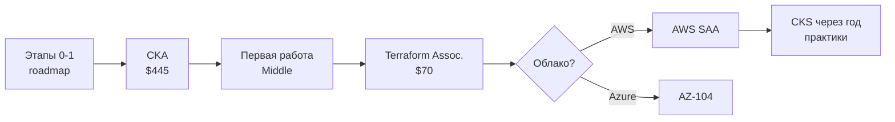

# 🎓 Сертификаты и ресурсы: полный гид

## 🏆 Сертификаты: стоит ли, какие, когда

### Kubernetes (CNCF) — главные для DevOps

| Сертификат | Формат | Цена | Сложность | Когда сдавать |
| :--- | :--- | :--- | :--- | :--- |
| **CKA** | 2ч практика в живом кластере | $445 | ⭐⭐⭐⭐ | После этапа 2 roadmap |
| CKAD | 2ч практика | $445 | ⭐⭐⭐ | Если уклон в разработку |
| **CKS** | 2ч практика (безопасность) | $445 | ⭐⭐⭐⭐⭐ | После года работы с K8s |

**Важно:** CKA/CKAD/CKS — экзамены **без вариантов ответов**: только реальные задачи в терминале. Поэтому они реально ценятся. Действительны 2 года.

```text
Программа CKA (проверьте актуальную!): 
25% Cluster Architecture | 15% Workloads & Scheduling
20% Services & Networking | 10% Storage | 30% Troubleshooting
```

### IaC и облака

| Сертификат | Цена | Комментарий |
| :--- | :--- | :--- |
| HashiCorp Terraform Associate | $70.50 | Дешёвая, теоретическая. Брать после этапа 3 |
| AWS Solutions Architect Associate | $150 | Стандарт индустрии, если AWS-регион |
| Azure AZ-104 | $165 | Для компаний на Microsoft-стеке |
| GCP Professional Cloud Architect | $200 | Редко, но весомо |

### Linux

| Сертификат | Комментарий |
| :--- | :--- |
| LFCS | Практический Linux от Linux Foundation — хороший старт |
| RHCSA | Только если целитесь в компании на RHEL |

### 📊 Мой порядок для максимального эффекта



💡 **Хитрость:** CNCF даёт скидку при покупке бандлов (CKA+CKAD), а KodeKloud/Mumshad курс + killer.sh (2 репетиции входят в ваучер!) покрывают подготовку на 100%.

---

## 📚 Книги: маршрут чтения

### Обязательные (по этапам)

| # | Книга | Этап | Зачем |
| :--- | :--- | :--- | :--- |
| 1 | Phoenix Project (Kim) | до старта | Мотивация, видение DevOps культуры |
| 2 | The DevOps Handbook (там же авторы) | после Phoenix | Конкретные практики |
| 3 | Kubernetes Up & Running (Hightower) | этап 2 | Фундамент K8s от создателей |
| 4 | Google SRE Book ([бесплатно онлайн](https://sre.google/sre-book/table-of-contents/)) | этап 4 | SLO, инциденты, on-call — библия SRE |
| 5 | Terraform Up & Running (Brikman) | этап 3 | IaC best practices |
| 6 | Designing Data-Intensive Applications (Kleppmann) | этап 4-5 | Как устроены распределённые системы ВНУТРИ |
| 7 | Site Reliability Workbook | этап 5 | Практика к теории SRE Book |

### Углублённые (выборочно по темам)

- **Linux:** «How Linux Works» (Ward) → «Performance» (Gregg) — библия производительности
- **Сети:** «Computer Networking: Top-Down Approach» (Kurose)
- **Безопасность:** «Container Security» (Liggett, O'Reilly)
- **Go:** «Learning Go» (Bodner) если пошли в операторы

---

## 🆓 Бесплатные ресурсы (качественные!)

### Интерактивные площадки

| Ресурс | Что даёт |
| :--- | :--- |
| [killercoda.com](https://killercoda.com) | Сценарии K8s/Linux прямо в браузере, бесплатно |
| [iximiuz labs](https://labs.iximiuz.com) | Контейнеры/сеть изнутри (часть бесплатно) |
| [play-with-docker](https://labs.play-with-docker.com) | Docker-песочница без установки |
| [katacoda-альтернативы](https://kodekloud.com/free-labs) | KodeKloud free labs |

### Курсы

- **MIT Missing Semester** (youtube + материалы) — shell/git/debugging как надо
- **Introduction to Kubernetes (LFS158)** — бесплатный официальный курс Linux Foundation
- **AWS Skill Builder Free Tier / Microsoft Learn** — официальные бесплатные треки облаков
- **Kubernetes docs tutorials** — недооценены, пройдите все

### YouTube-каналы (RU/EN)

| Канал | Язык | Тематика |
| :--- | :--- | :--- |
| TechWorld with Nana | EN | Лучший вход в DevOps |
| KodeKloud | EN | Глубина по K8s/CKA |
| Cloud Advocate (Александр Кульбикаев) | RU | AWS/Azure глубоко |
| Southbridge | RU | Linux/инфраструктура, чаты помощи |
| Slurm (Озон Тех) | RU | K8s/CI-CD вебинары |
| CNCF [Cloud Native] | EN | Записи KubeCon — доки уровня senior |

### Подкасты и рассылки (для дороги на работу)

- «Ламповый DevOps» (RU) — интервью с практиками
- Ship It! (Changelog) — SRE/platform темы
- kubelist + DevOps'ish — недельные дайджесты новостей
- TLDR DevOps — пятиминутное чтение утром

---

## 🧠 Как учиться эффективно (наука, не мотивация)

1. **Active recall > перечитывание.** Прочитали про NetworkPolicy? Закройте статью, напишите политику с нуля. Провал = нормально, это и есть обучение.
2. **Spaced repetition.** Anki-карточки по командам (`kubectl`, `helm`, PromQL). 10 минут в день.
3. **Feynman technique.** Объясните тему «резиновому утёнку»/в блоге. Где запнулись — там дыра.
4. **Break things deliberately.** После каждой лабы — сломайте её сами тремя способами.
5. **Публичность = ответственность.** Ведите блог/Telegram о прогрессе. Даже 200 подписчиков заставляют доводить до конца.

!!! success "Формула трудоустройства"
    **2 проекта из портфолио + homelab + CKA + умение рассказать про них** ≈ оффер Junior/Middle за 4-6 месяцев системной подготовки. Всё остальное — детали.
