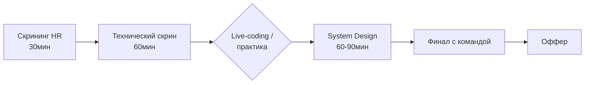

# 📄 Резюме, собеседования и первые 90 дней

## 📝 Резюме, которое читают

### Структура (1-2 страницы максимум)

```text
ИМЯ ФАМИЛИЯ — DevOps Engineer
Город / Telegram / GitHub / Email        ← GitHub с проектами ОБЯЗАТЕЛЕН

SUMMARY (3 строки)
DevOps инженер: Docker/K8s/GitLab CI. Автоматизировал деплой 
12 микросервисов, сократил релизный цикл с 2 недель до 1 дня.
CKA certified. Портфолио: github.com/me

ОПЫТ (в обратном хронологическом порядке, глаголы + цифры!)
Проект/Компания | Роль | даты
• Сократил время деплоя с 40 мин до 6 мин (GitLab CI кэш + kaniko)
• Внедрил мониторинг: Prometheus+Grafana, MTTD снизился с часов до минут  
• Перевёл 15 сервисов в Kubernetes, настроил HPA — экономия 30% инстансов
• Написал 20+ Ansible ролей с Molecule тестами

НАВЫКИ (группами, честно по уровням)
Containers: Docker, containerd, Podman | K8s: kind/k3s/EKS
IaC: Terraform, Ansible | CI/CD: GitLab CI, GitHub Actions, ArgoCD
Obs: Prometheus, Grafana, Loki | Языки: Bash, Python, Go(basics)

СЕРТИФИКАТЫ И ПРОЕКТЫ
CKA-2025 • [Проект 1](ссылка): краткое описание результата
```

### ❌ Плохой буллет vs ✅ хороший

| ❌ Так не пишут о вас | ✅ Так пишут о себе |
| :--- | :--- |
| «Занимался поддержкой серверов» | «Администрировал 40 Linux-серверов (Debian), uptime 99.95%» |
| «Работал с Kubernetes» | «Мигрировал 8 сервисов в EKS, настроил HPA/PDB — минус 35% стоимости» |
| «Знаю Terraform» | «Написал модульную TF-структуру на 200+ ресурсов с CI-plan на PR» |
| «Отвечал за мониторинг» | «Развернул kube-prometheus-stack, написал 50 алертов, MTTA < 10 мин» |

**Формула буллета:** *Действие + технология + измеримый результат.*

### ATS-оптимизация (роботы фильтруют до HR)

Вакансия требует «kubernetes, helm, gitlab»? Эти слова должны быть в резюме **дословно**. Не пишите только «K8s» если ищут «Kubernetes» — используйте оба варианта.

---

## 🎤 Собеседование: этапы и как проходить



### Этап 1: Скрининг HR — подготовьте заранее

- Рассказ о себе за 2 минуты: кто я, что умею, почему сюда.
- Зарплатные ожидания: называйте диапазон после вопроса, верхняя граница = желаемая +15%.
- Вопросы HR про компанию — минимум 3 (продукт, команда, процессы).

### Этап 2-4: Техника — что реально спрашивают

Используйте раздел [14-interview-prep](../14-interview-prep/01-devops-interview-core-qa.md) — там банк из 100+ реальных вопросов. Топ тем по частоте:

1. Разница Deployment/DaemonSet/StatefulSet + когда какой
2. Что происходит при `kubectl apply` (полный путь через apiserver)
3. Liveness vs readiness vs startup probes
4. Service types + kube-proxy iptables/IPVS
5. Terraform state: зачем remote backend, блокировки
6. Написать Dockerfile для X (проговорите multi-stage, nonroot, кэш!)
7. PromQL: посчитать error rate / p99
8. Debug пода в CrashLoopBackOff — проговорите чек-лист вслух

**Live-терминал:** вас могут попросить починить сломанный кластер в реальном времени. Прогоните все 10 сценариев из [17-break-fix](../17-break-fix/01-incident-simulations.md) — там ровно это.

### ❓ Ваши вопросы работодателю (по ним оценивают!)

- «Как выглядит процесс выката в прод? Кто отвечает?»
- «Есть ли on-call? Какая компенсация и частота алертов?»
- «Что случилось за последний год из крупных инцидентов? Как разбирали?»
- «Тестовая среда есть у каждого разработчика или общая staging?»
- «Почему открыта вакансия — рост команды или замена?»

Красные флаги ответов: «у нас всё руками», «мониторинг настроим потом», on-call без компенсации.

---

## 💰 Оффер и переговоры

### Оценивайте total compensation

| Компонент | Вопрос |
| :--- | :--- |
| Оклад gross/net? | Белая ли зарплата, когда индексация? |
| Бонусы | KPI понятны? Выплаты реальные или «до 100%»? |
| On-call доплаты | Частота дежурств × ставка |
| Обучение | Оплачивают конференции/сертификаты? |
| Техника | Ноутбук какой? Доплата за свой? |

**Переговоры:** получив оффер, всегда просите паузу 24-48ч («мне нужно подумать»). С другим оффером на руках торгуйтесь спокойно и корректно. Без альтернативы — торговаться можно один раз, мягко.

### Первые 90 дней на новом месте (план!)

| Недели | Цель |
| :--- | :--- |
| 1-2 | Настроить окружение, прочитать runbooks, познакомиться со всеми лично |
| 3-4 | Взять первый небольшой тикет и закрыть идеально. Найти «своего» ментора |
| 5-8 | Взять задачу средней сложности. Задокументировать найденные проблемы (не чинить молча!) |
| 9-12 | Предложить улучшение процесса с планом и оценкой эффекта |

!!! tip "Главное правило новичка"
    Первые месяцы задавайте вопросы смело и записывайте ответы. Один вопрос стыден один раз; одна ошибка на проде — навсегда. Никто не ожидает от нового человека знания их легаси.

---

## 🚀 Чек-лист готовности искать работу

- [ ] 2+ проекта из [портфолио](02-portfolio-projects.md) завершены и оформлены
- [ ] Homelab работает, есть скриншоты/диаграмма для рассказа
- [ ] CKA сдана (или уверенно решаете killer.sh >70%)
- [ ] Прошли все 10 break-fix сценариев на время
- [ ] Ответили на 80% банка вопросов из раздела 14 без подсматривания
- [ ] Резюме проверено на ATS (jobscan/resume-worded) и живым человеком
- [ ] LinkedIn/hh обновлены, включён режим «рассмотрю предложения»

Если 6 из 7 ✅ — начинайте откликаться. Первый оффер редко приходит первым же собесом: рассматривайте ранние отказы как тренировку.
