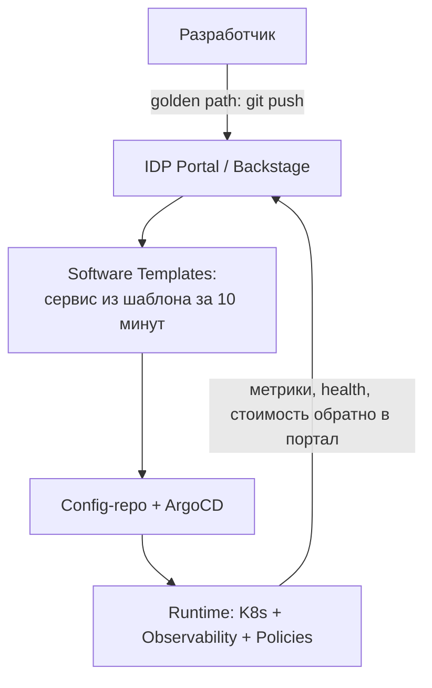

# 🏗️ 20.18 Platform Engineering: IDP, Golden Paths и Backstage

> Платформенная инженерия — продукт-подход к внутренней инфраструктуре: платформа как продукт, разработчики — её клиенты.

### 3.1 Теория

**Platform Engineering ≠ DevOps-команда «на подхвате».** Это создание **Internal Developer Platform (IDP)** — самообслуживаемого слоя поверх инфраструктуры, где разработчик получает окружение/деплой/наблюдаемость одной операцией, а все стандарты (безопасность, SRE-практики) зашиты в шаблоны по умолчанию.



Ключевые понятия:

| Термин | Значение |
| :--- | :--- |
| Golden Path | Поддерживаемый платформой «рельсовый» способ сделать вещь: новый сервис, деплой, БД. Отклонение возможно, но требует обоснования |
| IDP | Internal Developer Platform: совокупность инструментов+стандартов (не один продукт!) |
| Backstage | Open-source фреймворк портала от Spotify: каталог сервисов, шаблоны, TechDocs, Scorecard |
| Scorecard | Оценка сервиса по критериям зрелости (есть runbook? PDB? алерты?) — движок adoption стандартов |

Экономика подхода: без платформы каждый сервис настраивает мониторинг/алерты/CI сам (недели и разнобой); с golden path — 30 минут до продакшн-готового каркаса, единообразие проверяется автоматически.

### 3.2 Конфигурация и синтаксис

Минимальный жизнеспособный Backstage: каталог сервисов + шаблоны.

```yaml
# catalog-info.yaml каждого сервиса — карточка в каталоге
apiVersion: backstage.io/v1alpha1
kind: Component
metadata:
  name: shop-api
  title: Shop API
  tags: [go, production]
  annotations:
    github.com/project-slug: org/shop-api
    grafana/dashboard-selector: "service == shop-api"
    backstage.io/techdocs-ref: dir:.
spec:
  type: service
  owner: team-payments
  lifecycle: production
  dependsOn: [component:shop-db]
```

Software Template — «новый сервис за клик»:

```yaml
# template.yaml
apiVersion: scaffolder.backstage.io/v1beta3
kind: Template
metadata:
  name: go-service
  title: "Go микросервис (golden path)"
spec:
  parameters:
    - title: Основное
      required: [name, owner]
      properties:
        name: { type: string, title: Имя сервиса }
        owner: { type: string, title: Владелец (team) }
        db: { type: boolean, title: Нужна PostgreSQL (CloudNativePG) }
  steps:
    - id: fetch
      action: fetch:template
      input:
        url: ./skeleton           # репо с эталонным Dockerfile, CI, Helm, алертами
        values: { name: "${{ parameters.name }}", owner: "${{ parameters.owner }}" }
    - id: publish
      action: publish:gitlab
      input: { repoUrl: "gitlab.company.com?repo=${{ parameters.name }}" }
    - id: register
      action: catalog:register
      input: { repoContentsUrl: "${{ steps.publish.output.repoContentsUrl }}" }
```

Scorecard через плагин (пример правил):

```yaml
# правила готовности сервиса, проверяются автоматом
checks:
  hasOwner: { schedule: daily }
  hasRunbook: { description: "Ссылка на runbook в карточке" }
  hasPDB: { k8s: "PodDisruptionBudget exists" }
  alertsConfigured: { prometheus: ">=2 alert rules" }
```

### 3.3 Troubleshooting

```bash
# Каталог не синхронизируется: проверить интеграцию и обработку descriptor
backstage-cli config:check
curl -s "$BACKSTAGE/api/catalog/entities?filter=kind=component" | jq '.[].metadata.name'

# Шаблон падает на publish: права токена к GitLab/GitHub
# Логи backend: docker logs backstage | grep -E 'scaffolder|publish'

# Сервисы не появляются в каталоге: процессоры не читают репозитории
curl -s "$BACKSTAGE/api/catalog/locations" | jq '.items[].target'
```

Типовые проблемы:

1. **Каталог превращается в свалку**: нет lifecycle=deprecated-процесса. Решение: ежеквартальная чистка + автопометка сервисов без деплоев >90 дней.
2. **Шаблоны дублируют инфраструктуру**: skeleton скопирован и разъехался со стандартами. Решение: skeleton собирает общий helm-chart версии из registry, а не копирует манифесты.
3. **Разработчики обходят портал**: если golden path медленнее ручного пути — им воспользуются ноль раз. Измерять time-to-first-deploy как главный SLA платформы.

### 3.4 Интеграция со стеком

- **GitOps (05)**: шаблон генерирует и app-repo, и запись в config-repo — сервис сразу под ArgoCD.
- **Observability (09)**: аннотация `grafana/dashboard-selector` открывает дашборд прямо из карточки; scorecard проверяет наличие алертов.
- **Policy as Code (20.1)**: Kyverno гарантирует минимум даже мимо портала; портал показывает соответствие дружелюбно.
- **FinOps (20.19)**: cost allocation по владельцу из каталога — счёт командам по карточкам сервисов.

### 3.5 Проверь себя — 5 вопросов

**В1. Чем Platform Engineering отличается от «ещё одной ops-команды тикетов»?**

<details><summary>Ответ</summary>
Продуктный подход: платформа имеет backlog, метрики (time-to-deploy, NPS разработчиков), roadmap и клиентов. Ops-команда на тикетах обслуживает запросы вручную; платформа автоматизирует их до самообслуживания и измеряет adoption.
</details>

**В2. Что такое golden path и почему важно, что он не единственный путь?**

<details><summary>Ответ</summary>
Поддерживаемый по умолчанию маршрут выполнения типовой задачи (создать сервис, добавить БД), где стандарты уже соблюдены. Он не блокирует альтернативы — отклонение возможно через review; это сохраняет гибкость для легитимных исключений и снижает сопротивление adoption.
</details>

**В3. Какие три сущности Backstage закрывают основные боли больших организаций?**

<details><summary>Ответ</summary>
Catalog — «что у нас вообще есть» (владельцы, зависимости); Software Templates — быстрое создание по стандарту; TechDocs/Scorecard — документация рядом с кодом и автоматическая оценка зрелости сервисов.
</details>

**В4. Scorecard показывает: 40% сервисов без PDB и runbook. Что делать платформенной команде?**

<details><summary>Ответ</summary>
Не рассылать гневные письма: сначала закрыть путь по умолчанию (шаблон генерирует PDB/runbook автоматически), затем кампания по миграции существующих с автозаменой там, где возможно, и только потом включение gate. Adoption через упрощение, не через принуждение.
</details>

**В5. Как связать каталог Backstage с распределением затрат на облако?**

<details><summary>Ответ</summary>
Тегирование ресурсов именем компонента/owner из карточки (через Terraform default_tags или Kyverno mutate), затем cost-экспорт группируется по тегам → дашборд FinOps «стоимость по командам» ссылается на те же карточки каталога.
</details>

### 3.6 Практика — 3 задания

#### Задание 1: Карточка сервиса и локальный Backstage

**Условие:** поднять Backstage, зарегистрировать тестовый сервис.

```bash
npx @backstage/create-app@latest   # имя: my-idp; ~5 мин установок
cd my-idp && yarn dev              # http://localhost:3000
# В другом терминале: создать demo-репо с catalog-info.yaml (см. 3.2)
# Backstage → Catalog → Register existing component → URL raw-catalog-info.yaml
```

**Проверь себя:** компонент виден в Catalog, владелец и зависимости отображаются.

#### Задание 2: Software Template «Go-сервис»

**Условие:** шаблон создаёт репо из skeleton с Dockerfile, CI и карточкой.

```bash
mkdir -p my-idp/plugins/skeleton && cd my-idp/plugins/skeleton
# положить: Dockerfile, .gitlab-ci.yml (из раздела 18.4), catalog-info.yaml с placeholder'ами {{values.name}}
# template.yaml из раздела 3.2 зарегистрировать в app-config.yaml:
#   catalog.locations: [{type: file, target: ../../plugins/skeleton/template.yaml}]
```

**Проверь себя:** в UI появляется плитка шаблона; созданный сервис регистрируется в каталоге автоматически.

#### Задание 3: Scorecard-минимум

**Условие:** определить 5 критериев зрелости и посчитать их скриптом по каталогу.

```bash
for svc in $(yq '.spec.name' services/*.yaml); do
  ok=""
  grep -q PodDisruptionBudget k8s/$svc.yaml && ok="$ok pdb"
  grep -q runbook docs/$svc.md && ok="$ok runbook"
  echo "$svc: $ok"
done
```

**Проверь себя:** таблица соответствия по всем сервисам; два критерия закрываются автогенерацией шаблона.

---

<!-- enriched:v1 -->

*Связанные темы: [20.19 FinOps](19-finops.md) · [05.4 GitOps multi-env](../05-gitops-and-cicd/04-gitops-multienv-and-promotion.md)*
