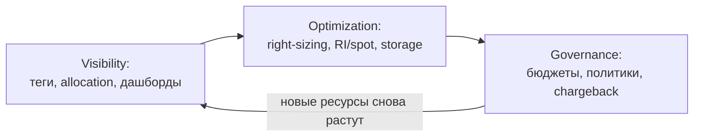

# 💰 20.19 FinOps: Управление Затратами на Облако и Кластер

> FinOps — дисциплина «инженеры видят стоимость своих решений». Три столпа: прозрачность (visibility), оптимизация, управление.

### 4.1 Теория

**Проблема:** счёт за облако растёт быстрее бизнеса, а ответить на вопрос «сколько стоит сервис X» не может никто. FinOps переносит ответственность за затраты к тем, кто их создаёт — продуктовым командам.



Три фазы цикла FinOps:

| Фаза | Что делаем | Инструменты |
| :--- | :--- | :--- |
| Inform (видимость) | Распределение 100% затрат по командам/сервисам | Cost export + теги, OpenCost/Kubecost |
| Optimize (оптимизация) | Устранение потерь | Right-sizing, spot/preemptible, RI/Savings Plans, очистка |
| Operate (управление) | Бюджеты, алерты, chargeback/showback | Budget alerts, политики тегирования |

Ключевые метрики: **unit economics** (стоимость на 1000 запросов / пользователя), utilization узлов (цель ≥60-70%), доля waste (запрошено vs использовано CPU/RAM).

### 4.2 Конфигурация и синтаксис

#### Тегирование — фундамент всего

```hcl
# Terraform: обязательные теги на всё (default_tags)
provider "aws" {
  default_tags {
    tags = {
      Environment = var.environment
      Team        = var.team          # без этого ресурса аллокация сломается
      Service     = var.service_name  # = карточка Backstage
      ManagedBy   = "terraform"
    }
  }
}
```

Политика принудительного тегирования (Kyverno mutate для K8s-ресурсов → cost-exporter):

```yaml
apiVersion: kyverno.io/v1
kind: ClusterPolicy
metadata: { name: require-cost-labels }
spec:
  validationFailureAction: Enforce
  rules:
    - name: check-team-label
      match: { any: [{ resources: { kinds: [Namespace] } }] }
      validate:
        message: "Namespace обязан иметь label cost-center"
        pattern:
          metadata:
            labels: { cost-center: "?*" }
```

#### OpenCost: распределение затрат внутри K8s

```bash
helm install opencost opencost/opencost -n opencost \
  --set opencost.prometheus.internalServiceName=prometheus-server

# API: стоимость по namespace за день
curl -s localhost:9003/allocation/compute?window=day \
  | jq '.[] | {namespace:.name, cpu:.cpuCost, ram:.ramCost, total:.totalCost}'

kubectl get namespaces -l cost-center --show-labels   # проверка покрытия лейблами
```

OpenCost считает: requests подов × цена узлов + share общих расходов. Именно поэтому **правильные requests = правильная аллокация**: завышенные requests показывают команду «дороже», чем она есть.

#### Right-sizing: данные из VPA-рекомендаций (см. 04.8)

```bash
# Рекомендации VPA в режиме Off — сырьё для right-sizing PR'ов
kubectl describe vpa shop-api | sed -n '/Recommendation/,+5p'
# Отчёт по всем деплойментам: запрошено vs используется
kubectl top pods -A --containers --sort-by=memory | head -30
```

### 4.3 Troubleshooting

```bash
# Счёт вырос втрое за неделю — найти виновника
aws ce get-cost-and-usage --time-period Start=2026-08-01,End=2026-08-25 \
  --granularity=DAILY --metrics UnblendedCost \
  --group-by Type=TAG,Key=Team | jq '.ResultsByTime[-7:]'

# Кто держит дорогие диски-сироты (PVC без подов)?
kubectl get pvc -A | while read ns p rest; do
  kubectl get pod -n $ns -o json 2>/dev/null | ! grep -q "\"$p\"" && echo "orphan PVC: $ns/$p"; done

# Spot-инстансы массово ушли — почему?
aws ec2 describe-spot-instance-requests \
  --query 'SpotInstanceRequests[].{id:SpotInstanceRequestId,status:Status.Code}' --output table
```

Типовые находки аудита затрат:

1. **Диски-сироты**: PVC/EBS пережили удаление подов. Решение: reclaimPolicy Delete + еженедельная джоба поиска сирот.
2. **Забытые dev/test окружения**, работающие ночью и в выходные: scheduled scaling (KEDA cron или Lambda stop) экономит ~65%.
3. **Cross-AZ трафик**: чаты между зонами стоят как инстансы; решение — topology spread + zone-aware routing.
4. **Overprovisioned requests**: utilization 5% при requests 2 CPU — right-sizing по VPA-данным.
5. **NAT Gateway гигабайты**: забыли VPC endpoints для S3 — трафик через NAT платный.

### 4.4 Интеграция со стеком

- **Backstage (20.18)**: `Service` tag из каталога = ключ аллокации; дашборд «стоимость команды» рядом с карточками сервисов.
- **Автоскейлинг (04.8)**: HPA/KEDA — главный инструмент оптимизации (scale-to-zero для очередей); overprovisioning-поды — осознанный trade-off.
- **Observability (09)**: unit economics как дашборд — стоимость запроса рядом с латентностью; алерт на аномальный рост spend.
- **Terraform (06)**: Infracost в CI показывает стоимость diff прямо в MR — «этот PR добавляет $340/мес» до мержа.

```yaml
# Infracost на MR: превью стоимости изменений
infracost:
  script:
    - infracost breakdown --path infra/ --format json > plan.json
    - infracost diff --path infra/ --compare-to infracost-base.json
```

### 4.5 Проверь себя — 5 вопросов

**В1. Почему тегирование — фундамент FinOps и что делать с legacy-ресурсами без тегов?**

<details><summary>Ответ</summary>
Без тега Team/Service затраты нельзя приписать владельцу — вся остальная работа бессмысленна. Legacy: сначала showback через приблизительную аллокацию (по имени/VPC/подписке), параллельно enforce-политика для новых ресурсов и разовая кампания догоняющего тегирования через Resource Groups Tagging API + скрипты.
</details>

**В2. Как OpenCost распределяет стоимость узла между подами и почему точность зависит от requests?**

<details><summary>Ответ</summary>
Стоимость узла делится пропорционально доле requests пода (CPU/RAM отдельно), остаток — по idle-алгоритму. Если requests занижены/завышены относительно реального потребления, аллокация искажается: команда выглядит дороже или дешевле факта. Поэтому right-sizing улучшает и инженерию, и учёт.
</details>

**В3. Назовите три классические «дыры», где утекают деньги в k8s-кластере.**

<details><summary>Ответ</summary>
Сироты (unattached EBS/PVC, Elastic IP без инстансов), забытые non-prod среды 24/7 (лечится расписанием), cross-AZ трафик и NAT Gateway без VPC endpoints для S3/ECR.
</details>

**В4. Чем chargeback отличается от showback и когда начинать с какого?**

<details><summary>Ответ</summary>
Showback — команды видят свою стоимость без списания; chargeback — реальные внутренние счета. Начинать всегда со showback: пока данные не доверяют и не привыкли, выставление счетов порождает споры об аллокации вместо оптимизации. Chargeback включать после 2-3 месяцев стабильной видимости.
</details>

**В5. Что даёт Infracost в пайплайне и какую культурную роль играет?**

<details><summary>Ответ</summary>
Показывает изменение месячной стоимости инфраструктуры в diff каждого MR («+2 m5.xlarge = +$280/мес»). Культурно сдвигает решение о стоимости в момент дизайна: ревьюер видит цену вместе с кодом, а не через месяц в счёте.
</details>

### 4.6 Практика — 3 задания

#### Задание 1: Аудит тегирования AWS

**Условие:** найти все нетегированные ресурсы.

```bash
aws resourcegroupstaggingapi get-resources \
  --tag-filters Key=Team \
  --resources-per-page 100 \
  --query 'ResourceTagMappingList[?!Tags]' --output json | jq length
```

**Проверь себя:** получен список; для EC2-инстансов добавлен тег скриптом `create-tags`; политика default_tags включена в Terraform.

#### Задание 2: OpenCost и топ потребителей

**Условие:** установить OpenCost, вывести топ-5 namespace по затратам за сутки.

```bash
helm repo add opencost https://opencost.github.io/opencost-helm-chart
helm install opencost opencost/opencost -n opencost --create-namespace
sleep 60 && curl -s "localhost:9003/allocation/compute?window=day&aggregate=namespace" \
  | jq '[to_entries[] | {ns:.key, total:.value.totalCost}] | sort_by(-.total) | .[:5]'
```

**Проверь себя:** список соответствует ожиданиям; namespace без лейблов попали в unallocated — это сигнал добавить теги.

#### Задание 3: Right-sizing одного сервиса

**Условие:** сравнить requests с реальным использованием и оформить PR.

```bash
kubectl get deploy shop-api -o jsonpath='{.spec.template.spec.containers[0].resources}'
kubectl top pod -l app=shop-api --containers
# Неделя данных: prometheus query
# avg_over_time(container_memory_working_set_bytes{name=~"shop-api.*"}[7d])
```

**Проверь себя:** новый requests = p95 использования + 20% headroom; VPA в режиме Off подтверждает рекомендацию; MR с изменением смержен.

---

<!-- enriched:v1 -->

*Связанные темы: [20.18 Platform Engineering](18-platform-engineering.md) · [04.8 Автоскейлинг](../04-kubernetes/08-k8s-autoscaling.md)*
