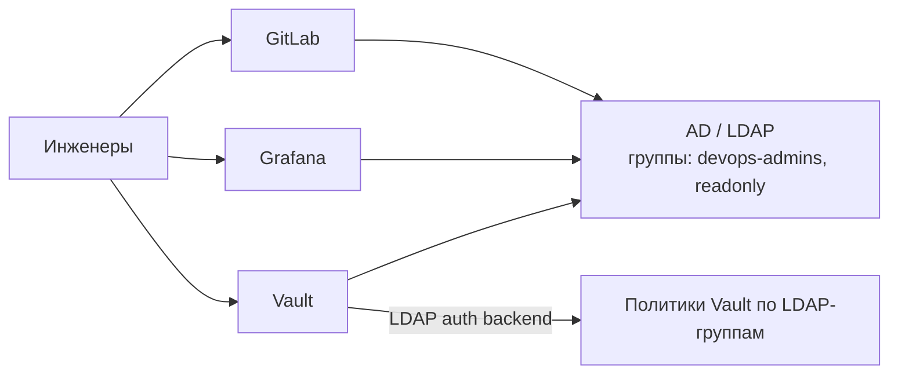

# 🔄 20.20 Nomad, Windows-Ноды и Enterprise-Интеграции (AD/LDAP)

> Senior Stack тема · формат: теория → конфигурация → troubleshooting → интеграция → 5 вопросов → практики · `<!-- enriched:v1 -->`

## 2.1 Теория

### HashiCorp Nomad: оркестратор «всё подряд»

Nomad — один бинарник, оркестрация Docker/podman, JVM, бинарей, VM-образов (QEMU) и batch-задач. Без Kubernetes-CRD-церемоний.

| Аспект | Nomad | Kubernetes |
|---|---|---|
| Область | контейнеры + legacy + Windows легко | контейнеры (+Windows сложнее) |
| Установка | один бинарник, HA из 3 серверов | контрольная плоскость из N компонентов |
| Спецификация | HCL job-файл | YAML манифесты |
| Планировщик | bin-packing с spread/constraints | scheduler-framework |
| Интеграции | Consul (сервис-дискавери), Vault (секреты) | вся экосистема CNCF |

### Job-файл: сервис + проверки

```hcl
job "api" {
  datacenters = ["dc1"]
  group "web" {
    count = 3
    network {
      port "http" { to = 8080 }
    }
    service {
      name     = "api"
      provider = "consul"
      port     = "http"
      check {
        type     = "http"
        path     = "/healthz"
        interval = "10s"
        timeout  = "2s"
      }
    }
    task "server" {
      driver = "docker"
      config {
        image = "registry.local/shop/api:2.15.0"
        ports = ["http"]
      }
      env { APP_ENV = "prod" }
      vault { policies = ["api-app"] }       # секреты из Vault нативно
      resources {
        cpu    = 500                          # МГц (не millicores!)
        memory = 512                          # MB
      }
    }
    restart { attempts = 3; interval = "10m"; delay = "15s" }
    update {
      max_parallel     = 1
      min_healthy_time = "20s"
      healthy_deadline = "5m"
      auto_revert      = true                   # откат при неудачном деплое!
    }
  }
}
```

```bash
nomad job run api.nomad.hcl && nomad status api
nomad alloc logs <alloc-id>
nomad job scale api web 5
nomad system gc                      # чистка мёртвых аллокаций
```

### Windows-ноды в Kubernetes

Реальный enterprise-кейс: легаси .NET Framework/IIS нельзя унести в Linux-контейнеры.

```yaml
# Под обязателен к Windows-ноде:
nodeSelector:
  kubernetes.io/os: windows
tolerations:
  - key: os
    operator: Equal
    value: windows
    effect: NoSchedule
containers:
  - image: mcr.microsoft.com/windows/servercore:iis   # ВАЖНО: базовый образ = версии хоста!
```

Ограничения Windows-нод: нет privileged-контейнеров/hostNetwork, свой CNI (Calico VXLAN/Win-Overlay), GMSA для AD-аутентификации контейнеров, меньший набор CSI-драйверов.

### Active Directory / LDAP как центр аутентификации



## 2.2 Конфигурация

**Vault LDAP-auth:**

```bash
vault auth enable ldap
vault write auth/ldap/config \
  url="ldaps://ad.corp.local" \
  userdn="OU=Users,DC=corp,DC=local" \
  groupdn="OU=Groups,DC=corp,DC=local" \
  groupattr="cn" upndomain="corp.local" \
  certificate=@ad-ca.pem
vault write auth/ldap/groups/devops-admins policies=admin,sudo
vault login -method=ldap username=ivanov
```

**Grafana через LDAP** (grafana.ini):

```ini
[auth.ldap]
enabled = true
config_file = /etc/grafana/ldap.toml
allow_sign_up = false
[auth.generic_oauth]              # или OIDC через Keycloak поверх AD
```

**Windows-пул в kind/реальном кластере:** taint `os=windows:NoSchedule` на ноды, отдельный node pool в облаках, GMSA-ресурс для доменных учёток:

```yaml
apiVersion: windows.k8s.io/v1beta1
kind: GMSA
metadata: { name: webapp-gmsa }
msaCredentials: { DNSHostName: "webapp$@corp.local", AccountName: webapp$ }
```

## 2.3 Troubleshooting

| Симптом | Диагноз | Действие |
|---|---|---|
| Nomad alloc в pending | нет ресурсов/placement constraint | `nomad eval status`; проверить `datacenters` |
| Windows-pod ImagePullBackOff | версия базового образа ≠ версии хоста | match tag (1809/ltsc2022); `docker images` на ноде |
| LDAP-login падает 500 | сертификат CA не доверен | добавить `certificate=` в конфиг; ldaps vs starttls |
| GMSA-под CrashLoop | учётка не в домене/нет прав | `Test-ADServiceAccount` на хосте |
| Nomad service без healthcheck в Consul | provider mismatch | consul vs nomad provider консистентно |

## 2.4 Интеграция

Связка enterprise: **AD** (люди) → **OIDC/LDAP** (приложения) → **Vault** (сервисные секреты) → **Consul/Nomad или K8s** (ворклоады). Единая точка отключения доступа при увольнении — деактивация в AD каскадом закрывает GitLab/Grafana/Vault.

Миграционный мост: Nomad умеет гонять K8s-манифесты через `podman`/`containerd` драйверы частично; реальный путь миграции — поэтапный (stateless первыми), а не big-bang.

## ❓ Пять вопросов (для тренажёра)

---


## ✅ Проверь себя

> Отвечай вслух до раскрытия ответа. Если «не помню» — вернись к разделу.


**В1. Почему Nomad выбирают вместо Kubernetes?**
<details><summary>Ответ</summary>
Разнородные ворклоады (Docker+JVM+бинари+QEMU) одним инструментом, простота эксплуатации (один бинарник, HA из 3 нод), предсказуемый планировщик bin-packing, нативная связка Consul/Vault. Типично: edge, гибридные фермы, команды без ресурсов на платформенную команду K8s.
</details>

**В2. Что такое GMSA и зачем она Windows-контейнерам?**
<details><summary>Ответ</summary>
Group Managed Service Account — доменная служебная учётка AD с авторотируемым паролем, управляемым контроллером домена. Контейнеры на Windows-нодах аутентифицируются к ресурсам домена (SQL Server, SMB) под GMSA без хранения паролей в манифестах.
</details>

**В3. Почему базовый образ Windows-контейнера должен совпадать версией хоста?**
<details><summary>Ответ</summary>
Windows-контейнеры разделяют ядро хоста: server core образ ltsc2022 не запустится на хосте 2019 — ImagePullBackOff/несовместимость. Изоляция Hyper-V снимает ограничение ценой overhead. Это главное отличие от Linux, где образ почти всегда совместим.
</details>

**В4. Как Vault связывает LDAP-группы с правами?**
<details><summary>Ответ</summary>
Auth backend LDAP маппит группы каталога на политики Vault: `auth/ldap/groups/devops-admins → policies`. Человек логинится доменным паролем, Vault читает его группы из AD и выдаёт токен с суммой политик. Управление доступом живёт в AD — едином источнике правды.
</details>

**В5. Какие ресурсы Nomad считает иначе, чем Kubernetes?**
<details><summary>Ответ</summary>
CPU в Nomad — целые МГц (cpu = 500), память в МБ (memory = 512); в K8s — millicores (500m ≈ 0.5 ядра) и MiB. При переносе спецификаций это источник ошибок планирования: 500 в K8s ≠ 500 в Nomad.
</details>

<!-- enriched:v1 -->

---

*Соседние темы:* [20.14 Rancher и k3s](14-rancher-and-k3s.md) · [20.15 Виртуализация](15-virtualization.md) · [20.19 FinOps](19-finops.md)
