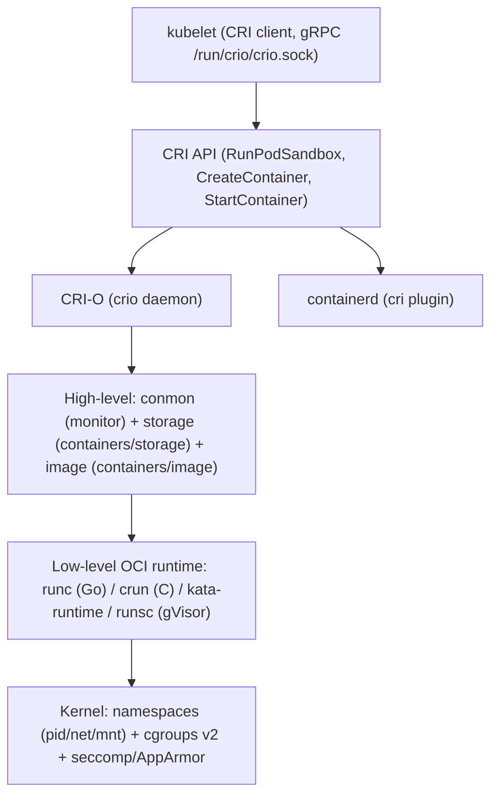

# 🐳 21. CRI-O и Контейнерные Runtime: от CRI до runc/crun, Kata и gVisor

> Kubelet → CRI (gRPC) → CRI-O / containerd → OCI runtime (runc/crun/kata) → kernel namespaces/cgroups. Зачем SRE знать разницу.

## 🏛️ Архитектура



| Уровень | Примеры | Что делает |
|---|---|---|
| **High** | CRI-O, containerd | CRI gRPC, image pull, snapshot (overlayfs), CNI вызов, log driver |
| **Low** | `runc`, `crun`, `kata-runtime`, `runsc` | `config.json` → `clone + pivot_root + set cgroup` |

---

## ⚙️ CRI-O: crio.conf и cgroups

```ini
# /etc/crio/crio.conf
[crio.runtime]
default_runtime = "runc"
default_work_dir = "/run/crio"
conmon = "/usr/libexec/crio/conmon"
conmon_cgroup = "pod"
cgroup_manager = "systemd"   # systemd (рекомендовано для K8s) vs cgroupfs
# systemd = один cgroup tree с kubelet, корректные OOM/kill, cgroups v2 единое дерево
# cgroupfs = legacy, конфликты с systemd

[crio.runtime.runtimes.runc]
runtime_path = "/usr/bin/runc"
runtime_type = "oci"
runtime_root = "/run/runc"

[crio.runtime.runtimes.crun]
runtime_path = "/usr/bin/crun"
runtime_type = "oci"

[crio.runtime.runtimes.kata]
runtime_path = "/usr/bin/kata-runtime"
runtime_type = "oci"

[crio.image]
global_auth_file = "/etc/containers/policy.json"
pause_image = "registry.k8s.io/pause:3.9"
pause_image_auth_file = ""
# compression, signatures

[crio.api]
listen = "/run/crio/crio.sock"
stream_address = "127.0.0.1"
stream_port = "10010"
```

```bash
# Применение
sudo systemctl restart crio
sudo crictl info | jq .config
# Проверка cgroup_manager
crictl info | grep -i cgroup
ps -o cgroup -p $(pgrep -f shop-api) | head
systemd-cgls | grep crio
```

### registries.conf и image management

```toml
# /etc/containers/registries.conf
unqualified-search-registries = ["docker.io"]

[[registry]]
location = "docker.io"
[[registry.mirror]]
location = "harbor.company.internal/dockerhub-proxy"
insecure = false

[[registry]]
location = "harbor.company.internal"
[[registry.mirror]]
location = "harbor.company.internal"
```

```bash
crictl images | head -20
crictl pull --creds myuser:mypass harbor.company.internal/shop/api:v1.4.1
crictl rmi harbor.company.internal/shop/api:old
crictl imagefsinfo | jq .
# В отличие от ctr/nerdctl: crictl говорит с CRI-O напрямую, ctr — с containerd low-level
```

### crictl vs ctr/nerdctl/podman

| Команда | Говорит с | Когда использовать |
|---|---|---|
| `crictl ps -a`, `crictl logs`, `crictl exec` | CRI-O/containerd через CRI | на ноде K8s, для пода |
| `ctr images pull` | containerd напрямую | deep debug containerd |
| `podman ps` | podman + containers/storage | standalone, не в K8s |
| `docker ps` | dockerd → containerd | если docker-shim (deprecated) |

---

## 🧩 RuntimeClass: выбор runtime per-pod

```yaml
apiVersion: node.k8s.io/v1
kind: RuntimeClass
metadata:
  name: crun      # быстрый C-реализация runc, меньше memory
  # name: kata      # VM-изоляция
  # name: gvisor    # userspace kernel
handler: crun     # должен совпадать с [crio.runtime.runtimes.<handler>]
overhead:
  podFixed:
    memory: "120Mi"
    cpu: "100m"
scheduling:
  nodeCriteria:
    - matchExpressions:
        - key: runtime
          operator: In
          values: ["crun"]
---
apiVersion: v1
kind: Pod
metadata: { name: crun-demo, namespace: shop }
spec:
  runtimeClassName: crun
  containers:
    - name: app
      image: nginxinc/nginx-unprivileged:1.27
---
apiVersion: v1
kind: Pod
metadata: { name: kata-demo, namespace: shop }
spec:
  runtimeClassName: kata
  containers:
    - name: app
      image: nginxinc/nginx-unprivileged:1.27
```

```bash
kubectl get runtimeclass
kubectl describe runtimeclass kata
kubectl get pods -n shop -o wide | grep kata-demo
# Внутри: kata = lightweight VM (QEMU/firecracker), изоляция ядра
```

---

## 🔒 Kata Containers vs gVisor vs runc/crun

| Критерий | `runc` (Go, дефолт) | `crun` (C, быстрее, меньше RAM) | **Kata** (VM, `kata-runtime`) | **gVisor (`runsc`)** |
|---|---|---|---:|---|
| Изоляция | namespaces/cgroups (поделили ядро) | то же | каждый pod — VM (ядро своё) | гостевое user-space ядро Sentry |
| Старт | ~200ms | ~80ms | ~800ms (QEMU) / 300ms (FC) | ~200ms |
| Overhead | минимальный | минимальный | +100–200MB/pod | +50MB/pod |
| Совместимость syscall | 100% | 100% | 100% | ~90% (нет `mount`/`ptrace` некоторых) |
| Use-case | дефолт | high density | untrusted multi-tenant (CI) | untrusted но быстрее kata |
| K8s | везде | нужен `crun` бинарник | требует kata shims | требует `runsc` + RuntimeClass |

**Выбор:** `crun` для экономии, `kata` для `privileged` CI джоб, `gVisor` для serverless (GKE gVisor).

---

## 📊 containerd vs CRI-O

| Критерий | containerd (cri plugin) | CRI-O |
|---|---|---|
| Scope | универсальный runtime + image + snapshot + CRI | **только** K8s CRI (лёгкий, OpenShift дефолт) |
| Storage | `containerd.io/snapshot/overlayfs` | `containers/storage` (чистый overlay, как Podman) |
| Image policy | `config.toml` `plugins.cri.registry` | `registries.conf` + `policy.json` (sigstore) |
| Cgroup manager | `SystemdCgroup = true` в `config.toml` | `cgroup_manager = "systemd"` в `crio.conf` |
| crictl | да (через `runtime-endpoint: unix:///run/containerd/containerd.sock`) | да (`unix:///run/crio/crio.sock`) |
| Когда брать | K8s дефолт везде, нужен `ctr` | OpenShift, нужен `podman`-совместимый storage, меньше moving parts |

```bash
# containerd config
cat /etc/containerd/config.toml | grep -A5 SystemdCgroup
# CRI-O
cat /etc/crio/crio.conf | grep cgroup_manager
```

---

## 🚑 Troubleshooting runtime

| Симптом | Причина | Диагностика | Фикс |
|---|---|---|---|
| `Failed to create pod sandbox: crio: cgroup manager mismatch` | kubelet `cgroupDriver: systemd` vs `crio cgroupfs` | `journalctl -u crio -u kubelet | grep -i cgroup`; `crictl info | grep cgroup` | выставить оба `systemd` + `systemctl restart crio kubelet` |
| `ImagePullBackOff: unauthorized` | нет `imagePullSecrets` или `registries.conf` не прокинут | `crictl pull --creds` вручную OK? `kubectl get secret regcred -n shop -o yaml` | `kubectl create secret docker-registry regcred ...` + `imagePullSecrets: [regcred]` |
| `OCI runtime create failed: runc create failed: unable to start container process: permission denied` | `seccomp/AppArmor` блокирует, или `runAsUser: 0` + `restricted` | `journalctl -u crio | grep -i seccomp`; `dmesg | grep -i denied` | `RuntimeDefault` профиль, не `Localhost` с ошибкой, `runAsNonRoot:false` для теста |
| Pod `kata` висит `ContainerCreating` 60с | нет `kata-runtime` на ноде | `kubectl describe pod kata-demo -n shop | grep -i runtime`; `which kata-runtime` на ноде | установить `kata-containers` пакет, label `runtime: kata` только на kata-ноды |
| Высокий `conmon` RSS | конмон на каждый pod держит лог/attach | `ps aux | grep conmon` | `crio.conf: log_level = "info"` не `debug`, `log_size_max` |
| `crictl logs` пусто | `log_driver` не `json-file` / rotation | `crictl inspect <ctr> | grep -i log` | `crio.conf: log_dir + container_log_max_size` |

```bash
# Deep debug
journalctl -u crio -f
journalctl -u kubelet -f | grep -i sandbox
crictl ps -a | grep -v Running
crictl inspect $(crictl ps -aq | head -1) | jq .info.runtimeSpec
runc --debug list
crun --help | head
```

---

## 🧪 Hands-on: CRI-O на kind + RuntimeClass (10 мин)

> kind по умолчанию использует `containerd`. Для CRI-O — запустите в VM/ноде с CRI-O или эмулируйте на kind с `RuntimeClass` `runc/crun` (показывает механику без смены runtime).

```bash
kind create cluster --name crio-lab
kubectl apply -f - <<'YAML'
apiVersion: node.k8s.io/v1
kind: RuntimeClass
metadata: { name: crun }
handler: runc  # в kind нет crun, но handler = runc пройдёт как demo
YAML
kubectl get runtimeclass

kubectl apply -f - <<'YAML'
apiVersion: v1
kind: Pod
metadata: { name: demo-runc, namespace: default }
spec:
  runtimeClassName: crun
  containers: [{ name: app, image: nginxinc/nginx-unprivileged:1.27 }]
YAML
kubectl get pods -o wide | grep demo
kubectl describe pod demo-runc | grep -A2 RuntimeClass

# Проверка cgroup_manager на ноде с CRI-O (в VM):
# crictl info | jq .config.cgroupManager
# kubelet --cgroup-driver=systemd должен совпадать
```

---

## ✅ Чек-лист зрелости

- [ ] `cgroup_manager` и `kubelet cgroupDriver` оба `systemd` (`journalctl -u crio -u kubelet | grep cgroup`)
- [ ] `registries.conf` с `mirror` на `harbor`, `policy.json` sigstore где нужно
- [ ] `RuntimeClass` per-tenant (`crun` для density, `kata` для untrusted), `overhead` задан
- [ ] `crictl pull` + `imagePullSecrets` в `shop` namespace, `crictl images` без `ctr`
- [ ] Runbook `cgroup manager mismatch` + `ImagePullBackOff` рядом с кодом

---

## 🎤 Пять вопросов для повторения

**В1. Kubelet → CRI-O → runc: какие gRPC вызовы идут при `kubectl apply -f pod.yaml`?**

<details><summary>Ответ</summary>

`RunPodSandbox` (создать pause, CNI, cgroups), `CreateContainer` (pull image, create `config.json`), `StartContainer` (runc create/start), `Attach/Exec` по требованию. Всё через `/run/crio/crio.sock`. `conmon` держит `pid 1` sandbox и логи.

</details>

**В2. Зачем `cgroup_manager = "systemd"` и что сломается при `cgroupfs`?**

<details><summary>Ответ</summary>

Kubelet с `systemd` ожидает один cgroup tree `system.slice/kubepods.slice`. `cgroupfs` создаёт параллельные деревья — конфликты OOM/kill, `Failed to create pod sandbox` mismatch. В cgroups v2 только `systemd` корректен.

</details>

**В3. Чем `crun` лучше `runc` и когда брать `kata`?**

<details><summary>Ответ</summary>

`crun` на C — быстрее (80 vs 200ms) и меньше RAM. `kata` — VM изоляция для недоверенных (CI, multi-tenant) ценой +100MB и 800ms. `gVisor` — посередине. Выбор по угрозе.

</details>

**В4. Как проверить что `RuntimeClass kata` работает?**

<details><summary>Ответ</summary>

`kubectl get runtimeclass kata`, pod с `runtimeClassName: kata` → `kubectl describe pod | grep RuntimeClass`, на ноде `which kata-runtime`, `journalctl -u crio | grep kata`. `crictl inspect` покажет `runtimeType: kata`.

</details>

**В5. `crictl` vs `ctr` — когда какой?**

<details><summary>Ответ</summary>

`crictl` — CRI (k8s pods) через `crio.sock`/`containerd.sock` — для ноды K8s. `ctr` — напрямую containerd (без CRI) — для deep debug containerd. В K8s — `crictl`, вне K8s — `ctr`/`podman`.

</details>

---

## 🧭 Что дальше

| Шаг | Материал |
|---|---|
| 🔬 Закрепить | [Docker deep internals](../03-docker/04-docker-deep-internals-and-engine.md) — `pivot_root`, `capabilities` |
| 💪 Практика | [K8s Troubleshooting: CRI](../04-kubernetes/04-k8s-troubleshooting-handbook.md) — sandbox debug |
| 🎤 Проверить | [Kata/gVisor](../20-senior-stack/15-virtualization.md) |

<!-- enriched:v1 -->
