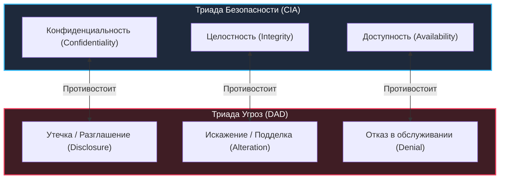
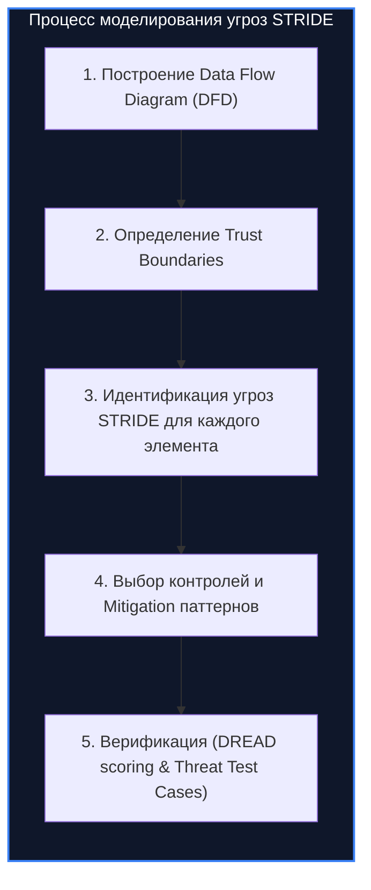
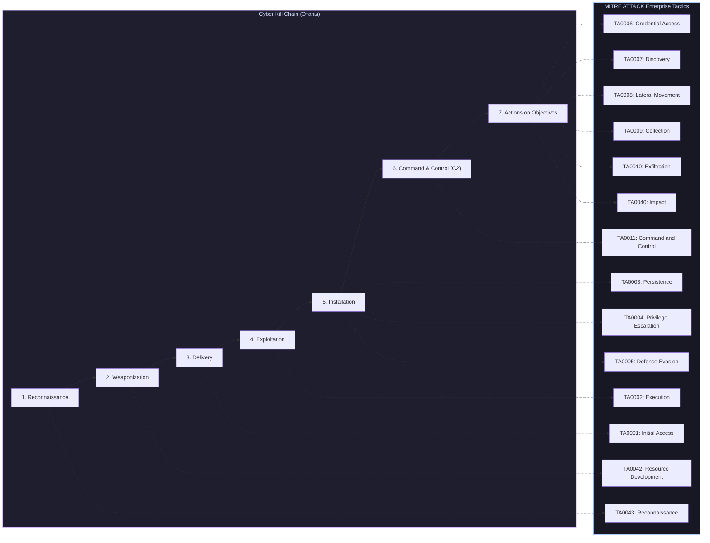
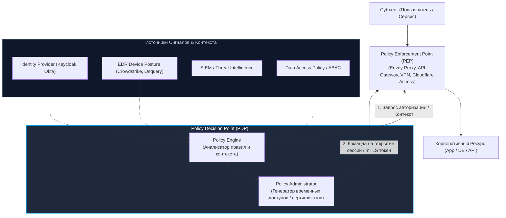

# 🛡️ 01. Основы Кибербезопасности, Модели Угроз и MITRE ATT&CK

> Уровень: Middle→Senior SRE / DevOps / Security Engineer  
> Цель: Овладеть фундаментальными концепциями информационной безопасности, методиками моделирования угроз (STRIDE, PASTA, DREAD), матрицами MITRE ATT&CK / Cyber Kill Chain, калькуляцией метрик CVSS v3.1/v4.0 и архитектурным внедрением концепции Zero Trust (NIST SP 800-207).

---

### 1. Фундаментальные модели: Триада CIA и Триада DAD

Классическая безопасность информационных систем базируется на балансе трех базовых свойств (**CIA Triad**), каждому из которых противостоит специфический вектор деструктивного воздействия (**DAD Triad**).



#### Матрица свойств и защитных механизмов

| Свойство CIA | Угроза DAD | Описание и бизнес-риск | Инженерные механизмы защиты |
| :--- | :--- | :--- | :--- |
| **Confidentiality** (Конфиденциальность) | **Disclosure** (Разглашение) | Несанкционированный доступ к конфиденциальным данным (PII, секреты, токены, коммерческая тайна). | TLS 1.3, AES-256-GCM (Data at Rest), Envelope Encryption (KMS/Vault), RBAC/ABAC, Masking/Tokenization. |
| **Integrity** (Целостность) | **Alteration** (Искажение) | Несанкционированная модификация данных, конфигураций или исполняемого кода в покое или при передаче. | Криптографические хэши (SHA-256, BLAKE3), цифровые подписи (Cosign, GPG), HMAC, WORM-хранилища, Immutable OS. |
| **Availability** (Доступность) | **Denial** (Отказ в доступе) | Нарушение или блокировка своевременного доступа авторизованных пользователей и сервисов к ресурсам. | Anycast DNS/BGP, CDN, WAF rate-limiting, k8s HPA/PDB, Multi-AZ/Multi-Region репликация, Disaster Recovery (RTO/RPO). |

---

### 2. Моделирование угроз (Threat Modeling)

Моделирование угроз — это структурированный процесс выявления, анализа и нейтрализации рисков безопасности на этапе архитектурного проектирования системы (Shift-Left Security).

#### 2.1 Фреймворк STRIDE (Microsoft)

STRIDE классифицирует угрозы относительно нарушаемых ими свойств безопасности:

| Угроза (STRIDE) | Нарушаемое свойство | Техническая суть вектора | Пример атаки | Контрмера / Защитный паттерн |
| :--- | :--- | :--- | :--- | :--- |
| **S** - Spoofing (Спуфинг) | Аутентичность (Authenticity) | Подмена личности пользователя, сервиса или узла сети. | Подделка JWT (None-alg), ARP/DNS Spoofing, IP Spoofing. | mTLS (X.509), OIDC/OAuth2, FIDO2/WebAuthn, DNSSEC, DMARC/DKIM/SPF. |
| **T** - Tampering (Фальсификация) | Целостность (Integrity) | Несанкционированное изменение данных в памяти, на диске или в канале. | Man-in-the-Middle (MitM), SQLi UPDATE, подмена бинарного файла сборки. | TLS с Certificate Pinning, HMAC-SHA256, Sigstore Cosign, Read-only FS. |
| **R** - Repudiation (Отказ от авторства) | Неотказуемость (Non-Repudiation) | Невозможность доказать факт выполнения операции конкретным субъектом. | Удаление локальных логов злоумышленником, отсутствие User ID в транзакции. | Неизменяемые audit-логи (WORM S3, Append-Only), eBPF/auditd, цифровая подпись транзакций. |
| **I** - Information Disclosure (Утечка информации) | Конфиденциальность (Confidentiality) | Непреднамеренная или принудительная публикация приватных данных. | SSRF на `169.254.169.254`, утечка stack trace, Directory Traversal. | IMDSv2, Generic Error Pages, Secret Scanners (TruffleHog), шифрование БД. |
| **D** - Denial of Service (Отказ в обслуживании) | Доступность (Availability) | Исчерпание ресурсов (CPU, RAM, сокеты, I/O, дескрипторы файлов). | HTTP Flood, Slowloris, Regex ReDoS, Zip-бомбы, fork-бомбы. | Nginx `limit_req`, Envoy Rate Limiting, Cloudflare DDoS Shield, cgroups v2 memory limits. |
| **E** - Elevation of Privilege (Повышение привилегий) | Авторизация (Authorization) | Получение прав, превышающих выданные субъекту (LPE, RCE to root). | SUID-бинарники, Sudoers NOPASSWD, BOLA/IDOR в REST API, K8s escape. | Least Privilege, AppArmor/SELinux, Non-root containers, Policy as Code (OPA/Kyverno). |



#### 2.2 Методология PASTA (Process for Attack Simulation and Threat Analysis)
PASTA — это рискориентированный 7-этапный фреймворк моделирования угроз, ориентированный на бизнес-цели:
1. **Stage I: Define Objectives** — фиксация бизнес-целей, комплаенса (PCI-DSS, GDPR, HIPAA) и SLA.
2. **Stage II: Define Technical Scope** — инвентаризация активов, сервисов, интерфейсов, сетевых границ.
3. **Stage III: Application Decomposition** — DFD-диаграммы, идентификация точек входа (Trust Boundaries, User inputs).
4. **Stage IV: Threat Analysis** — анализ источников угроз, сбор Threat Intelligence (TI), корреляция с отраслью.
5. **Stage V: Vulnerability & Weaknesses Analysis** — анализ CVE/CWE, SAST/DAST/SCA отчеты, конфигурационные бреши.
6. **Stage VI: Attack Modeling (Simulation)** — моделирование векторов атак (Attack Trees), симуляция сценариев (Kill Chain).
7. **Stage VII: Risk & Impact Analysis** — оценка остаточного риска, вычисление ROI защитных контролей.

#### 2.3 Модель ранжирования рисков DREAD
Шкала от 1 до 10 для каждого параметра, итоговый Risk Score = `(D + R + E + A + D) / 5`:
- **D (Damage Potential):** Насколько велик ущерб при успешной атаке? (10 = Полный захват инфраструктуры / RCE).
- **R (Reproducibility):** Насколько легко воспроизвести атаку? (10 = Срабатывает в 100% случаев одним HTTP-запросом).
- **E (Exploitability):** Какой уровень навыков требуется? (10 = Доступен готовый скрипт / 1 = Требуется 0-day + физический доступ).
- **A (Affected Users):** Какой процент пользователей затронут? (10 = Все пользователи / 1 = 1 сервис).
- **D (Discoverability):** Насколько легко обнаружить уязвимость? (10 = Публичный эндпоинт без аутентификации).

---

### 3. MITRE ATT&CK Matrix и Cyber Kill Chain

Для стандартизации описания поведения злоумышленников индустрия использует две взаимодополняющие модели: линейную **Lockheed Martin Cyber Kill Chain** и графовую поведенческую **MITRE ATT&CK Matrix**.



#### Детальный маппинг тактик и техник MITRE ATT&CK

| ID Тактики | Тактика (Tactic) | Цель атакующего | Примеры ключевых техник (Enterprise) | Методы детекции (Detection) |
| :--- | :--- | :--- | :--- | :--- |
| **TA0043** | Reconnaissance | Сбор информации о жертве | `T1595` Active Scanning, `T1589` Gather Victim Identity Info | WAF/CDN Threat Intelligence, DNS query logs, Shodan alerts |
| **TA0001** | Initial Access | Проникновение в периметр | `T1190` Exploit Public-Facing App, `T1566` Phishing, `T1078` Valid Accounts | WAF alert logs, VPN GeoIP anomalies, IdP MFA fatigue alerts |
| **TA0002** | Execution | Запуск вредоносного кода | `T1059` Command and Scripting Interpreter, `T1203` Exploitation for Client | Sysmon Event ID 1, Linux auditd `execve`, EDR telemetry |
| **TA0003** | Persistence | Закрепление в системе | `T1053` Scheduled Task/Cron, `T1543` Create/Modify System Process, `T1098` Account Manipulation | Auditd rules на `/etc/cron*` и `/etc/systemd/`, Active Directory Event ID 4720 |
| **TA0004** | Privilege Escalation | Получение прав root / SYSTEM / Domain Admin | `T1548` Abuse Elevation Mechanism (SUID, Sudoers), `T1068` Exploitation for PrivEsc | Auditd monitoring `setuid()`, PAM logs, Windows Event ID 4672 |
| **TA0005** | Defense Evasion | Обход антивирусов, EDR, логов | `T1070` Indicator Removal (Log clearing), `T1027` Obfuscated Files, `T1562` Impair Defenses | Windows Event ID 1102 (Log cleared), auditd immutable mode (`-e 2`) |
| **TA0006** | Credential Access | Кража паролей, хэшей, токенов | `T1003` OS Credential Dumping (LSASS, `/etc/shadow`), `T1558` Steal Kerberos Tickets | Sysmon ID 10 (ProcessAccess to lsass.exe), AD Event ID 4769 (Kerberoasting) |
| **TA0007** | Discovery | Исследование окружения | `T1082` System Info Discovery, `T1046` Network Service Scanning, `T1087` Account Discovery | Сетевые NetFlow аномалии, необычный вызов `net view`, `whoami /all` |
| **TA0008** | Lateral Movement | Перемещение внутри сети | `T1021` Remote Services (SSH, RDP, WinRM, SMB), `T1550` Use Alternate Auth Material (Pass-the-Hash) | Windows Event ID 4624 (Logon Type 3 / 10), Zeek/Suricata SMB alerts |
| **TA0011** | Command and Control | Управление хостом удаленно | `T1071` Application Layer Protocol (DNS tunneling, HTTPS C2, Telegram bot), `T1573` Encrypted Channel | Анализ энтропии DNS-запросов, TLS JA3/JA4 fingerprinting, proxy logs |
| **TA0010** | Exfiltration | Эксфильтрация данных | `T1048` Exfiltration Over Alternative Protocol, `T1567` Exfiltration Over Web Service (AWS S3, Dropbox) | DLP системы, аномалии Outbound Bandwidth в NetFlow / VPC Flow Logs |
| **TA0040** | Impact | Уничтожение, шифрование или сбой | `T1486` Data Encrypted for Impact (Ransomware), `T1485` Data Destruction (Wiper) | Массовая модификация inode (I/O burst), Canary-файлы с Tripwire |

---

### 4. Калькуляция уязвимостей: CVSS v3.1 и CVSS v4.0

Стандарт **Common Vulnerability Scoring System (CVSS)** предоставляет числовую оценку критичности уязвимости от `0.0` до `10.0`.

#### 4.1 Метрики CVSS v3.1 (Base Score)

Вектор метрик: `CVSS:3.1/AV:N/AC:L/PR:N/UI:N/S:U/C:H/I:H/A:H`

```text
Базовая формула:
BaseScore = f(Impact, Exploitability, Scope)

Exploitability Metrics (Эксплуатируемость):
- Attack Vector (AV): Network (N=0.85) | Adjacent (A=0.62) | Local (L=0.55) | Physical (P=0.2)
- Attack Complexity (AC): Low (L=0.77) | High (H=0.44)
- Privileges Required (PR): None (N=0.85) | Low (L=0.62 / 0.68) | High (H=0.27 / 0.50)
- User Interaction (UI): None (N=0.85) | Required (R=0.62)

Scope (Размах):
- Scope (S): Unchanged (U) | Changed (C)

Impact Metrics (Влияние):
- Confidentiality Impact (C): None (N) | Low (L) | High (H)
- Integrity Impact (I): None (N) | Low (L) | High (H)
- Availability Impact (A): None (N) | Low (L) | High (H)
```

**Качественная шкала тяжести (Severity Rating):**
- `0.0`: None
- `0.1 – 3.9`: Low
- `4.0 – 6.9`: Medium
- `7.0 – 8.9`: High
- `9.0 – 10.0`: Critical

#### 4.2 Ключевые нововведения CVSS v4.0
1. **Новая номенклатура скоринга:**
   - `CVSS-B`: Base Score (неизменные свойства уязвимости).
   - `CVSS-BT`: Base + Threat (учет реального наличия PoC / эксплуатации в дикой природе: `Exploit Maturity = Unreported | PoC | Attacked`).
   - `CVSS-BE`: Base + Environmental (учет компенсирующих мер в инфраструктуре заказчика).
   - `CVSS-BTE`: Base + Threat + Environmental.
2. **Метрика Attack Requirements (AT):** отделена от Attack Complexity (учитывает предварительные условия, например race conditions или MITM позицию).
3. **Разделение Impact на System (VC/VI/VA) и Subsequent Systems (SC/SI/SA):** вместо размытой метрики `Scope: Changed` теперь явно оценивается влияние на саму уязвимую систему и на внешние зависимые сервисы.
4. **Safety (Метрика автоматической безопасности):** оценка риска физического ущерба здоровью человека (критично для IoT, SCADA, медицины, автопилотов).

---

### 5. Архитектура Zero Trust (NIST SP 800-207)

Концепция **Zero Trust ("Никому не доверяй, всегда проверяй")** исключает концепцию "доверенного периметра". Любой субъект (пользователь, микросервис, скрипт), запрашивающий доступ к ресурсу, считается потенциально скомпрометированным.



#### Ключевые постулаты NIST SP 800-207:
1. **Все источники данных и вычислительные сервисы считаются ресурсами.**
2. **Все коммуникации защищены независимо от физического местоположения сети** (никакого доверия локальной сети офиса или default VPC).
3. **Доступ к отдельным ресурсам предоставляется на основе сессий** (Least Privilege, Just-In-Time access).
4. **Доступ определяется динамической политикой:** атрибуты пользователя, статус здоровья хоста (EDR posture), геолокация, поведенческая аномалия.
5. **Организация непрерывно оценивает и проверяет целостность и безопасность всех активов.**
6. **Динамическая аутентификация и авторизация являются непрерывными** (Continuous Adaptive Trust).

---

### 6. Практический пример: Моделирование угроз микросервиса оплаты

Рассмотрим архитектуру платежного сервиса `Payment-API` и разберем моделирование угроз по фреймворку STRIDE:

```yaml
# threat-model-payment.yaml
service: Payment-Gateway-Service
criticality: Tier-0 (PCI-DSS Scoped)
data_assets:
  - id: DA-01
    name: Credit Card Primary Account Number (PAN)
    classification: Highly-Confidential
  - id: DA-02
    name: Idempotency-Key & Transaction-Status
    classification: Confidential

trust_boundaries:
  - TB-01: Public Internet -> Cloudflare Edge
  - TB-02: Cloudflare Edge -> Kubernetes Ingress (mTLS)
  - TB-03: Payment-Pod -> PostgreSQL Vault Backend

identified_threats:
  - id: TH-01
    category: Spoofing
    target: /api/v1/charge
    vector: "Злоумышленник отправляет запрос с поддельным Header X-User-ID"
    stride: Spoofing
    dread_score: 8.4 # D:9, R:9, E:8, A:9, D:7
    mitigation: "JWT валидируется в Envoy с проверкой RS256 подписи Auth0, X-User-ID инжектируется из claims внутри защищенной сети mesh"
    status: Mitigated

  - id: TH-02
    category: Tampering
    target: payment_events (Kafka topic)
    vector: "MitM модификация суммы списания в незашифрованном трафике брокера"
    stride: Tampering
    dread_score: 9.0
    mitigation: "Kafka mTLS аутентификация + TLS 1.3 шифрование + Payload HMAC подпись приватным ключом сервиса"
    status: Mitigated

  - id: TH-03
    category: Denial of Service
    target: /api/v1/webhook
    vector: "Атака исчерпания соединений пула БД через генерацию 50 000 RPS вебхуков"
    stride: Denial of Service
    dread_score: 7.2
    mitigation: "Redis Token-Bucket Rate Limiter на Envoy Ingress + асинхронная очередь с RabbitMQ/BullMQ"
    status: Mitigated
```

---

### 7. Практика & Troubleshooting: Расчет CVSS и анализ инцидента

#### Сценарий инцидента:
> **Симптом:** SIEM зафиксировал обращение к метаданным облака `http://169.254.169.254/latest/meta-data/iam/security-credentials/` от пода `pdf-generator-service`.  
> **Анализ:** Сервис конвертирует переданный URL в PDF через headless Chrome (`html-pdf` lib). Злоумышленник передал `url=http://169.254.169.254/latest/meta-data/iam/security-credentials/eks-node-role`.  
> **CVSS v3.1 вектор:** `CVSS:3.1/AV:N/AC:L/PR:N/UI:N/S:C/C:H/I:N/A:N` (Base Score: **8.6 High**).

#### Команды расследования и нейтрализации:

```bash
# 1. Проверка доступности IMDSv1 на нодах EKS / EC2
aws ec2 describe-instances \
  --query "Reservations[*].Instances[*].[InstanceId,MetadataOptions.HttpTokens,MetadataOptions.HttpEndpoint]" \
  --output table

# 2. Принудительное включение IMDSv2 (Session Token обязателен, защита от SSRF)
aws ec2 modify-instance-metadata-options \
  --instance-id i-0123456789abcdef0 \
  --http-tokens required \
  --http-endpoint enabled \
  --http-put-response-hop-limit 1

# 3. Блокировка доступа к link-local адресу на уровне iptables ноды Linux / Calico GlobalNetworkPolicy
cat <<EOF | kubectl apply -f -
apiVersion: crd.projectcalico.org/v3
kind: GlobalNetworkPolicy
metadata:
  name: drop-instance-metadata
spec:
  order: 10
  selector: all()
  types:
  - Egress
  egress:
  - action: Deny
    destination:
      nets:
      - 169.254.169.254/32
    protocol: TCP
    source:
      notSelector: k8s-app == "k8s-node-daemonset"
EOF
```
