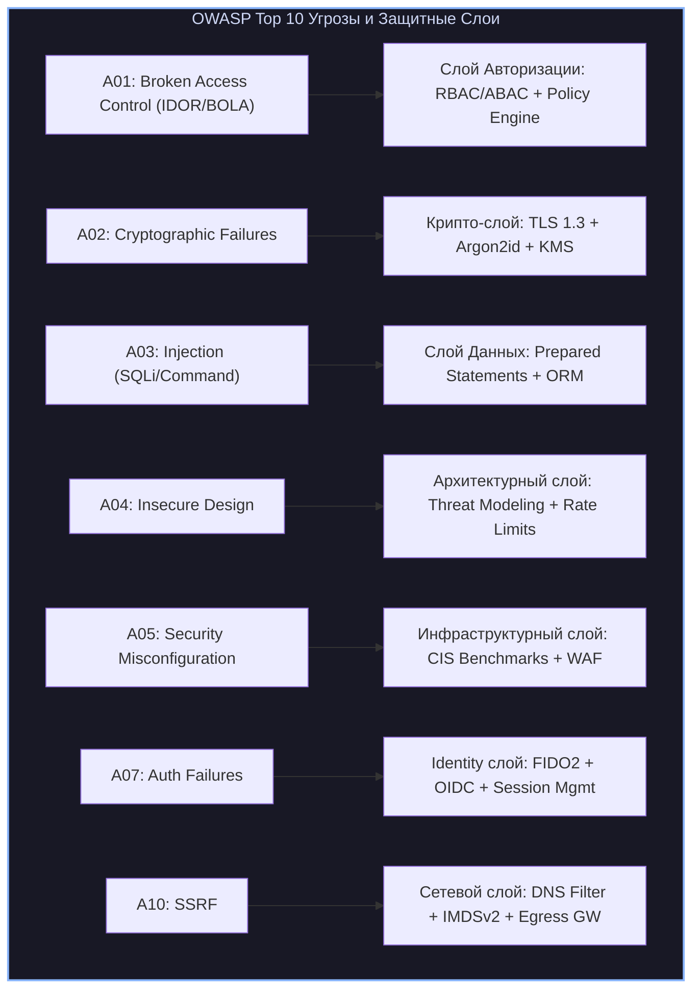
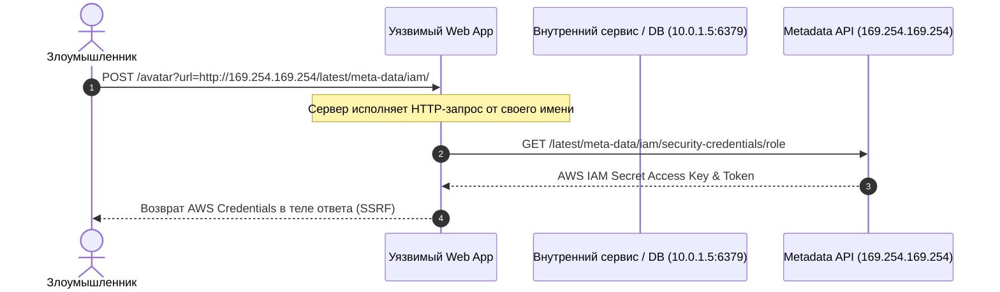
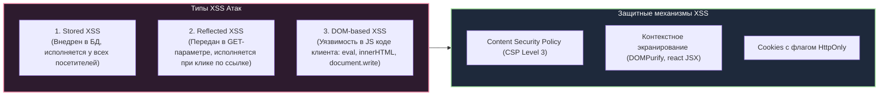

# 🌐 02. Безопасность Веб-Приложений и OWASP Top 10

> Уровень: Middle→Senior Application Security / SRE / DevOps  
> Цель: Изучить архитектурные уязвимости веб-приложений по стандарту OWASP Top 10, механику атак (Injection, BOLA, SSRF, XSS, CSRF), принципы глубокой эшелонированной защиты (Defense-in-Depth), настройку WAF (ModSecurity / Coraza), Content Security Policy (CSP Level 3) и боевые конфигурации веб-серверов.

---

### 1. Архитектура OWASP Top 10: Глубокий разбор категорий

OWASP Top 10 представляет консенсус индустрии относительно наиболее критических рисков безопасности веб-приложений и API.



---

### 2. Детальный анализ ключевых векторов атак

#### 2.1 A01: Broken Access Control (BOLA / IDOR / Mass Assignment)

**Broken Object Level Authorization (BOLA / IDOR):**  
Возникает, когда API принимает идентификатор объекта (`id`) от клиента и выполняет операцию без проверки принадлежности объекта текущему авторизованному пользователю.

```text
Уязвимый паттерн (Node.js/Express):
app.get('/api/documents/:docId', async (req, res) => {
    const doc = await db.documents.findOne({ id: req.params.docId }); // ❌ Нет проверки req.user.id
    res.json(doc);
});

Безопасный паттерн (Least Privilege ABAC):
app.get('/api/documents/:docId', async (req, res) => {
    const doc = await db.documents.findOne({ 
        id: req.params.docId, 
        tenantId: req.user.tenantId, //  Проверка владения тенантом
        userId: req.user.id 
    });
    if (!doc) return res.status(404).json({ error: "Document not found" });
    res.json(doc);
});
```

#### 2.2 A03: Injection (SQLi, NoSQLi, Command Injection)

1. **SQL Injection (SQLi):**  
   - **Union-based:** извлечение структуры БД через `UNION SELECT schema_name FROM information_schema.schemata`.
   - **Error-based:** провоцирование синтаксической ошибки сервера с выводом данных в теле ошибки (`CAST(... AS int)`).
   - **Time-based Blind:** внедрение задержек `pg_sleep(5)` или `WAITFOR DELAY '0:0:5'` для посимвольного считывания хэшей.
2. **Command Injection:**  
   - Вызов небезопасных системных оболочек (`system()`, `exec()`, `eval()`, `child_process.exec()`).
   - Защита: использование `child_process.execFile()` с массивом аргументов без запуска оболочки (`shell: false`).

```python
#  Уязвимый код Python (Command Injection)
import subprocess

def ping_host(host_ip):
    # Если host_ip = "127.0.0.1; cat /etc/passwd"
    return subprocess.getoutput(f"ping -c 1 {host_ip}")

#  Безопасный код (Строго типизированный массив аргументов)
import ipaddress, subprocess

def secure_ping_host(host_ip: str):
    # 1. Валидация входного типа
    ip_obj = ipaddress.ip_address(host_ip)
    # 2. Вызов без shell interpreter
    res = subprocess.run(["ping", "-c", "1", str(ip_obj)], capture_output=True, text=True, check=True)
    return res.stdout
```

#### 2.3 A10: Server-Side Request Forgery (SSRF)

SSRF возникает, когда веб-сервер принимает URL от пользователя и загружает ресурс без должной фильтрации, позволяя атакующему сканировать локальную сеть (`10.0.0.0/8`, `192.168.0.0/16`), дергать сервисы администрирования (`http://127.0.0.1:2379` etcd) или красть метаданные облака (`http://169.254.169.254/latest/meta-data/`).



**Меры защиты от SSRF:**
- Использование белого списка схем (`http/https`) и доменных имен.
- DNS Pinning: разрешение DNS-имени до выполнения запроса и блокировка Private / Loopback / Link-Local IP (`RFC 1918`, `RFC 3927`).
- Запрет HTTP Redirects в HTTP-клиентах при обработке пользовательских URL.

---

### 3. XSS (Cross-Site Scripting) и CSRF (Cross-Site Request Forgery)



#### Защита от CSRF: SameSite Cookies и Anti-CSRF Tokens
- **SameSite=Strict:** Cookie отправляется только в запросах, инициированных с того же самого домена.
- **SameSite=Lax:** Cookie отправляется при переходе по внешним ссылкам (GET), но блокируется для POST/PUT запросов с внешних сайтов.
- **Synchronizer Token Pattern:** Случайный криптографический токен, генерируемый на бэкенде и сверяемый при POST-запросе в заголовке `X-CSRF-Token`.

---

### 4. Defense-in-Depth: Комплексная защита веб-приложений

#### 4.1 Content Security Policy (CSP Level 3)

Заголовок `Content-Security-Policy` указывает браузеру строгие правила загрузки и исполнения скриптов, стилей и медиа.

```http
Content-Security-Policy: default-src 'self'; script-src 'self' 'nonce-rAnd0m12345' 'strict-dynamic'; style-src 'self' 'unsafe-inline'; img-src 'self' data: https://cdn.example.com; font-src 'self' https://fonts.gstatic.com; connect-src 'self' https://api.example.com; frame-ancestors 'none'; base-uri 'none'; form-action 'self'; object-src 'none'; upgrade-insecure-requests;
```

| Директива CSP | Назначение | Предотвращаемый вектор атаки |
| :--- | :--- | :--- |
| `default-src 'self'` | Источник по умолчанию — только свой домен | Загрузка левых внешних ресурсов |
| `script-src 'nonce-...'` | Разрешение только тех `<script>`, у которых совпадает криптографический `nonce` | Блокировка Stored и Reflected XSS |
| `frame-ancestors 'none'` | Запрет встраивания сайта в `<iframe>` | Полная защита от Clickjacking |
| `base-uri 'none'` | Запрет манипуляции тегом `<base>` | Защита от подмены относительных путей скриптов |
| `object-src 'none'` | Запрет плагинов Flash/Java | Блокировка устаревших векторных уязвимостей |

---

### 5. Боевые конфигурации: Hardening Nginx и WAF ModSecurity

#### 5.1 Hardened Nginx Production Configuration

```nginx
# /etc/nginx/conf.d/hardened_app.conf

# Ограничение частоты запросов (Rate Limiting)
limit_req_zone $binary_remote_addr zone=api_limit:20m rate=10r/s;
limit_req_zone $binary_remote_addr zone=login_limit:10m rate=1r/s;
limit_conn_zone $binary_remote_addr zone=addr_conn_limit:10m;

server {
    listen 443 ssl http2;
    server_name app.example.com;

    # SSL/TLS Hardening
    ssl_certificate /etc/letsencrypt/live/app.example.com/fullchain.pem;
    ssl_certificate_key /etc/letsencrypt/live/app.example.com/privkey.pem;
    ssl_protocols TLSv1.2 TLSv1.3;
    ssl_ciphers 'ECDHE-ECDSA-AES128-GCM-SHA256:ECDHE-RSA-AES128-GCM-SHA256:ECDHE-ECDSA-AES256-GCM-SHA384:ECDHE-RSA-AES256-GCM-SHA384:DHE-RSA-AES128-GCM-SHA256:DHE-RSA-AES256-GCM-SHA384';
    ssl_prefer_server_ciphers off;
    ssl_session_timeout 1d;
    ssl_session_cache shared:SSL:10m;
    ssl_session_tickets off;
    ssl_stapling on;
    ssl_stapling_verify on;

    # Защитные HTTP-заголовки
    add_header Strict-Transport-Security "max-age=63072000; includeSubDomains; preload" always;
    add_header X-Content-Type-Options "nosniff" always;
    add_header X-Frame-Options "DENY" always;
    add_header X-XSS-Protection "0" always; # 0 отключает устаревший и багованный XSS-аудитор браузера в пользу CSP
    add_header Referrer-Policy "strict-origin-when-cross-origin" always;
    add_header Permissions-Policy "geolocation=(), microphone=(), camera=(), payment=()" always;
    add_header Content-Security-Policy "default-src 'self'; script-src 'self'; object-src 'none'; frame-ancestors 'none';" always;

    # Защита от сканеров и скрытие версии сервера
    server_tokens off;
    client_max_body_size 10M;
    client_body_buffer_size 128k;

    # Глобальные лимиты соединений
    limit_conn addr_conn_limit 20;

    location / {
        limit_req zone=api_limit burst=20 nodelay;
        proxy_pass http://127.0.0.1:8080;
        proxy_http_version 1.1;
        proxy_set_header Upgrade $http_upgrade;
        proxy_set_header Connection "upgrade";
        proxy_set_header Host $host;
        proxy_set_header X-Real-IP $remote_addr;
        proxy_set_header X-Forwarded-For $proxy_add_x_forwarded_for;
        proxy_set_header X-Forwarded-Proto $scheme;
    }

    location /api/v1/auth/login {
        limit_req zone=login_limit burst=3 nodelay;
        proxy_pass http://127.0.0.1:8080;
    }
}
```

#### 5.2 ModSecurity v3 + OWASP Core Rule Set (CRS v4)

```apache
# /etc/modsecurity/crs-setup.conf

# Включение движка WAF в режим блокировки
SecRuleEngine On
SecRequestBodyAccess On
SecResponseBodyAccess Off
SecRequestBodyLimit 13107200
SecRequestBodyNoFilesLimit 131072

# OWASP CRS Anomaly Scoring Mode
SecAction \
 "id:900000,\
  phase:1,\
  nolog,\
  pass,\
  t:none,\
  setvar:tx.paranoia_level=1,\
  setvar:tx.inbound_anomaly_score_threshold=5,\
  setvar:tx.outbound_anomaly_score_threshold=4"

# Кастомное правило: Блокировка попыток сканирования и обращения к .env / .git
SecRule REQUEST_URI "@rx \.(env|git|htaccess|aws/credentials)$" \
    "id:100001,\
     phase:1,\
     deny,\
     status:403,\
     log,\
     msg:'Directory Traversal & Sensitive File Access Attempt'"
```

---

### 6. Практический кейс: Расследование и устранение уязвимости SSRF

#### Симптомы инцидента:
SIEM генерирует Critical Alert: сервис `image-resizer` инициировал исходящее TCP-соединение на внутренний порт Redis `10.0.2.14:6379` и передал команду `CONFIG SET`.

#### Диагностика и локализация:

```bash
# 1. Просмотр логов доступа пода image-resizer
kubectl logs deploy/image-resizer -n prod --tail=100 | grep -E "(127\.0\.0\.1|10\.|169\.254)"

# 2. Проверка запущенных сетевых сокетов внутри контейнера через ss/lsof
kubectl exec -it deploy/image-resizer -n prod -- ss -tunap

# 3. Применение NetworkPolicy для изоляции пода от внутренней приватной инфраструктуры
cat <<EOF | kubectl apply -f -
apiVersion: networking.k8s.io/v1
kind: NetworkPolicy
metadata:
  name: isolate-image-resizer-egress
  namespace: prod
spec:
  podSelector:
    matchLabels:
      app: image-resizer
  policyTypes:
  - Egress
  egress:
  # Разрешен только публичный интернет (через исключение приватных диапазонов)
  - to:
    - ipBlock:
        cidr: 0.0.0.0/0
        except:
        - 10.0.0.0/8
        - 172.16.0.0/12
        - 192.168.0.0/16
        - 169.254.169.254/32
    ports:
    - protocol: TCP
      port: 443
    - protocol: TCP
      port: 80
  # Разрешен доступ к CoreDNS
  - to:
    - namespaceSelector: {}
      podSelector:
        matchLabels:
          k8s-app: kube-dns
    ports:
    - protocol: UDP
      port: 53
EOF
```
