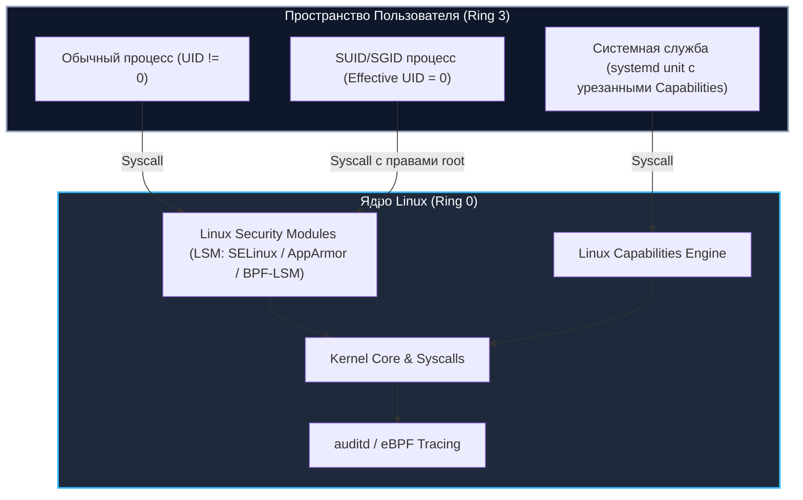
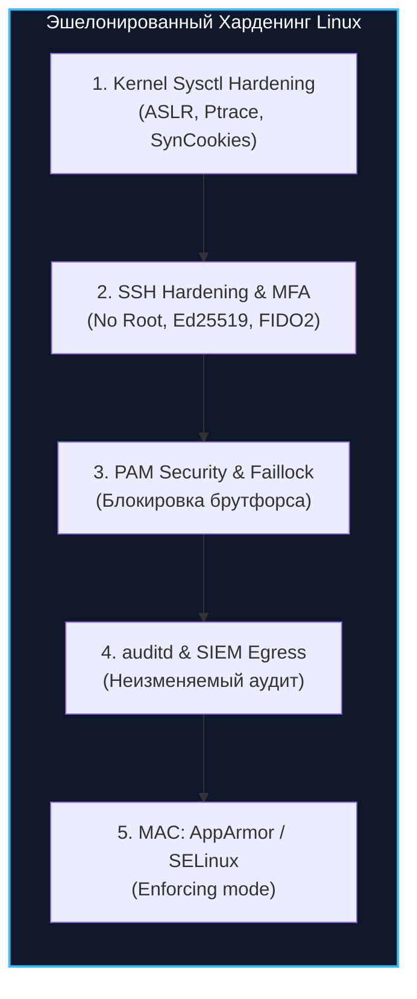

# 🐧 03. Безопасность Linux-Серверов и Защита от Повышения Привилегий

> Уровень: Senior Linux Engineer / DevOps / DevSecOps  
> Цель: Изучить векторы локального повышения привилегий в Linux (LPE: SUID, Sudoers, Capabilities, Kernel Exploits, Cron), освоить комплексный харденинг ядра (sysctl, AppArmor/SELinux), подсистемы аудита (`auditd`), PAM-модулей и SSH-инфраструктуры.

---

### 1. Архитектура безопасности ядра Linux и Модель Привилегий

В Linux безопасность строится на разграничении дискреционного (DAC) и мандатного (MAC) контроля доступа, пространств имен (Namespaces), контрольных групп (cgroups) и возможностей ядра (Capabilities).



---

### 2. Векторы локального повышения привилегий (Privilege Escalation)

#### 2.1 Злоупотребление SUID/SGID бинарными файлами

Бит SUID (`chmod u+s /path/binary` / `4000`) заставляет процесс выполняться с правами владельца файла (обычно `root`), независимо от того, какой пользователь его запустил.

```bash
# Поиск всех файлов с битом SUID на сервере
find / -perm -4000 -type f -exec ls -la {} 2>/dev/null \;
```

**Опасные SUID-утилиты (GTFOBins):**
- Если утилита `find` имеет SUID: `find . -exec /bin/sh -p \; -quit` (мгновенный root shell).
- Если утилита `vim` имеет SUID: `vim -c ':!/bin/sh'`.
- Если утилита `env` имеет SUID: `env /bin/sh -p`.

#### 2.2 Некорректные конфигурации Sudoers (`/etc/sudoers`)

```bash
# 1. Просмотр разрешенных sudo-команд без пароля
sudo -l
```

**Типичные уязвимости sudoers:**
1. `ALL=(ALL) NOPASSWD: /usr/bin/less /var/log/*` → Внутри `less` нажатие `!/bin/sh` дает root shell.
2. `Defaults env_keep += "LD_PRELOAD"` → Загрузка произвольной разделяемой библиотеки с переопределением функций перед выполнением sudo команды:
   ```c
   // evil.c
   #include <stdio.h>
   #include <sys/types.h>
   #include <unistd.h>
   void _init() {
       unsetenv("LD_PRELOAD");
       setgid(0); setuid(0);
       system("/bin/bash");
   }
   // Компиляция: gcc -fPIC -shared -o /tmp/evil.so evil.c -nostartfiles
   // Запуск: sudo LD_PRELOAD=/tmp/evil.so /usr/bin/find
   ```

#### 2.3 Злоупотребление Linux Capabilities

Linux Capabilities разбивают всемогущие привилегии `root` (UID 0) на гранулярные блоки. Неправильная выдача capability обычному бинарнику эквивалентна SUID root.

| Capability | Вектор эскалации | Метод защиты |
| :--- | :--- | :--- |
| `CAP_SETUID` | Процесс может вызвать `setuid(0)` и стать root | Никогда не выдавать бинарникам общего назначения |
| `CAP_DAC_READ_SEARCH` | Обход всех проверок прав на чтение (чтение `/etc/shadow`, закрытых ключей SSH) | Ограничивать через LSM и systemd `CapabilityBoundingSet` |
| `CAP_SYS_ADMIN` | Практически полный эквивалент root (монтирование ФС, eBPF, raw memory) | Запрещать в контейнерах (`drop: [SYS_ADMIN]`) |
| `CAP_SYS_PTRACE` | Внедрение шеллкода в память любого другого процесса через `ptrace` | `kernel.yama.ptrace_scope = 2` |

```bash
# Поиск всех файлов с установленными возможностями (Capabilities)
getcap -r / 2>/dev/null

# Пример опасной уязвимости: Python с CAP_SETUID
# /usr/bin/python3.11 = cap_setuid+ep
# Эксплуатация:
python3 -c 'import os; os.setuid(0); os.system("/bin/bash")'
```

#### 2.4 Эксплуатация уязвимостей ядра (Kernel Exploits)

- **Dirty COW (CVE-2016-5195):** Состояние гонки (Race Condition) в подсистеме Copy-on-Write ядра Linux, позволяющее перезаписывать файлы, открытые только для чтения (например, `/etc/passwd`).
- **Dirty Pipe (CVE-2022-0847):** Ошибка в обработке пайпов (`pipe_buffer.flags`), позволяющая писать в page cache любого read-only файла.
- **PwnKit (CVE-2021-4034):** Ошибка выхода за границы массива аргументов в `pkexec` (Polkit).

---

### 3. Комплексный Hardening Linux-Серверов



#### 3.1 Sysctl Kernel Hardening (`/etc/sysctl.d/99-security-hardening.conf`)

```ini
# /etc/sysctl.d/99-security-hardening.conf

# 1. Защита памяти и рандомизация адресов (ASLR)
kernel.randomize_va_space = 2
kernel.kptr_restrict = 2
kernel.dmesg_restrict = 1
kernel.yama.ptrace_scope = 2
kernel.unprivileged_bpf_disabled = 1
net.core.bpf_jit_harden = 2

# 2. Защита файловой системы от Race Conditions и Link Attacks
fs.protected_hardlinks = 1
fs.protected_symlinks = 1
fs.protected_fifos = 2
fs.protected_regular = 2
fs.suid_dumpable = 0

# 3. Сетевой харденинг ядра (Защита стека TCP/IP)
net.ipv4.tcp_syncookies = 1
net.ipv4.tcp_rfc1337 = 1
net.ipv4.conf.all.rp_filter = 1
net.ipv4.conf.default.rp_filter = 1
net.ipv4.conf.all.accept_redirects = 0
net.ipv4.conf.default.accept_redirects = 0
net.ipv4.conf.all.secure_redirects = 0
net.ipv4.conf.all.send_redirects = 0
net.ipv4.conf.all.accept_source_route = 0
net.ipv4.conf.all.log_martians = 1
net.ipv4.icmp_echo_ignore_broadcasts = 1
net.ipv4.icmp_ignore_bogus_error_responses = 1

# 4. Отключение IPv6 маршрутизации (если не используется)
net.ipv6.conf.all.disable_ipv6 = 1
net.ipv6.conf.default.disable_ipv6 = 1
```

Применение параметров:
```bash
sudo sysctl --system
```

#### 3.2 SSH Daemon Hardening (`/etc/ssh/sshd_config.d/hardening.conf`)

```text
# /etc/ssh/sshd_config.d/hardening.conf
Port 2222
Protocol 2
PermitRootLogin no
MaxAuthTries 3
MaxSessions 2
PubkeyAuthentication yes
PasswordAuthentication no
PermitEmptyPasswords no
ChallengeResponseAuthentication no
KerberosAuthentication no
GSSAPIAuthentication no
X11Forwarding no
AllowAgentForwarding no
AllowTcpForwarding no
ClientAliveInterval 300
ClientAliveCountMax 2
UsePAM yes

# Строгий выбор шифров и KEX алгоритмов (OpenSSH Post-Quantum ready)
KexAlgorithms curve25519-sha256,curve25519-sha256@libssh.org,diffie-hellman-group16-sha512,diffie-hellman-group18-sha512
Ciphers chacha20-poly1305@openssh.com,aes256-gcm@openssh.com,aes128-gcm@openssh.com
MACs hmac-sha2-512-etm@openssh.com,hmac-sha2-256-etm@openssh.com
```

#### 3.3 Аудит критических событий через auditd (`/etc/audit/rules.d/audit.rules`)

```ini
## /etc/audit/rules.d/audit.rules

# Удалить все существующие правила
-D

# Размер буфера сообщений ядра
-b 8192

# Флаг отказа (1 = log, 2 = kernel panic при переполнении буфера аудита)
-f 1

# Мониторинг изменений пользователей и групп
-w /etc/group -p wa -k identity_changes
-w /etc/passwd -p wa -k identity_changes
-w /etc/gshadow -p wa -k identity_changes
-w /etc/shadow -p wa -k identity_changes
-w /etc/security/opasswd -p wa -k identity_changes

# Мониторинг sudoers и PAM
-w /etc/sudoers -p wa -k sudoers_changes
-w /etc/sudoers.d/ -p wa -k sudoers_changes
-w /etc/pam.d/ -p wa -k pam_changes

# Мониторинг вызовов execve от непривилегированных пользователей
-a always,exit -F arch=b64 -S execve -F auid>=1000 -F auid!=4294967295 -k user_commands

# Мониторинг загрузки модулей ядра
-a always,exit -F arch=b64 -S init_module,finit_module,delete_module -k kernel_modules

# Фиксация конфигурации (только перезагрузка снимет защиту правил)
-e 2
```

Активация правил:
```bash
sudo augenrules --load
sudo systemctl restart auditd
```

#### 3.4 Защита от перебора паролей через PAM (`pam_faillock`)

Файл `/etc/pam.d/common-auth` (Debian/Ubuntu) или `/etc/pam.d/system-auth` (RHEL/AlmaLinux):

```text
auth        required      pam_env.so
auth        required      pam_faillock.so preauth audit silent deny=5 unlock_time=900
auth        [success=1 default=bad] pam_unix.so nullok
auth        [default=die] pam_faillock.so authfail audit deny=5 unlock_time=900
auth        sufficient    pam_faillock.so authsucc
```

---

### 4. Автоматизированный аудит безопасности с Lynis

```bash
# Установка и запуск глубокого аудита системы
sudo apt update && sudo apt install lynis -y
sudo lynis audit system --quick

# Просмотр сводного индекса безопасности (Hardening Index)
grep "Hardening index" /var/log/lynis-report.dat

# Просмотр конкретных предупреждений и рекомендаций
grep "warning\[\]" /var/log/lynis-report.dat
grep "suggestion\[\]" /var/log/lynis-report.dat
```

---

### 5. Troubleshooting & Case Study: Расследование PrivEsc инцидента

#### Описание инцидента:
> **Симптом:** SIEM зафиксировал создание новой учетной записи с UID 0 (`root2`) и запуск bash-сессии из-под сервисного пользователя `www-data`.  
> **Анализ:** Атакующий загрузил веб-шелл через уязвимость в CMS, обнаружил SUID на кастомном бинарнике `/usr/local/bin/backup-tool`, вызывающем системный вызов `system("tar -czf /tmp/backup.tar.gz /var/log")` с относительным путем без сброса `$PATH`.

#### Пошаговые команды расследования и локализации:

```bash
# 1. Поиск команд злоумышленника в журнале аудита auditd
ausearch -k user_commands -ts today --raw | aureport -x --summary

# 2. Идентификация сессии и родительского процесса
ausearch -k identity_changes -i

# 3. Немедленная блокировка скомпрометированного пользователя и удаление бэкдора
sudo passwd -l www-data
sudo userdel -f root2

# 4. Поиск и устранение небезопасного SUID бинарника
sudo chmod u-s /usr/local/bin/backup-tool

# 5. Проверка целостности системных пакетов (Debian/Ubuntu)
debsums -c -s
# Для RHEL/CentOS/AlmaLinux:
# rpm -Va
```
