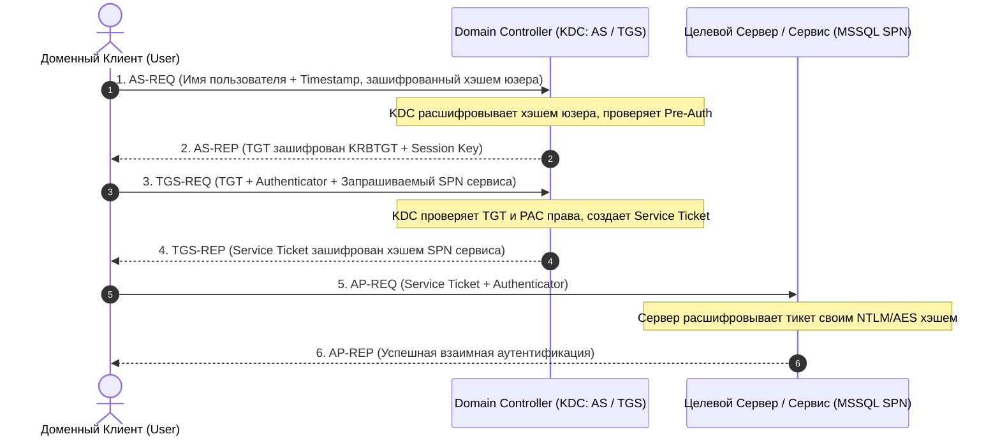
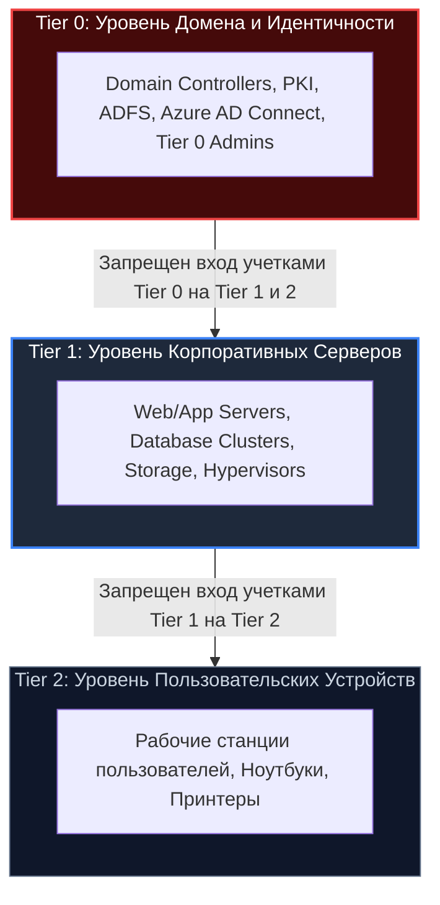

# 🪟 04. Безопасность Windows и Инфраструктуры Active Directory

> Уровень: Senior Infrastructure / Windows Security Engineer / Enterprise Architect  
> Цель: Разобрать архитектуру безопасности Active Directory Domain Services (AD DS), протокол Kerberos, векторы атак (Kerberoasting, AS-REP Roasting, Pass-the-Hash, NTLM Relay), защиту LSASS (Credential Guard, RunAsPPL), AppLocker/WDAC, аудит PowerShell и практический GPO Hardening.

---

### 1. Архитектура безопасности Active Directory и Протокол Kerberos

Active Directory использует **Kerberos v5** в качестве основного протокола аутентификации. Доменный контроллер (Domain Controller, DC) выступает в роли **KDC (Key Distribution Center)**, состоящего из **AS (Authentication Service)** и **TGS (Ticket Granting Service)**.



#### Сравнение Kerberos и NTLM

| Характеристика | NTLMv2 | Kerberos v5 |
| :--- | :--- | :--- |
| **Принцип работы** | Challenge-Response (NetNTLMv2 хэш отправляется серверу) | Билетная система (Ticket-based) через доверенный KDC |
| **Взаимная аутентификация** | Нет (клиент не может проверить подлинность сервера) | Да (клиент и сервер взаимно проверяют друг друга) |
| **Уязвимость к Relay-атакам** | Высокая (без SMB Signing и EPA возможен NTLM Relay) | Не подвержен NTLM Relay |
| **Делегирование прав** | Отсутствует | Unconstrained / Constrained / Resource-Based (RBCD) |
| **Скорость аутентификации** | Требует обращения сервера к DC (Netlogon pass-through) | Сервер сам локально расшифровывает Service Ticket |

---

### 2. Векторы атак на Active Directory и Защитные Меры

#### 2.1 Kerberoasting

**Механика:** Любой аутентифицированный доменный пользователь может запросить у KDC билет сервиса (TGS) для любой учетной записи, имеющей зарегистрированный **SPN (Service Principal Name)**. KDC выдает билет, зашифрованный парольным хэшем сервисного аккаунта. Атакующий извлекает этот билет из памяти и брутфорсит его пароль в офлайне с помощью Hashcat (`hashcat -m 13100`).

```mermaid
flowchart LR
    subgraph Kerberoasting["Атака Kerberoasting"]
        U["Низкопривилегированный пользователь"] -->|1. TGS-REQ для MSSQL/svc_sql| DC["Domain Controller"]
        DC -->|2. TGS Ticket (зашифрован хэшем svc_sql)| U
        U -->|3. Офлайн брутфорс пароля в Hashcat| Cracked["Plaintext пароль сервиса!"]
    end
    style Kerberoasting fill:#2d1b2e,stroke:#f38ba8,stroke-width:2px,color:#fff
```

**Инженерная защита:**
1. **Переход на gMSA (Group Managed Service Accounts):** пароли длиной 128 символов, генерируемые и ротируемые контроллером домена каждые 30 дней в автоматическом режиме.
2. **Принудительное включение AES-256:** запрет RC4-HMAC шифрования билетов Kerberos.
3. **Мониторинг Event ID 4769:** фильтрация запросов билетов с шифрованием `0x17` (RC4) и опциями `0x40810000`.

#### 2.2 AS-REP Roasting

**Механика:** Если на доменном аккаунте включен флаг `DONT_REQ_PREAUTH` ("Do not require Kerberos preauthentication"), любой может запросить `AS-REP` без знания пароля. Зашифрованная часть ответа KDC содержит хэш, который взламывается в офлайне (`hashcat -m 18200`).

**Защита и аудит (PowerShell):**
```powershell
# Поиск учетных записей с отключенной преаутентификацией
Get-ADUser -Filter {DoesNotRequirePreAuth -eq $True} -Properties DoesNotRequirePreAuth | Select-Object SamAccountName, Enabled

# Исправление: принудительное включение Pre-Auth
Set-ADAccountControl -Identity "target_user" -DoesNotRequirePreAuth $False
```

#### 2.3 Модель Эшелонированного Администрирования (Tier Model)

Чтобы предотвратить атаки **Pass-the-Hash (PtH)** и компрометацию домена из-за входа администратора на зараженную рабочую станцию, внедряется 3-уровневая модель:



- **Protected Users Security Group:** Аккаунты в этой группе не кэшируют парольные хэши в LSASS, не поддерживают NTLM, DES/RC4 шифрование, а их TGT билеты действуют максимум 4 часа.

---

### 3. Защита платформы Windows (Platform Security)

#### 3.1 Защита LSASS: RunAsPPL и Credential Guard

Процесс `lsass.exe` хранит секреты и хэши в памяти. Для предотвращения дампа памяти (`Mimikatz`, `comsvcs.dll` MiniDump) применяются:

1. **LSA Protection (RunAsPPL):** превращает LSASS в защищенный процесс Protected Process Light (PPL), запрещая сторонним процессам даже с правами локального `SYSTEM` открывать дескриптор `PROCESS_VM_READ`.
2. **Windows Defender Credential Guard:** использует **Virtualization-Based Security (VBS)** и гипервизор Hyper-V для изоляции секретов (LSAIso) в защищенном виртуальном анклаве (Trustlet), физически недоступном для ядра ОС.

```powershell
# Включение RunAsPPL через реестр
Set-ItemProperty -Path "HKLM:\SYSTEM\CurrentControlSet\Control\Lsa" -Name "RunAsPPL" -Value 1 -Type DWord

# Проверка статуса Credential Guard
Get-CimInstance -ClassName Win32_DeviceGuard -Namespace root\Microsoft\Windows\DeviceGuard | Select-Object SecurityServicesRunning
```

#### 3.2 Контроль запуска приложений: AppLocker и WDAC

**Windows Defender Application Control (WDAC)** — аппаратная и системная блокировка несанкционированных исполняемых файлов, DLL и скриптов на основе цифровых подписей.

```powershell
# Создание базовой политики WDAC для сканирования доверенного каталога
New-CIPolicy -Level Publisher -FilePath "C:\Windows\System32\CodeIntegrity\CiPolicy.xml" -UserPEs

# Конвертация политики в бинарный формат
ConvertFrom-CIPolicy "C:\Windows\System32\CodeIntegrity\CiPolicy.xml" "C:\Windows\System32\CodeIntegrity\SIPolicy.p7b"
```

#### 3.3 Аудит PowerShell: Script Block Logging и Constrained Language Mode

```powershell
# Принудительное включение Constrained Language Mode (CLM) для защиты от вызовов .NET API
[Environment]::SetEnvironmentVariable("__PSLockdownPolicy", "4", "Machine")
```

Включение Script Block Logging через реестр:
```reg
[HKEY_LOCAL_MACHINE\SOFTWARE\Policies\Microsoft\Windows\PowerShell\ScriptBlockLogging]
"EnableScriptBlockLogging"=dword:00000001
"EnableScriptBlockInvocationLogging"=dword:00000001
```
*События логируются в журнал: Microsoft-Windows-PowerShell/Operational (Event ID 4104).*

---

### 4. Практический GPO Hardening Playbook

Ниже приведен список ключевых Group Policy Objects (GPO) для применения на уровне контроллеров домена и рабочих станций:

```ini
; GPO Настройки безопасности для Active Directory

; 1. Блокировка устаревших протоколов сетевого разрешения имен (Защита от Responder/MitM)
Computer Configuration -> Administrative Templates -> Network -> DNS Client
"Turn off multicast name resolution (LLMNR)" = Enabled

; 2. Принудительное подписание SMB трафика (Защита от NTLM Relay)
Computer Configuration -> Windows Settings -> Security Settings -> Local Policies -> Security Options
"Microsoft network client: Digitally sign communications (always)" = Enabled
"Microsoft network server: Digitally sign communications (always)" = Enabled

; 3. Ограничение NTLM протокола
Computer Configuration -> Windows Settings -> Security Settings -> Local Policies -> Security Options
"Network security: Restrict NTLM: Audit NTLM authentication in this domain" = Enable all
"Network security: LAN Manager authentication level" = Send NTLMv2 response only. Refuse LM & NTLM

; 4. Внедрение LAPS (Local Administrator Password Solution)
Computer Configuration -> Administrative Templates -> System -> LAPS
"Password Settings: Complexity" = Large letters, small letters, numbers, special characters
"Password Settings: Length" = 24
"Password Settings: Age (Days)" = 30
```

---

### 5. Troubleshooting & DFIR: Расследование Kerberoasting & NTLM Relay

#### Сценарий инцидента:
> **Симптом:** SOC зафиксировал серию событий Event ID 4769 от хоста `WS-DEV-42` с шифрованием билета `0x17` (RC4) для сервисных аккаунтов `MSSQL_PROD` и `SVC_BACKUP`. Спустя 20 минут зарегистрирован вход под учетной записью `SVC_BACKUP` через SMB на файловый сервер.

#### Команды расследования в PowerShell:

```powershell
# 1. Поиск подозрительных запросов Service Tickets (Kerberoasting)
Get-WinEvent -FilterHashtable @{
    LogName = 'Security'
    Id = 4769
    StartTime = (Get-Date).AddHours(-2)
} | Where-Object { 
    $_.Properties[4].Value -eq '0x17' -and $_.Properties[0].Value -notlike '*$'
} | Select-Object TimeCreated, 
    @{N='TargetService';E={$_.Properties[0].Value}}, 
    @{N='ClientIP';E={$_.Properties[3].Value}}, 
    @{N='UserName';E={$_.Properties[1].Value}}

# 2. Немедленная ротация пароля скомпрометированного сервиса на 30+ символов
Set-ADAccountPassword -Identity "SVC_BACKUP" -Reset -NewPassword (ConvertTo-SecureString -AsPlainText -Force "C0mpl3x_#Str0ng!P@ssw0rd_2026_Secured")

# 3. Миграция целевого сервиса на Group Managed Service Account (gMSA)
New-ADServiceAccount -Name "gmsa_backup" -DNSHostName "gmsa_backup.corp.domain" -PrincipalsAllowedToRetrieveManagedPassword "BackupServersGroup"
```
