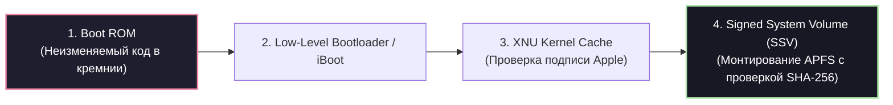
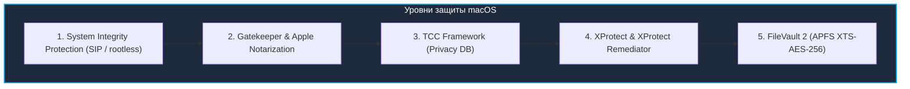

# 🍏 05. Архитектура Безопасности Apple: iOS и macOS

> Уровень: Senior Security Engineer / Platform Security / Mobile Architect  
> Цель: Изучить аппаратные и программные механизмы безопасности экосистемы Apple: Secure Enclave Processor (SEP), цепочку доверенной загрузки (Secure Boot), модель изоляции приложений (Sandbox, Entitlements), криптографические классы Data Protection API, Pointer Authentication Codes (PAC), а также уровни защиты macOS (SIP, Gatekeeper, TCC, XProtect, FileVault).

---

### 1. Аппаратная безопасность и Secure Enclave (Apple Silicon)

Безопасность устройств Apple (чипы серий A и M) строится на аппаратном корне доверия (Hardware Root of Trust).

```mermaid
flowchart TD
    subgraph SoC["Apple Silicon SoC (A-Series / M-Series)"]
        subgraph AP["Application Processor (Cores)"]
            Kernel["XNU Kernel + Sandboxed Apps"]
        end

        subgraph SEP["Secure Enclave Processor (SEP)"]
            SEPCore["Выделенное безопасное ядро (sepOS)"]
            TRNG["Генератор случайных чисел (TRNG)"]
            AESEngine["Аппаратный криптодвижок AES"]
            PKA["Public Key Accelerator (ECC)"]
            SecureStorage["Защищенная память (Anti-Replay NVRAM)"]
        end

        subgraph HardwareKeys["Аппаратные Fuses (Прожигаются на заводе)"]
            UID["Device Unique ID (UID) - Недоступен ядру!"]
            GID["Device Group ID (GID)"]
        end
    end

    HardwareKeys --> AESEngine
    SEP <-->|Изолированная почтовая шина (Mailbox) и зашифрованная RAM| AP
    style SoC fill:#1e293b,stroke:#38bdf8,stroke-width:2px,color:#fff
    style SEP fill:#0f172a,stroke:#a855f7,stroke-width:2px,color:#fff
    style HardwareKeys fill:#3b0764,stroke:#e879f9,stroke-width:1px,color:#fff
```

#### Ключевые компоненты аппаратной безопасности:
1. **Device Unique ID (UID):** Уникальный 256-битный ключ, прожигаемый в кремнии при фабричном производстве. Ни программное обеспечение, ни отладочные интерфейсы JTAG не могут прочитать UID напрямую. Он используется исключительно аппаратным AES-движком Secure Enclave.
2. **Secure Enclave Processor (SEP):** Изолированный микроконтроллер, работающий под управлением собственной защищенной операционной системы (`sepOS`). Он обрабатывает биометрию (Face ID / Touch ID), хранит мастер-ключи шифрования файлов и ключи связки ключей (Keychain).
3. **Цепочка доверенной загрузки (Secure Boot Chain):**



---

### 2. Модель безопасности iOS: Sandboxing, Entitlements и Data Protection

#### 2.1 Изоляция приложений (App Sandboxing) и Entitlements

Каждое стороннее приложение в iOS работает внутри изолированного контейнера («песочницы») под уникальным непривилегированным пользователем `mobile`.
- Приложение не имеет прямого доступа к файловой системе других приложений.
- Межпроцессное взаимодействие (IPC) строго ограничено системными механизмами (XPC, App Groups).
- **Entitlements (Права):** Подписанный Apple XML-словарь привилегий, определяющий доступ к возможностям ОС:

```xml
<!-- Пример Entitlements файла приложения -->
<!DOCTYPE plist PUBLIC "-//Apple//DTD PLIST 1.0//EN" "http://www.apple.com/DTDs/PropertyList-1.0.dtd">
<plist version="1.0">
<dict>
    <key>com.apple.developer.networking.wifi-info</key>
    <true/>
    <key>keychain-access-groups</key>
    <array>
        <string>$(AppIdentifierPrefix)com.example.corp.sharedkeychain</string>
    </array>
    <key>aps-environment</key>
    <string>production</string>
</dict>
</plist>
```

#### 2.2 Data Protection API: Криптографические классы защиты данных

iOS шифрует каждый файл индивидуальным ключом (**Per-File Key**), который затем оборачивается ключом соответствующего класса (**Class Key**), связанным с паролем пользователя и UID Secure Enclave.

| Класс защиты | Описание и доступность | Назначение |
| :--- | :--- | :--- |
| **Class A (Complete Protection)** | Данные расшифрованы **только когда устройство разблокировано**. Ключ выгружается из памяти через 10 секунд после блокировки экрана. | Банковские приложения, пароли, приватные сообщения. |
| **Class B (Protected Unless Open)** | Доступны, если файл был открыт до блокировки экрана (ключ сохраняется в памяти процесса). | Фоновая запись аудио, навигационные треки. |
| **Class C (Protected Until First Auth)** | Данные становятся доступными **после первой разблокировки** устройства после перезагрузки и остаются доступными до выключения. | Фоновая синхронизация почты, загрузка уведомлений. |
| **Class D (No Protection)** | Зашифрованы только аппаратным ключом UID устройства. Доступны всегда, даже до ввода пароля. | Системные бинарники, обои экрана блокировки. |

#### 2.3 Аппаратные механизмы целостности памяти (PAC, APRR)
- **Pointer Authentication Codes (PAC):** Инструкции процессоров ARMv8.3-A/Apple Silicon, вычисляющие криптографический HMAC указателей кода и данных. Это полностью предотвращает атаки Return-Oriented Programming (ROP) и Jump-Oriented Programming (JOP).
- **BlastDoor:** Песочница в iMessage, написанная на Swift и изолирующая парсинг всех входящих медиафайлов и сложных бинарных протоколов без доступа к сети и ФС.
- **Lockdown Mode (Режим блокировки):** Экстремальный профиль защиты, отключающий JIT-компиляцию в WebKit, предварительный рендеринг вложений и проводные соединения при заблокированном экране.

---

### 3. Эшелонированная защита macOS



#### 3.1 System Integrity Protection (SIP)

SIP ограничивает даже учетную запись `root` от модификации системных директорий (`/System`, `/usr`, `/bin`, `/sbin`), загрузки неподписанных kext (Kernel Extensions) и привязки дебаггеров к системным процессам.

```bash
# Проверка статуса SIP в терминале macOS
csrutil status
# Вывод: System Integrity Protection status: enabled.
```

#### 3.2 Gatekeeper и Нотаризация (Notarization)

При скачивании бинарного файла через браузер выставляется атрибут `com.apple.quarantine`. Gatekeeper проверяет:
1. Валидность цифровой подписи Apple Developer ID.
2. Наличие билета нотаризации (Notarization Ticket) от серверов Apple (проверка на отсутствие вредоносного кода при сборке).

```bash
# Проверка подписи и нотаризации приложения
codesign --verify --deep --strict --verbose=4 /Applications/ExampleApp.app
spctl -a -vvv -t install /Applications/ExampleApp.app

# Просмотр расширенных атрибутов файла (карантин)
xattr -l ~/Downloads/installer.pkg
```

#### 3.3 Подсистема TCC (Transparency, Consent, and Control)

TCC управляет доступом приложений к сенсорам и приватным данным (Камера, Микрофон, Full Disk Access, Доступ к файлам пользователя). База хранится в SQLite:
- Системная база: `/Library/Application Support/com.apple.TCC/TCC.db`
- Пользовательская база: `~/Library/Application Support/com.apple.TCC/TCC.db`

```bash
# Сброс разрешений TCC для конкретного приложения или сервиса
tccutil reset Camera com.example.app
tccutil reset All com.example.app
```

#### 3.4 Встроенный антивирусный движок XProtect & Remediator

macOS выполняет фоновый мониторинг с помощью двух системных демонов:
- **XProtect:** Проверяет сигнатуры YARA при первом запуске приложений (`/Library/Apple/System/Library/CoreServices/XProtect.bundle`).
- **XProtect Remediator:** Автономный сканер ядра, периодически проверяющий систему на активность известных семейств зловредов (DubRobber, Pirrit, CloudMensis).

---

### 4. Практика & Troubleshooting: Анализ безопасности хоста macOS

#### Диагностика и проверка комплаенса:

```bash
# 1. Проверка шифрования FileVault
fdesetup status
# Вывод: FileVault is On.

# 2. Проверка активных демонов безопасности XProtect
launchctl list | grep -E "com.apple.XProtect"

# 3. Аудит установленных профилей управления MDM
sudo profiles show -all

# 4. Проверка защищенного хранилища Keychain через CLI
security dump-keychain -d login.keychain-db 2>&1 | head -n 20
```
