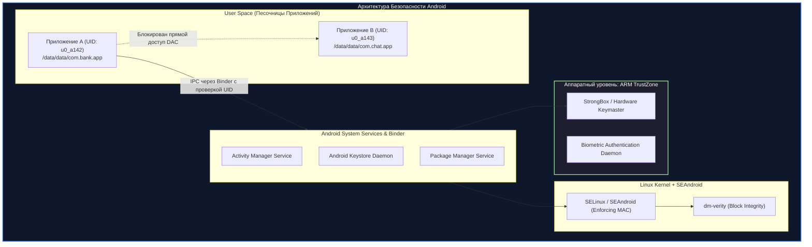
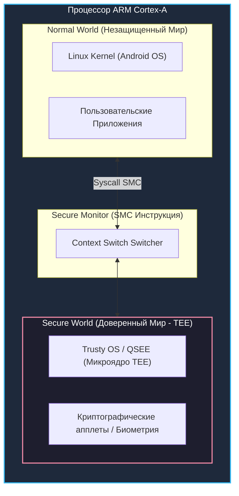

# 🤖 06. Безопасность Android и Мобильных Приложений

> Уровень: Senior Mobile Security Engineer / AppSec / Android Developer  
> Цель: Разобрать архитектуру безопасности операционной системы Android (UID Sandbox, SEAndroid/SELinux, Android Verified Boot AVB 2.0), аппаратные доверенные среды (ARM TrustZone, StrongBox Keymaster), схемы цифровой подписи (APK Signature v1–v4), сетевую безопасность (SSL Pinning) и методы активной защиты RASP (Runtime Application Self-Protection).

---

### 1. Архитектура безопасности Android OS и Песочница Приложений

В отличие от классического Linux, где один пользователь запускает множество программ, Android использует модель **Multi-User Sandbox**, где каждому установленному приложению назначается уникальный системный пользователь Linux (**UID**, например `u0_a142`).



#### 1.1 SEAndroid (Security Enhancements for Android)
Android использует строгий мандатный контроль доступа (MAC) на базе SELinux в режиме `Enforcing`. Все процессы разделены на домены (например, `untrusted_app`, `system_server`, `isolated_app`), а доступ к системным вызовам и файлам ограничен правилами `neverallow`.

#### 1.2 Android Verified Boot (AVB 2.0 / dm-verity)
Цепочка доверенной загрузки верифицирует целостность каждого блока разделов `boot`, `dtbo`, `system`, `vendor`:
- Дерево хэшей **dm-verity** проверяет блоки данных при чтении в реальном времени.
- При обнаружении модификации хотя бы 1 бита в системном разделе устройство блокирует загрузку или переходит в режим `Red State` (Device Corrupted).
- Механизм аппаратных предохранителей (**eFuses**) предотвращает откат на уязвимые версии прошивок (Anti-Rollback Protection).

---

### 2. Аппаратная безопасность: ARM TrustZone и StrongBox Keymaster



#### Классы аппаратных хранилищ Android Keystore:
1. **Software-backed:** Ключи хранятся в зашифрованном виде в файловой системе (Android < 6.0 или эмуляторы). Небезопасно.
2. **TEE-backed Keymaster (ARM TrustZone):** Приватные ключи генерируются и используются исключительно внутри Secure World. Ядро Linux никогда не имеет доступа к телу ключа.
3. **StrongBox Keymaster:** Выделенный физический чип безопасности (Secure Element / Titan M2) со своим CPU, памятью и аппаратными датчиками защиты от физического вскрытия (DPA, Glitch attacks).

---

### 3. Схемы подписи приложений (APK Signature Schemes v1–v4)

| Версия схемы | Способ верификации | Уязвимости / Особенности |
| :--- | :--- | :--- |
| **v1 (JAR signing)** | Проверка контрольных сумм каждого отдельного файла в `META-INF/` | Уязвима к Janus Attack (добавление байтов без изменения подписи). Медленная проверка. |
| **v2 (APK Signing Block)** | Хэширование всего содержимого файла APK (блочный хэш-дерево) | Защищает всю структуру APK. Блокирует любые модификации архива. |
| **v3 (Key Rotation)** | Добавление блока истории ключей (Proof-of-Rotation) | Позволяет приложению безопасно менять сертификат подписи при обновлении. |
| **v4 (Streaming / fs-verity)** | Формирование дерева хэшей Merkle Tree в отдельном файле `.idsig` | Позволяет запускать приложение до завершения полной загрузки (Play Streaming). |

---

### 4. Сетевая безопасность: Network Security Config и SSL Pinning

Начиная с Android 9 (API 28), весь открытый HTTP-трафик (`Cleartext HTTP`) блокируется по умолчанию.

#### 4.1 Конфигурация сетевой безопасности (`res/xml/network_security_config.xml`)

```xml
<?xml version="1.0" encoding="utf-8"?>
<network-security-config>
    <!-- Запрет открытого незашифрованного HTTP трафика -->
    <base-config cleartextTrafficPermitted="false">
        <trust-anchors>
            <!-- Доверие только системным предустановленным CA (пользовательские CA игнорируются) -->
            <certificates src="system" />
        </trust-anchors>
    </base-config>

    <!-- SSL Certificate Pinning для домена банковского API -->
    <domain-config>
        <domain includeSubdomains="true">api.bank.example.com</domain>
        <pin-set expiration="2027-01-01">
            <!-- SHA-256 хэш публичного ключа (SPKI Pinning) основного сертификата -->
            <pin digest="SHA-256">k2oTX1jigQHbWorc3Crur9+/ChPczzaWLD/itJG4EQA=</pin>
            <!-- Резервный пин (Backup Pin) на случай экстренной ротации CA -->
            <pin digest="SHA-256">WoiWRyIOVNa9ihaBciRSC7XHjliYS9VwUGOIud4PB18=</pin>
        </pin-set>
    </domain-config>
</network-security-config>
```

Регистрация в `AndroidManifest.xml`:
```xml
<application
    android:networkSecurityConfig="@xml/network_security_config"
    android:allowBackup="false"
    ... >
</application>
```

---

### 5. Mobile App Hardening и RASP (Runtime Application Self-Protection)

#### 5.1 Обфускация кода с R8 / ProGuard (`proguard-rules.pro`)

```text
# Включение максимальной оптимизации и обфускации
-repackageclasses 'o'
-allowaccessmodification
-flattenpackagehierarchy

# Удаление отладочных логов Log.d() и Log.v() на этапе сборки
-assumenosideeffects class android.util.Log {
    public static boolean isLoggable(java.lang.String, int);
    public static int v(...);
    public static int d(...);
}

# Защита критических нативных методов
-keepclasseswithmembernames class * {
    native <methods>;
}
```

#### 5.2 Комплексный модуль RASP (Root, Debugger, Hooking Detection в Kotlin)

```kotlin
package com.bank.security

import android.content.Context
import android.os.Build
import android.os.Debug
import java.io.File

object SecurityGuard {

    // 1. Проверка наличия Root-прав
    fun isDeviceRooted(): Boolean {
        val paths = arrayOf(
            "/system/app/Superuser.apk",
            "/sbin/su",
            "/system/bin/su",
            "/system/xbin/su",
            "/data/local/xbin/su",
            "/data/local/bin/su",
            "/system/sd/xbin/su",
            "/system/bin/failsafe/su",
            "/data/local/su"
        )
        for (path in paths) {
            if (File(path).exists()) return true
        }
        val buildTags = Build.TAGS
        return buildTags != null && buildTags.contains("test-keys")
    }

    // 2. Детекция подключения отладчика (Debugger Detection)
    fun isDebuggerConnected(): Boolean {
        return Debug.isDebuggerConnected() || Debug.waitingForDebugger()
    }

    // 3. Детекция инструментов динамической модификации памяти (Frida / Xposed)
    fun isHookingFrameworkDetected(): Boolean {
        val stackTrace = Thread.currentThread().stackTrace
        for (element in stackTrace) {
            val cls = element.className.lowercase()
            if (cls.contains("com.saurik.substrate") || 
                cls.contains("de.robv.android.xposed") || 
                cls.contains("org.meowcat.edxposed") ||
                cls.contains("frida")) {
                return true
            }
        }
        // Проверка загруженных библиотек в /proc/self/maps
        try {
            val maps = File("/proc/self/maps").readText()
            if (maps.contains("frida") || maps.contains("gadget") || maps.contains("xposed")) {
                return true
            }
        } catch (e: Exception) {
            // Ошибка чтения /proc/self/maps может указывать на изоляцию sepolicy
        }
        return false
    }
}
```

---

### 6. Troubleshooting & Mobile Triage: Анализ безопасности APK

```bash
# 1. Проверка схем цифровой подписи APK через apksigner
apksigner verify --verbose --print-certs app-release.apk

# 2. Декомпиляция и статический анализ с помощью jadx
jadx -d ./decompiled_app app-release.apk

# 3. Проверка флагов безопасности в AndroidManifest.xml (Debuggable, AllowBackup)
aapt dump badging app-release.apk | grep -E "application-debuggable|allowBackup"
```
