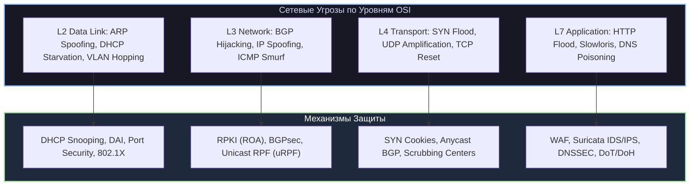
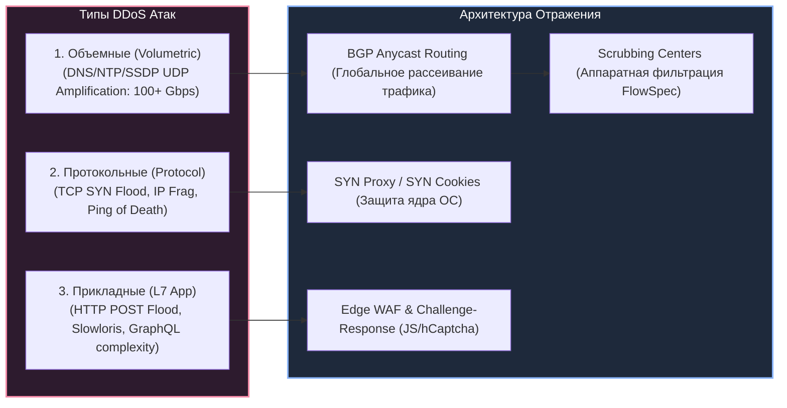
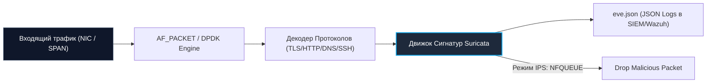
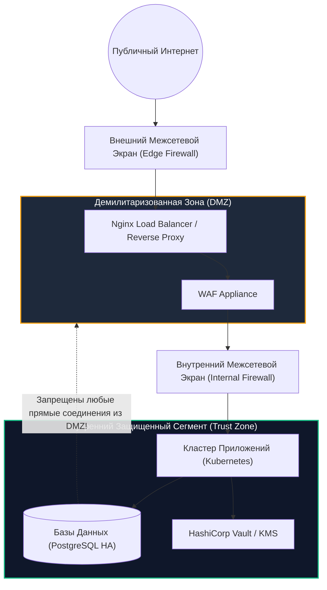

# 📡 07. Сетевые Атаки, Мониторинг и Защита Периметра

> Уровень: Senior Network / Security Engineer / SRE  
> Цель: Изучить векторы атак на сетевых уровнях L2–L4 (ARP Spoofing, DHCP Starvation, DNS Cache Poisoning, BGP Hijacking, VLAN Hopping), механизмы отражения DDoS (Volumetric, Protocol, L7 Slowloris), архитектуру Anycast Scrubbing, а также развертывание систем IDS/IPS (Suricata) и микросегментацию DMZ.

---

### 1. Архитектура сетевых атак L2/L3/L4 и Протокольные Защиты

Сетевая безопасность строится на изоляции уровней модели OSI и нейтрализации уязвимостей протоколов маршрутизации и коммутации.



#### 1.1 Детальный анализ векторов атак и защитных протоколов

| Атака / Вектор | Уровень OSI | Механика воздействия | Защитный стандарт / Протокол |
| :--- | :--- | :--- | :--- |
| **ARP Spoofing / Poisoning** | L2 | Рассылка фиктивных Gratuitous ARP ответов для перехвата чужого шлюза (MitM). | **Dynamic ARP Inspection (DAI)** в связке с таблицей привязок DHCP Snooping. |
| **DHCP Starvation** | L2 | Генерация миллионов фиктивных MAC-адресов для исчерпания пула IP-адресов DHCP. | **DHCP Snooping** + ограничение **Port Security** (Max MAC = 1–2 на порт). |
| **VLAN Hopping (Double Tagging)** | L2 | Инкапсуляция двух тегов 802.1Q (Native VLAN), позволяющая фрейму прыгнуть в другой VLAN. | Смена Native VLAN на неиспользуемый ID, `switchport nonegotiate` (отключение DTP). |
| **BGP Hijacking / Route Leak** | L3 | Анонс более специфичного префикса (например, `/24` вместо `/22`) чужой автономной системы (AS). | **RPKI (Resource Public Key Infrastructure)** с валидацией **ROA (Route Origin Authorization)**. |
| **DNS Cache Poisoning** | L7/L4 | Атака Каминского: внедрение фиктивных NS/A-записей в кэш рекурсивного DNS-сервера. | **DNSSEC** (валидация цепочки доверия RRSIG, DNSKEY, DS), рандомизация портов (0x20 bit). |

---

### 2. Классификация и Отражение DDoS Атак



#### 2.1 Факторы усиления UDP Amplification (DRDoS)
Атакующий отправляет запрос с поддельным IP-адресом жертвы (IP Spoofing) на открытые серверы-отражатели:
- **NTP `monlist`:** Фактор усиления ~550x (запрос 234 байта → ответ 130 КБ).
- **DNS EDNS0 ANY:** Фактор усиления ~50–100x.
- **Memcached (UDP 11211):** Фактор усиления до **50 000x** (отправка 15 байт `get stats` → ответ 750 КБ).

#### 2.2 Атака Slowloris (L7 Low-and-Slow)
Клиент открывает тысячи HTTP-соединений и отправляет заголовки порциями по 1 байту каждые 10 секунд (`X-Header: a...`). Это исчерпывает пул воркеров веб-сервера без генерации большого объема сетевого трафика.
- **Защита:** Установка агрессивных таймаутов на чтение заголовков в Nginx (`client_header_timeout 5s;`, `client_body_timeout 5s;`).

---

### 3. IDS/IPS Системы: Развертывание и Правила Suricata

**Suricata** — высокопроизводительный многопоточный движок обнаружения и предотвращения вторжений (IDS/IPS), поддерживающий анализ трафика на скорости 40+ Gbps.



#### 3.1 Боевые сигнатуры Suricata (`/etc/suricata/rules/local.rules`)

```ini
# /etc/suricata/rules/local.rules

# 1. Детекция сканирования портов Nmap (SYN Stealth Scan)
alert tcp any any -> $HOME_NET any (msg:"SCAN Nmap TCP Scan Detected"; flags:S,12; ack:0; threshold:type both, track by_src, count 20, seconds 5; classtype:attempted-recon; sid:1000001; rev:1;)

# 2. Детекция обращения к обратной оболочке (Reverse Shell Bash)
drop tcp $HOME_NET any -> $EXTERNAL_NET any (msg:"MALWARE Linux Interactive Bash Reverse Shell Established"; content:"/bin/sh"; content:"/bin/bash"; flow:established,to_server; classtype:trojan-activity; sid:1000002; rev:2;)

# 3. Детекция атаки Log4j (CVE-2021-44228 JNDI Injection)
drop http any any -> $HOME_NET any (msg:"EXPLOIT Apache Log4j RCE Attempt (JNDI Lookup)"; flow:to_server,established; content:"${jndi:"; nocase; classtype:attempted-admin; sid:1000003; rev:3;)

# 4. Детекция DNS-туннелирования (Аномальная длина субдомена > 50 символов)
alert dns any any -> any 53 (msg:"PROTOCOL-DNS High Entropy Long Subdomain Query (Possible C2 Tunnel)"; dns.query; pcre:"/^[a-zA-Z0-9_-]{50,}\./"; classtype:bad-unknown; sid:1000004; rev:1;)
```

---

### 4. Архитектура DMZ и Микросегментация Сети



#### Принципы изоляции DMZ:
1. Серверы в DMZ никогда не должны инициировать соединения во внутреннюю сеть (только внутренняя сеть может опрашивать DMZ или принимать строго регламентированные сессии).
2. Базы данных и хранилища секретов никогда не размещаются в DMZ.
3. Весь трафик между DMZ и внутренней сетью проходит инспекцию на прикладном уровне (L7 Inspection).

---

### 5. Практика & Troubleshooting: Анализ сетевого инцидента с tcpdump и Suricata

#### Сценарий инцидента:
> **Симптом:** Резкий скачок входящего трафика до 8 Gbps на интерфейсе `eth0`, сервер не отвечает на легитимные HTTP-запросы. Загрузка CPU ядра (SoftIRQs) близка к 100%.

#### Команды расследования и нейтрализации:

```bash
# 1. Анализ распределения протоколов в реальном времени с помощью iftop / tshark
sudo tshark -i eth0 -q -z io,phs

# 2. Дамп первых 1000 подозрительных пакетов с фильтром по SYN-флуду
sudo tcpdump -i eth0 "tcp[tcpflags] & (tcp-syn) != 0 and tcp[tcpflags] & (tcp-ack) == 0" -c 1000 -nn

# 3. Экстренное включение SYN Cookies в ядре Linux
sudo sysctl -w net.ipv4.tcp_syncookies=1
sudo sysctl -w net.ipv4.tcp_max_syn_backlog=65535
sudo sysctl -w net.ipv4.tcp_synack_retries=2

# 4. Сброс вредоносного трафика на уровне ядра через iptables / nftables RAW таблицу
sudo iptables -t raw -A PREROUTING -p tcp -m tcp --syn -m limit --limit 500/s --limit-burst 1000 -j ACCEPT
sudo iptables -t raw -A PREROUTING -p tcp -m tcp --syn -j DROP

# 5. Проверка журналов Suricata eve.json на наличие сработавших правил
jq 'select(.event_type=="alert") | {timestamp, src_ip, alert: .alert.signature}' /var/log/suricata/eve.json | tail -n 20
```
