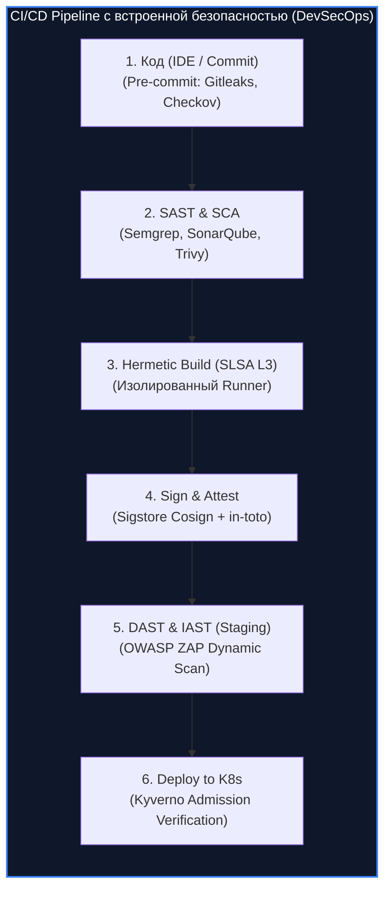
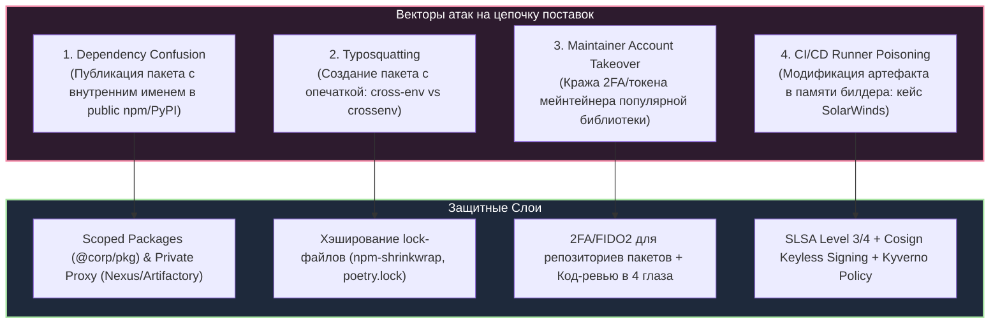
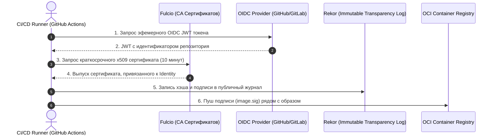

# 🔄 08. DevSecOps и Безопасность Цепочки Поставок (Supply Chain)

> Уровень: Senior DevSecOps / Lead Infrastructure / Security Architect  
> Цель: Выстроить сквозной конвейер безопасной разработки (Shift-Left Security: SAST, DAST, SCA, Secrets Detection), нейтрализовать атаки на цепочку поставок (Dependency Confusion, Typosquatting, SolarWinds-style компрометации), внедрить стандарты SLSA Framework, генерацию SBOM (CycloneDX/SPDX) и цифровую подпись артефактов Sigstore Cosign.

---

### 1. Shift-Left Security: Пайплайн Безопасности CI/CD

Концепция **Shift-Left** переносит практики безопасности с поздних этапов эксплуатации на самые ранние стадии написания кода и сборки.



#### Матрица инструментов тестирования безопасности

| Категория | Инструменты | Фаза внедрения | Что обнаруживает |
| :--- | :--- | :--- | :--- |
| **Secrets Scanning** | Gitleaks, TruffleHog | Pre-commit / PR Hook | Захардкоженные токены, API-ключи, приватные SSH/TLS ключи |
| **SAST** (Static Analysis) | Semgrep, SonarQube | CI Pull Request | SQLi, XSS, небезопасные десериализации, Buffer Overflow в коде |
| **SCA** (Software Composition) | Trivy, Snyk, Grype | CI Build Phase | Известные CVE в зависимостях (`package.json`, `go.mod`, `pom.xml`) |
| **Container Scanning** | Trivy, Clair, Docker Scout | CI Image Registry | Уязвимости базовых OS-пакетов (glibc, openssl) и конфигурации |
| **DAST** (Dynamic Analysis) | OWASP ZAP, Nuclei | QA / Staging Environment | Уязвимости развернутого сервиса (Header checks, Auth bypass, SSRF) |

---

### 2. Угрозы цепочке поставок ПО (Software Supply Chain Attacks)



#### Анатомия атаки SolarWinds (Sunburst):
Злоумышленники получили доступ к билд-системе Orion и внедрили вредоносный процесс, который на лету подменял исходные файлы C# во время компиляции перед подписанием легитимным сертификатом разработчика.
- **Урок для индустрии:** Сборка должна быть воспроизводимой (Reproducible Builds), выполняться в эфемерных герметичных контейнерах без доступа к интернету, а артефакты должны иметь криптографическую аттестацию происхождения (Provenance).

---

### 3. Фреймворк SLSA (Supply-chain Levels for Software Artifacts)

SLSA определяет уровни зрелости безопасности цепочки поставок:

| Уровень SLSA | Требования к сборке | Предотвращаемые риски |
| :--- | :--- | :--- |
| **SLSA 1** | Автоматизированный скрипт сборки в VCS, генерация базового Provenance | Ошибки ручной сборки "с ноутбука" |
| **SLSA 2** | Использование доверенного хостинга CI/CD (GitHub Actions, GitLab CI), цифровая подпись Provenance | Подделка метаданных сборки |
| **SLSA 3** | Изолированная среда сборки (Ephemeral Runners), защита истории Git, Provenance генерируется доверенным сервисом | Модификация кода во время сборки сторонними процессами |
| **SLSA 4** | Двухфакторное ревью кода (Two-party review), герметичные и воспроизводимые сборки (Hermetic & Reproducible) | Саботаж со стороны одного разработчика, инъекции в билдере |

---

### 4. Генерация SBOM (Software Bill of Materials) и VEX

**SBOM** — это полный машиночитаемый паспорт всех компонентов, лицензий и транзитивных зависимостей в приложении.

```bash
# Генерация SBOM контейнера в формате CycloneDX JSON с помощью Syft
syft packages app-backend:v1.2.0 -o cyclonedx-json=sbom.cdx.json

# Генерация SBOM в формате SPDX JSON
syft packages app-backend:v1.2.0 -o spdx-json=sbom.spdx.json

# Сканирование сгенерированного SBOM на уязвимости с помощью Trivy
trivy sbom sbom.cdx.json --severity HIGH,CRITICAL
```

---

### 5. Криптографическая подпись артефактов: Sigstore Cosign

**Cosign** позволяет подписывать контейнерные образы, SBOM и аттестации Provenance без необходимости долгосрочного хранения приватных ключей (Keyless Signing) с использованием протокола OIDC и прозрачного журнала **Rekor**.



#### Команды генерации и верификации подписи:

```bash
# 1. Keyless подпись образа контейнера в GitHub Actions
cosign sign --yes ghcr.io/org/app-backend:v1.2.0

# 2. Прикрепление SBOM как подписанного аттестата к образу
cosign attest --yes --predicate sbom.cdx.json --type cyclonedx ghcr.io/org/app-backend:v1.2.0

# 3. Верификация подписи образа перед развертыванием
cosign verify ghcr.io/org/app-backend:v1.2.0 \
  --certificate-identity-regexp "https://github.com/org/app-backend/.*" \
  --certificate-oidc-issuer "https://token.actions.githubusercontent.com"
```

---

### 6. Контроль целостности в Kubernetes: Политика Kyverno

Политика Admission Controller блокирует запуск любых подов, чьи образы не подписаны официальным ключом компании:

```yaml
# /k8s/kyverno-verify-images.yaml
apiVersion: kyverno.io/v1
kind: ClusterPolicy
metadata:
  name: check-image-signatures
spec:
  validationFailureAction: Enforce
  background: false
  rules:
  - name: verify-signature-rule
    match:
      any:
      - resources:
          kinds:
          - Pod
    verifyImages:
    - imageReferences:
      - "ghcr.io/org/*"
      attestors:
      - entries:
        - keyless:
            issuer: "https://token.actions.githubusercontent.com"
            subject: "https://github.com/org/*"
            rekor:
              url: "https://rekor.sigstore.dev"
```

---

### 7. Практический пайплайн: GitLab CI DevSecOps Stage

```yaml
# .gitlab-ci.yml
stages:
  - test
  - security
  - build
  - sign

semgrep-sast:
  stage: security
  image: returntocorp/semgrep
  script:
    - semgrep scan --config auto --json -o semgrep-results.json --error
  artifacts:
    reports:
      sast: semgrep-results.json

trivy-sca:
  stage: security
  image: aquasec/trivy:latest
  script:
    - trivy fs --exit-code 1 --severity HIGH,CRITICAL --ignore-unfixed .

gitleaks-secrets:
  stage: security
  image: zricethezav/gitleaks:latest
  script:
    - gitleaks detect --verbose --redact
```
