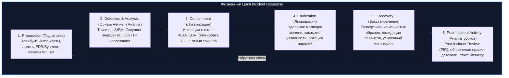
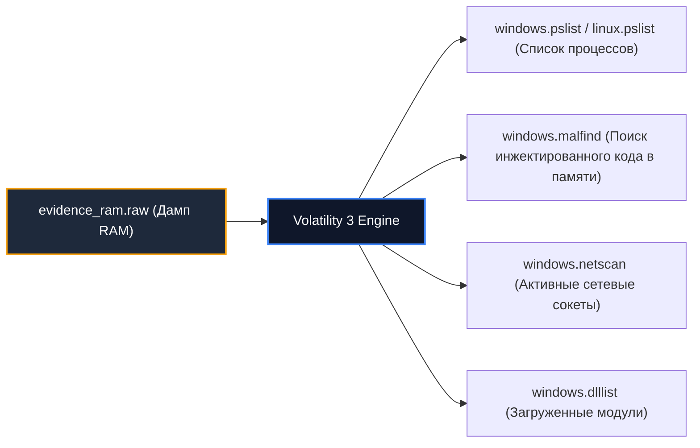
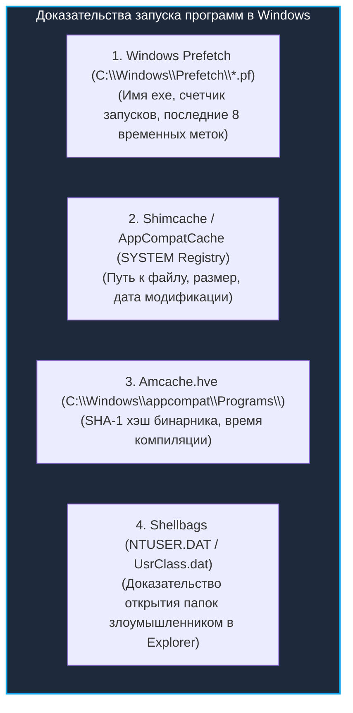

# 🔍 09. Реагирование на Инциденты (IR) и Компьютерная Криминалистика (DFIR)

> Уровень: Senior DFIR Specialist / Security Operations / Incident Commander  
> Цель: Освоить жизненный цикл реагирования на инциденты (NIST SP 800-61 / SANS), порядок сбора волатильных доказательств (RFC 3227), дамп и анализ оперативной памяти (LiME, Volatility 3), криминалистику артефактов Linux и Windows (MFT, Prefetch, Shimcache, EVTX, Auditd), а также построение супер-таймлайнов (Plaso / log2timeline).

---

### 1. Жизненный цикл реагирования на инциденты (NIST SP 800-61 / SANS)



---

### 2. Порядок сбора цифровых доказательств (Order of Volatility — RFC 3227)

При начале расследования критически важно собирать артефакты в порядке их энергозависимости и скорости деградации:

```text
Порядок волатильности (от быстроисчезающих к стабильным):
1. Регистры процессора, L1/L2/L3 кэш CPU
2. Содержимое оперативной памяти (RAM), таблицы соединений ядра, ARP-кэш
3. Сетевое состояние хоста (активные сокеты, открытые порты, routing table)
4. Временные файловые системы (tmpfs, /dev/shm)
5. Постоянные дисковые накопители (HDD/SSD, swap partitions)
6. Сетевые топологии, внешние логи SIEM/WAF/Proxy
7. Архивы резервных копий и долговременные оптические/ленточные носители
```

> **Правило криминалиста (Chain of Custody):** Любой снятый образ (RAM, Raw Disk DD) должен немедленно хэшироваться с записью в протокол (`sha256sum /path/image.raw > /path/image.raw.sha256`).

---

### 3. Анализ оперативной памяти (Memory Forensics)

#### 3.1 Снятие дампа RAM (Memory Acquisition)

- **Linux:** Использование утилиты **AVML** (Azure VM Linvestigator) или модуля ядра **LiME**:
  ```bash
  # Снятие сырого дампа памяти на Linux через AVML (без компиляции модуля)
  sudo ./avml /mnt/forensic_usb/evidence_ram.raw
  sha256sum /mnt/forensic_usb/evidence_ram.raw | tee evidence_ram.sha256
  ```
- **Windows:** Снятие дампа через **WinPmem**:
  ```cmd
  winpmem.exe -o C:\forensic_usb\memdump.raw --mode 1
  ```

#### 3.2 Анализ дампа RAM в фреймворке Volatility 3



```bash
# 1. Поиск скрытых и завершенных процессов в дампе Windows
vol -f memdump.raw windows.pslist
vol -f memdump.raw windows.psscan

# 2. Обнаружение внедренного шеллкода и инъекций DLL (Memory Injection / Hollow processes)
vol -f memdump.raw windows.malfind --dump-dir ./injected_dumps

# 3. Реконструкция сетевых соединений на момент снятия дампа
vol -f memdump.raw windows.netscan

# 4. Анализ процессов на Linux дампе
vol -f evidence_ram.raw linux.pslist
vol -f evidence_ram.raw linux.check_modules # Проверка скрытых Rootkit модулей ядра
```

---

### 4. Криминалистический анализ артефактов Linux

```bash
# 1. Восстановление удаленного, но запущенного в памяти вредоносного бинарника
# Если злоумышленник запустил малварь и выполнил 'rm /tmp/evil'
ls -la /proc/*/exe 2>/dev/null | grep "(deleted)"
# Копирование удаленного файла из дескриптора процесса PID 1337:
cp /proc/1337/exe /mnt/forensic/recovered_malware.bin

# 2. Анализ журнала аутентификаций и успешных входов
last -Faiwx -f /var/log/wtmp
lastb -Faiwx # Неудачные попытки входа (брутфорс)

# 3. Анализ командной строки пользователей с временными метками
export HISTTIMEFORMAT="%F %T "
cat /home/*/.bash_history /root/.bash_history

# 4. Анализ механизмов автозапуска и персистентности (Persistence)
ls -la /etc/cron* /var/spool/cron/crontabs/
systemctl list-timers --all
ls -la /etc/systemd/system/ /lib/systemd/system/
```

---

### 5. Криминалистический анализ артефактов Windows

#### 5.1 Ключевые Windows Event Logs (`.evtx`)

| Event ID | Журнал | Значение для криминалиста |
| :--- | :--- | :--- |
| **4624** | Security | Успешный вход (Logon Type 2 = Interactive, 3 = Network/SMB, 10 = RDP). |
| **4625** | Security | Ошибка аутентификации (признак брутфорса или Password Spraying). |
| **4688** | Security | Создание нового процесса (с включенным аудитом Command Line). |
| **4720** | Security | Создание новой учетной записи пользователя. |
| **7045** | System | Установка нового сервиса Windows (частый метод Persistence). |
| **1102** | Security | Очистка журнала безопасности злоумышленником (Defense Evasion). |
| **1** | Sysmon | Запуск процесса (Хэши SHA-256, полный ParentProcessId, CommandLine). |
| **3** | Sysmon | Сетевое соединение процесса (SrcIP, DstIP, DstPort). |

#### 5.2 Артефакты выполнения программ (Execution Proof)



#### 5.3 Анализ файловой системы NTFS: $MFT и $UsnJrnl
- **$MFT (Master File Table):** Содержит атрибуты `$STANDARD_INFORMATION` ($SI) и `$FILE_NAME` ($FN). Расхождение временных меток между ними указывает на атаку **Timestomping** (подделка времени создания файла злоумышленником).
- **$UsnJrnl ($J):** Журнал изменений файлов NTFS. Позволяет увидеть имена созданных и удаленных файлов даже после их стирания с диска.

---

### 6. Построение Супер-Таймлайна: Plaso (log2timeline)

**Plaso** извлекает временные метки из сотен различных источников (файловая система, логи, реестр, история браузера) и объединяет их в единую хронологическую цепочку событий.

```bash
# 1. Извлечение всех артефактов и временных меток с дискового образа E01 / RAW
log2timeline.py --storage-file case_01.plaso /mnt/forensic/disk_image.raw

# 2. Фильтрация и генерация CSV-таймлайна для периода инцидента
psort.py -o l2tcsv \
  -w timeline_incident.csv \
  case_01.plaso \
  "date >= '2026-09-01 00:00:00' and date <= '2026-09-02 23:59:59'"

# 3. Анализ первых событий проникновения через grep/awk
head -n 50 timeline_incident.csv
```
