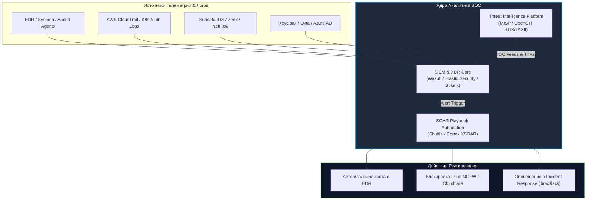
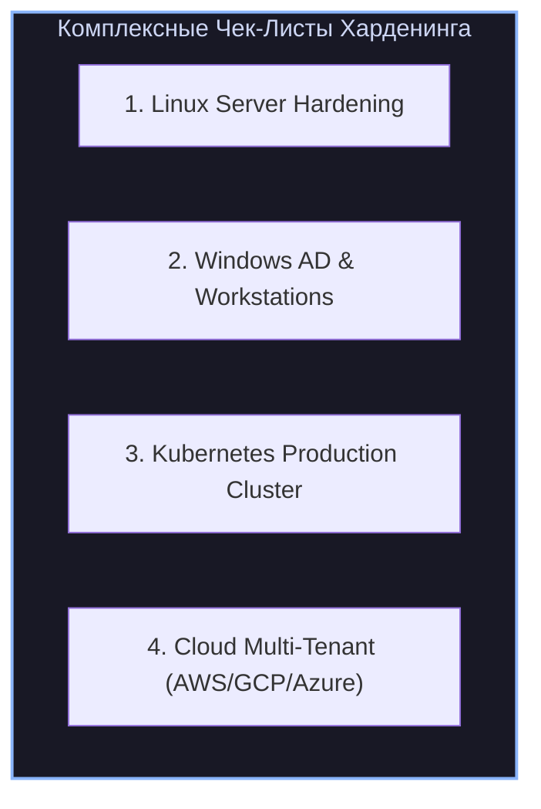

# 🎯 10. SOC, Threat Hunting и Мастер Чек-Листы Харденинга

> Уровень: Lead Security Engineer / SOC Lead / DevSecOps Architect  
> Цель: Спроектировать архитектуру современного Центра Мониторинга Безопасности (SOC: SIEM, SOAR, TIP, EDR), освоить методологию проактивного поиска угроз (Threat Hunting), написание правил детекции в форматах YARA и SIGMA, а также получить исчерпывающие мастер чек-листы харденинга для Linux, Windows AD, Kubernetes и Cloud (AWS/GCP/Azure).

---

### 1. Архитектура современного SOC (Security Operations Center)



---

### 2. Threat Hunting и Разработка Правил Детекции (Detection Engineering)

#### 2.1 Написание правил YARA для детекции вредоносного ПО

**YARA** используется для идентификации и классификации вредоносных бинарных файлов, веб-шеллов и скриптов в файловой системе или памяти процессов.

```yara
/* /etc/yara/rules/webshell_php_detection.yar */

import "pe"
import "math"

rule Webshell_Generic_PHP_Obfuscated {
    meta:
        description = "Detects obfuscated PHP webshells and command execution wrappers"
        author = "SecOps Team"
        date = "2026-09-02"
        reference = "MITRE ATT&CK T1505.003"
        severity = "CRITICAL"

    strings:
        // Сигнатуры опасных вызовов
        $php_tag = "<?php" nocase
        $eval = "eval(" ascii nocase
        $assert = "assert(" ascii nocase
        $b64_decode = "base64_decode(" ascii nocase
        $system_call = "passthru(" ascii nocase
        $shell_exec = "shell_exec(" ascii nocase
        $preg_replace = "preg_replace" ascii nocase

        // Признаки обфускации и шеллов (WSO, b374k, Weevely)
        $magic_var = /\$_POST\[['\"][a-zA-Z0-9_]{1,10}['\"]\]/
        $hex_payload = { 65 76 61 6c 28 62 61 73 65 36 34 } // eval(base64

    condition:
        filesize < 2MB and
        $php_tag and
        (
            ($eval and $b64_decode) or
            ($assert and $b64_decode) or
            ($system_call and $magic_var) or
            ($shell_exec and $magic_var) or
            $hex_payload or
            ($preg_replace and math.entropy(0, filesize) > 6.5)
        )
}
```

#### 2.2 Разработка правил SIGMA (Generic SIEM Rules)

**SIGMA** — это универсальный YAML-формат для описания логики детекции в логах, который транслируется в диалекты любых SIEM (Splunk, Elastic, Wazuh, QRadar).

```yaml
# /sigma/rules/proc_creation_linux_reverse_shell.yml
title: Interactive Reverse Shell Execution via Bash/Python
id: 9b2d3e4f-1234-5678-9abc-def012345678
status: production
description: Обнаруживает запуск интерактивной обратной оболочки через bash dev/tcp, python socket или nc
references:
    - https://attack.mitre.org/techniques/T1059/004/
author: SOC Engineering Team
date: 2026-09-02
tags:
    - attack.execution
    - attack.t1059.004
    - attack.command_and_control
    - attack.t1071
logsource:
    category: process_creation
    product: linux
detection:
    selection_bash:
        CommandLine|contains:
            - 'bash -i >& /dev/tcp/'
            - '/dev/tcp/'
            - 'bash -c "sh -i'
    selection_nc:
        CommandLine|contains:
            - 'nc -e /bin/sh'
            - 'nc -e /bin/bash'
            - 'ncat -e /bin/bash'
    selection_python:
        CommandLine|contains:
            - 'python -c import socket'
            - 'python3 -c import socket'
            - 'pty.spawn("/bin/bash")'
    condition: 1 of selection_*
fields:
    - CommandLine
    - ParentCommandLine
    - User
    - ProcessId
falsepositives:
    - Регламентные автоматизированные тесты надежности (Chaos Engineering)
level: critical
```

Конвертация SIGMA в синтаксис Lucene / Elastic Query:
```bash
sigma convert -t es-qs -p ecs /sigma/rules/proc_creation_linux_reverse_shell.yml
```

---

### 3. Мастер Чек-Листы Харденинга Инфраструктуры



#### 3.1 Чек-Лист: Production Linux Server Hardening

- [ ] **Файловая система и точки монтирования:** Разделы `/tmp`, `/var/tmp`, `/dev/shm` смонтированы с флагами `noexec,nosuid,nodev`.
- [ ] **Контроль учетных записей:** Пароль `root` заблокирован (`passwd -l root`), вход только через `sudo` с индивидуальными учетками.
- [ ] **SSH Сервер:** `PermitRootLogin no`, `PasswordAuthentication no`, кастомный порт, таймаут сессии `ClientAliveInterval 300`.
- [ ] **Аудит и логирование:** Демон `auditd` включен в неизменяемом режиме (`-e 2`), логи стримятся на удаленный syslog/SIEM сервер.
- [ ] **Мандатный контроль доступа:** `SELinux` или `AppArmor` переведены в постоянный режим `Enforcing`.
- [ ] **Ядро и Sysctl:** Включены `kernel.randomize_va_space=2`, `fs.protected_symlinks=1`, `net.ipv4.tcp_syncookies=1`, отключен IPv6/IP forwarding.
- [ ] **Минимизация SUID:** Удалены SUID-биты с неиспользуемых утилит (`chmod u-s /usr/bin/pkexec`, `find / -perm -4000`).

#### 3.2 Чек-Лист: Windows Server & Active Directory Hardening

- [ ] **Административная модель:** Внедрена трехуровневая модель администрирования (Tier 0 / Tier 1 / Tier 2).
- [ ] **Защита учетных записей:** Включена группа безопасности `Protected Users` для всех доменных администраторов.
- [ ] **Защита LSASS:** Включены `RunAsPPL` и `Windows Defender Credential Guard` через виртуализацию VBS.
- [ ] **Сервисные учетные записи:** Все сервисы переведены на `gMSA` с автоматической ротацией паролей.
- [ ] **Сетевые протоколы:** Отключены устаревшие `SMBv1`, `LLMNR`, `NetBIOS over TCP/IP`, принудительно включен `SMB Signing`.
- [ ] **Аудит PowerShell:** Включены `Script Block Logging` (Event ID 4104), `Module Logging` и режим `Constrained Language Mode (CLM)`.
- [ ] **LAPS:** Развернут `Windows LAPS` для рандомизации локальных паролей администраторов на всех хостах.

#### 3.3 Чек-Лист: Kubernetes Cluster Production Hardening

- [ ] **CIS Kubernetes Benchmark:** Кластер проверен утилитой `kube-bench`, устранены все несоответствия Control Plane и Worker нод.
- [ ] **Pod Security Standards:** Во всех неймспейсах приложений включен режим `pod-security.kubernetes.io/enforce: restricted`.
- [ ] **Сетевая изоляция:** По умолчанию применяется политика `DefaultDenyAll` для Ingress и Egress через Calico/Cilium `NetworkPolicy`.
- [ ] **Безопасность API-сервера:** Отключен `anonymous-auth`, включен аудит-лог в JSON-формате, закрыт публичный доступ к порту 6443.
- [ ] **Шифрование Secret:** Включено шифрование etcd на уровне Secret (`KMS Envelope Encryption`).
- [ ] **Admission Control:** Развернут движок политик `Kyverno` / `Gatekeeper` для проверки цифровых подписей образов (`Cosign`).
- [ ] **Runtime Security:** Установлен агент `Falco` или `Tetragon` (eBPF) для обнаружения побегов из контейнеров в реальном времени.

#### 3.4 Чек-Лист: Cloud Infrastructure (AWS / GCP / Azure)

- [ ] **Root/Billing Account:** Учетная запись защищена аппаратным FIDO2 MFA, активные API-ключи для Root удалены.
- [ ] **Identity & Access Management (IAM):** Принцип наименьших привилегий (Least Privilege), запрет wildcards (`*`), обязательная сессия через SSO/IdP.
- [ ] **Централизованный аудит:** Включены `AWS CloudTrail` / `GCP Cloud Audit Logs` с доставкой в защищенный WORM S3 бакет с `Object Lock`.
- [ ] **Сетевые периметры:** Запрещены Security Groups с правилами `0.0.0.0/0` на административные порты (SSH 22, RDP 3389).
- [ ] **Шифрование данных:** Все блочные тома (EBS, Persistent Disks) и S3 бакеты зашифрованы ключами заказчика (`Customer Managed Keys KMS`).
- [ ] **Детекция угроз:** Включены облачные детекторы аномалий `AWS GuardDuty` / `GCP Security Command Center`.

---

### 4. Практика: Настройка SOC-агента Wazuh для мониторинга атак

Фрагмент конфигурации агента Wazuh (`ossec.conf`):

```xml
<!-- /var/ossec/etc/ossec.conf -->
<ossec_config>
  <!-- Мониторинг целостности системных файлов (FIM) -->
  <syscheck>
    <disabled>no</disabled>
    <frequency>43200</frequency>
    <scan_on_start>yes</scan_on_start>
    
    <!-- Real-time мониторинг критических директорий -->
    <directories realtime="yes" check_all="yes">/etc,/usr/bin,/usr/sbin</directories>
    <directories realtime="yes" check_all="yes">/root/.ssh,/home/*/.ssh</directories>
    
    <!-- Игнорирование часто меняющихся временных файлов -->
    <ignore>/etc/mtab</ignore>
    <ignore>/etc/hosts.deny</ignore>
  </syscheck>

  <!-- Интеграция с подсистемой аудита auditd -->
  <localfile>
    <log_format>audit</log_format>
    <location>/var/log/audit/audit.log</location>
  </localfile>

  <!-- Активное реагирование (Active Response) при обнаружении брутфорса -->
  <active-response>
    <command>firewall-drop</command>
    <location>local</location>
    <rules_id>5712,5720</rules_id>
    <timeout>1800</timeout>
  </active-response>
</ossec_config>
```
