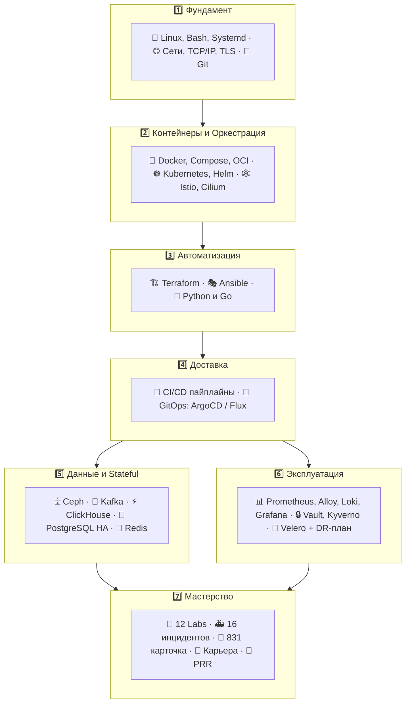

# 🚀 DevOps Knowledge Base & Handbook (Docs-as-Code)

<!-- stats -->
> 📊 **299 страниц** • **12 лаб** • **4 блока инцидентов** • **1033 сценариев песочницы** • **831 карточек тренажёра**
<!-- /stats -->

Добро пожаловать в структурированную базу знаний для DevOps / SRE / Platform инженеров. Здесь собраны концентрированная теория, шпаргалки, готовые шаблоны, troubleshooting, **100 вопросов с собесов**, **100 задач**, **12 лаб** и **831 карточка тренажёра** — всё как Docs-as-Code.

<div class="handbook-hero" markdown>
Добро пожаловать — это ваш путеводитель от Junior до Senior. Выберите траекторию и начните практиковаться сразу в браузере.

<div class="cta-row" markdown>
[🚀 Начать с Roadmap](00-roadmap/01-devops-roadmap-2026.md){ .cta }
[🧪 Песочница](21-playground/playground.html){ .cta secondary }
[🎯 Тренажёр SRS](22-trainer/quiz.html){ .cta secondary }
</div>

<input class="hero-search" placeholder="🔍 Поиск по handbook…  (нажмите / )" onclick="(function(){var q=document.querySelector('[data-md-component=search-query]'); if(q){q.focus(); q.click();} else {var b=document.querySelector('[data-md-component=search]'); if(b) b.click();}})()" readonly style="cursor:pointer">

</div>

!!! tip "С чего начать?"
    Откройте [Roadmap: путь от нуля до DevOps](00-roadmap/01-devops-roadmap-2026.md) — пошаговый план с чек-листами и ссылками на все материалы.

---

## 🗺️ Карта знаний и навигация



!!! tip "Кликабельная версия"
    Каждая плашка выше — это раздел в оглавлении слева. Не запоминайте карту — идите по [Roadmap](00-roadmap/01-devops-roadmap-2026.md).

---

## 📂 Структура разделов

Полная навигация — в левой панели и вкладках вверху. Ниже — быстрый старт по популярным направлениям.

<div class="card-grid" markdown>

<div class="card" markdown>
<div class="card-title">🐧 01. Linux, Сети и Bash <span class="badge">30 стр.</span></div>
<div class="card-desc">Ядро, systemd, сети, eBPF, хранилище, хардининг.</div>
[Открыть →](01-linux-and-networking/01-linux-core-and-systemd.md){ .card-link }
</div>

<div class="card" markdown>
<div class="card-title">🐙 02. Git <span class="badge">10 стр.</span></div>
<div class="card-desc">Workflows, rebase, LFS, подписи, монорепо.</div>
[Открыть →](02-git/01-git-internals-and-workflows.md){ .card-link }
</div>

<div class="card" markdown>
<div class="card-title">🐳 03. Docker <span class="badge">4 стр.</span></div>
<div class="card-desc">OCI, Dockerfile, BuildKit, compose, security.</div>
[Открыть →](03-docker/01-docker-architecture-and-cli.md){ .card-link }
</div>

<div class="card" markdown>
<div class="card-title">☸️ 04. Kubernetes <span class="badge">12 стр.</span></div>
<div class="card-desc">Архитектура, сети, Helm, HPA/VPA, Gateway API.</div>
[Открыть →](04-kubernetes/01-k8s-architecture-and-workloads.md){ .card-link }
</div>

<div class="card" markdown>
<div class="card-title">🔄 05. GitOps & CI <span class="badge">7 стр.</span></div>
<div class="card-desc">ArgoCD/Flux, Progressive Delivery, Tekton.</div>
[Открыть →](05-gitops-and-cicd/01-gitops-argocd-flux.md){ .card-link }
</div>

<div class="card" markdown>
<div class="card-title">🏗️ 06-07. IaC <span class="badge">6 стр.</span></div>
<div class="card-desc">Terraform, Terragrunt, Ansible, Vault, AWX.</div>
[Открыть →](06-terraform/01-terraform-fundamentals.md){ .card-link }
</div>

<div class="card" markdown>
<div class="card-title">📊 09. Observability <span class="badge">10 стр.</span></div>
<div class="card-desc">Prometheus, Alloy, Loki, Grafana as Code, SRE.</div>
[Открыть →](09-observability/01-prometheus-and-grafana.md){ .card-link }
</div>

<div class="card" markdown>
<div class="card-title">🐍 08. Python и Go <span class="badge">20 стр.</span></div>
<div class="card-desc">Скрипты, операторы Kopf/Kubebuilder, FastAPI.</div>
[Открыть →](08-programming-python-go/01-python-for-devops.md){ .card-link }
</div>

<div class="card" markdown>
<div class="card-title">🤖 23. MLOps <span class="badge">9 стр.</span></div>
<div class="card-desc">MLflow, DVC, Feast, GPU/Kueue, LLMOps/RAG.</div>
[Открыть →](23-mlops/00-plan.md){ .card-link }
</div>

</div>

<div class="card-grid" markdown>

<div class="card" markdown>
<div class="card-title">🧪 Песочница <span class="badge badge-accent">1033 сценария</span></div>
<div class="card-desc">Терминал + Monaco прямо в браузере.</div>
[Открыть →](21-playground/index.md){ .card-link }
</div>

<div class="card" markdown>
<div class="card-title">🎯 Тренажёр SRS <span class="badge badge-ok">831 карточка</span></div>
<div class="card-desc">Anki-алгоритм, интервалы 1→70 дней.</div>
[Открыть →](22-trainer/index.md){ .card-link }
</div>

<div class="card" markdown>
<div class="card-title">🔬 Guided Labs <span class="badge">12 лаб</span></div>
<div class="card-desc">От systemd до Vault и сквозного E2E трека.</div>
[Открыть →](16-guided-labs/01-lab-linux-systemd-namespaces.md){ .card-link }
</div>

<div class="card" markdown>
<div class="card-title">📦 Ещё: Security · Data · Mesh · DR <span class="badge">12 стр.</span></div>
<div class="card-desc">Vault, Ceph/Kafka/PG, Istio/Cilium, Velero.</div>
[Открыть →](10-security-and-cloud/01-devsecops-and-secrets.md){ .card-link }
</div>

</div>

> 💡 Ищете что-то конкретное? Нажмите <kbd>/</kbd> или <kbd>S</kbd> для мгновенного поиска по всем **300+ страницам**.

<details open markdown><summary>📚 Полный список разделов (таблица)</summary>

| Раздел | Что внутри | Где начать |
|---|---|---|
| **00 Roadmap** | План от нуля до Senior | [Roadmap](00-roadmap/01-devops-roadmap-2026.md) |
| **01 Linux** | 30 тем: ядро, сети, storage, eBPF | [01. Core](01-linux-and-networking/01-linux-core-and-systemd.md) |
| **02 Git** | workflows, LFS, security | [Git](02-git/01-git-internals-and-workflows.md) |
| **03 Docker** | OCI, BuildKit, slim | [Docker](03-docker/01-docker-architecture-and-cli.md) |
| **04 K8s** | Controllers, CNI, Gateway | [K8s](04-kubernetes/01-k8s-architecture-and-workloads.md) |
| **05 GitOps/CI** | Argo/Flux, progressive delivery | [GitOps](05-gitops-and-cicd/01-gitops-argocd-flux.md) |
| **06 Terraform** | State, Terragrunt, testing | [Terraform](06-terraform/01-terraform-fundamentals.md) |
| **07 Ansible** | Vault, Molecule, AWX | [Ansible](07-ansible/01-ansible-architecture-and-playbooks.md) |
| **08 Python/Go** | Kopf, client-go, FastAPI | [Python/Go](08-programming-python-go/01-python-for-devops.md) |
| **09 Observability** | Prometheus, Loki, Tempo | [Obs](09-observability/01-prometheus-and-grafana.md) |
| **10-13 Ещё** | Security, Data, Mesh, DR | [Ещё](10-security-and-cloud/01-devsecops-and-secrets.md) |
| **14 Interview** | 100 Q + system design | [Interview](14-interview-prep/01-devops-interview-core-qa.md) |
| **15 Practice** | 100 задач с решениями | [Practice](15-hands-on-practice/01-100-devops-practical-tasks-part1.md) |
| **18 Templates** | PRR, Helm, CI | [Templates](18-templates/01-containers-and-k8s.md) |
| **19 Career** | Homelab, портфолио | [Career](19-career/01-home-lab-setup.md) |
| **20 Senior** | 17 тем + своды | [Senior](20-senior-stack/00-senior-stack-summary.md) |

</details>

---

## 🛠️ Как использовать и развернуть локально

Эту базу знаний можно читать прямо в репозитории на GitHub/GitLab, в приложении **Obsidian**, либо запустить как статический сайт с мгновенным поиском через **Material for MkDocs**:

```bash
# Установка mkdocs и темы material со всеми плагинами
pip install mkdocs-material

# Локальный запуск dev-сервера с авто-перезагрузкой
mkdocs serve
# Откройте в браузере: http://127.0.0.1:8000
```

---

## 🎓 Траектории обучения (Learning Paths)

| Роль / Цель | Маршрут | Время | Выходной артефакт |
| :--- | :--- | :--- | :--- |
| **Junior DevOps** | `01` → `02` → `03/01-03` → `04/01-03` → `06/01` → `08/01` | 4-6 недель | Пет-проект: `kind` + Terraform + CI |
| **Kubernetes Admin** | `03/04` → `04/05-07` → `12/02` → `09/01-03` → `13` | 3-4 недели | CKA-ready: траблшутинг, NetworkPolicy, Helm |
| **SRE / Observability** | `09/*` → `10/vault` → `11/*` → `06/02` | 2-3 недели | SLI/SLO, burn-rate алерты, дашборды RED/USE |
| **Platform Engineer** | `05/*` → `06/*` → `07/*` → `12/01` → `10/*` | 4 недели | ArgoCD ApplicationSet + Vault PKI платформа |
| **Подготовка к собесу** | `14/*` (банк 100 вопросов) → `15/*` (задачи) | 1-2 недели | 100+ Q&A + 100 задач с решениями |

### Самопроверка перед собеседованием

- [ ] Объясните разницу bridge / overlay2 / eBPF datapath без подсмотра?
- [ ] Напишете PromQL p99 latency по histogram и burn-rate алерт?
- [ ] Соберете multi-stage distroless образ < 20MB?
- [ ] Восстановите etcd из снапшота и PVC из Velero за 15 минут?
- [ ] Решите 80%+ задач из раздела [15](15-hands-on-practice/01-100-devops-practical-tasks-part1.md)?

Хотя бы один «нет» — вернитесь к соответствующему разделу handbook'а.

---

## 📖 Глоссарий (выжимка)

| Термин | Определение | Где читать |
| :--- | :--- | :--- |
| **CFS** | Completely Fair Scheduler — планировщик CPU в Linux | `01-linux/01` |
| **eBPF** | ВМ в ядре для трассировки и сетевого datapath (Cilium) | `12-mesh/02` |
| **CRUSH** | Детерминированное размещение PG→OSD в Ceph | `11-data/01` |
| **ISR** | In-Sync Replicas — синхронные реплики партиции Kafka | `11-data/02` |
| **PDB** | PodDisruptionBudget — защита от добровольных эвикций | `04-k8s/07` |
| **SLO / Error Budget** | Цель доступности и допустимый бюджет ошибок | `09-obs/06` |
| **mTLS** | Двусторонняя аутентификация TLS (Istio/Vault PKI) | `12-mesh/01` |
| **RPO/RTO** | Потеря данных / время восстановления при DR | `13-velero` |

---

## 🤝 Contribute (Docs-as-Code)

1. Ветка `feat/<раздел>-<тема>` → PR с описанием изменений.
2. Проверка перед PR: `mkdocs build --strict` локально проходит без warnings.
3. Диаграммы — только Mermaid (читаемый diff), примеры — только проверенные.
4. Секреты в примерах — только placeholder (`changeme`, `vault:...`).

Лицензия контента: CC BY-SA 4.0. PR, issue и звезды приветствуются! ❤️
