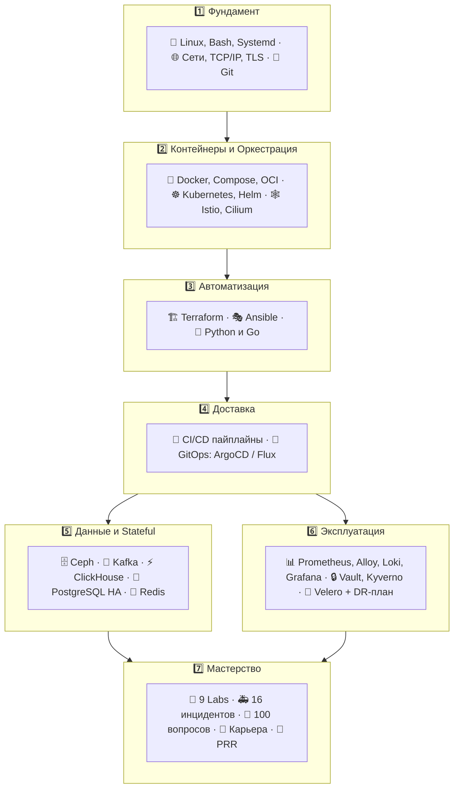

# 🚀 DevOps Knowledge Base & Handbook (Docs-as-Code)

Добро пожаловать в структурированную базу знаний для DevOps / SRE / Platform инженеров. Здесь собраны концентрированная теория, практические шпаргалки (cheatsheets), готовые конфигурационные шаблоны, пошаговые руководства по устранению неполадок (troubleshooting), **банк из 100 сложнейших вопросов с собеседований**, **100 боевых практических задач** и **7 пошаговых лабораторных**.

> 🗺️ **С чего начать?** Откройте [Roadmap: путь от нуля до DevOps](00-roadmap/01-devops-roadmap-2026.md) — там пошаговый план с чек-листами и ссылками на все материалы.

---

## 🗺️ Карта знаний и навигация



!!! tip "Кликабельная версия"
    Каждая плашка выше — это раздел в оглавлении ниже. Не запоминайте карту — просто идите по [Roadmap](00-roadmap/01-devops-roadmap-2026.md), он проведёт через всё в правильном порядке.

---

## 📂 Структура разделов

### [00. Roadmap: путь от нуля до DevOps](00-roadmap/01-devops-roadmap-2026.md)
* 📄 [Полный план обучения: этапы, сроки, ресурсы, критерии выхода](00-roadmap/01-devops-roadmap-2026.md)

### [01. Linux, Сети и Bash](01-linux-and-networking/01-linux-core-and-systemd.md)
* 📄 [01. Ядро Linux, Процессы, Память и Systemd](01-linux-and-networking/01-linux-core-and-systemd.md)
* 📄 [02. Сетевой стек, Диагностика и SSH](01-linux-and-networking/02-networking-and-troubleshooting.md)
* 📄 [03. Bash-скриптинг и утилиты автоматизации (jq, awk, sed)](01-linux-and-networking/03-bash-scripting-and-automation.md)
* 📄 [04. Модель OSI, Сетевые протоколы, TCP/IP, TLS и DNS](01-linux-and-networking/04-osi-model-and-network-protocols.md)

### [02. Git и Управление версиями](02-git/01-git-internals-and-workflows.md)
* 📄 [01. Архитектура Git, Ветвление и Стратегии релиза](02-git/01-git-internals-and-workflows.md)
* 📄 [02. Cheat Sheet, Rebase, Cherry-pick и Git Hooks](02-git/02-git-cheatsheet-and-rebase.md)

### [03. Контейнеризация: Docker](03-docker/01-docker-architecture-and-cli.md)
* 📄 [01. Архитектура Docker, Runtime и Управление](03-docker/01-docker-architecture-and-cli.md)
* 📄 [02. Dockerfile Best Practices и Multi-Stage сборки](03-docker/02-dockerfile-best-practices.md)
* 📄 [03. Docker Compose, Сети, Хранилища и Отладка](03-docker/03-docker-compose-and-networking.md)
* 📄 [04. Как устроен Docker под капотом: Linux Primitives, OCI, Overlay2 и Сеть](03-docker/04-docker-deep-internals-and-engine.md)

### [04. Оркестрация: Kubernetes & Helm](04-kubernetes/01-k8s-architecture-and-workloads.md)
* 📄 [01. Архитектура K8s и базовые Workloads](04-kubernetes/01-k8s-architecture-and-workloads.md)
* 📄 [02. Сети (CNI, Services, Ingress) и Хранилище (CSI, PVC)](04-kubernetes/02-k8s-networking-and-storage.md)
* 📄 [03. Управление пакетами: Helm и Kustomize](04-kubernetes/03-helm-and-kustomize.md)
* 📄 [04. Справочник по устранению неполадок (K8s Troubleshooting)](04-kubernetes/04-k8s-troubleshooting-handbook.md)
* 📄 [05. Внутреннее устройство контроллеров и Informer Pattern](04-kubernetes/05-k8s-controllers-and-internals.md)
* 📄 [06. Глубокое погружение в сеть K8s: Путь сетевого пакета (Packet Flow)](04-kubernetes/06-k8s-networking-packet-flow.md)
* 📄 [07. Полный справочник по контроллерам Kubernetes: Логика, Алгоритмы и Edge Cases](04-kubernetes/07-all-kubernetes-controllers-reference.md)
* 📄 [08. Автоскейлинг: HPA, VPA, KEDA, Cluster Autoscaler](04-kubernetes/08-k8s-autoscaling.md)
* 📄 [09. Эксплуатация кластера: апгрейды, etcd, замена узлов](04-kubernetes/09-k8s-cluster-operations.md)

### [05. GitOps и CI/CD](05-gitops-and-cicd/01-gitops-argocd-flux.md)
* 📄 [01. Принципы GitOps: ArgoCD и FluxCD](05-gitops-and-cicd/01-gitops-argocd-flux.md)
* 📄 [02. Паттерны построения пайплайнов (GitLab CI / GitHub Actions)](05-gitops-and-cicd/02-cicd-pipelines-patterns.md)
* 📄 [03. GitLab CI Deep Dive: Runners, Rules, Cache, Vault OIDC](05-gitops-and-cicd/03-gitlab-ci-deep-dive.md)
* 📄 [04. GitOps Advanced: Multi-Env, App-of-Apps, Promotion](05-gitops-and-cicd/04-gitops-multienv-and-promotion.md)

### [06. Инфраструктура как код: Terraform](06-terraform/01-terraform-fundamentals.md)
* 📄 [01. Основы Terraform/OpenTofu, HCL и Провайдеры](06-terraform/01-terraform-fundamentals.md)
* 📄 [02. Remote State, Модульность и Terragrunt](06-terraform/02-state-modules-and-terragrunt.md)
* 📄 [03. Тестирование, CI и Операции со Стейтом (Atlantis, импорт, дрейф)](06-terraform/03-terraform-testing-ci-and-state-ops.md)

### [07. Управление конфигурациями: Ansible](07-ansible/01-ansible-architecture-and-playbooks.md)
* 📄 [01. Архитектура Ansible, Inventory и Плейбуки](07-ansible/01-ansible-architecture-and-playbooks.md)
* 📄 [02. Роли, Коллекции, Jinja2, Vault и Тестирование Molecule](07-ansible/02-roles-vault-and-best-practices.md)
* 📄 [03. Collections, Производительность, ansible-pull и AWX](07-ansible/03-ansible-collections-performance-and-awx.md)

### [08. Языки автоматизации: Python и Go](08-programming-python-go/01-python-for-devops.md)
* 📄 [01. Python для DevOps: Скрипты, API, Boto3 и K8s SDK](08-programming-python-go/01-python-for-devops.md)
* 📄 [02. Go для DevOps: CLI-инструменты (Cobra), K8s Controllers](08-programming-python-go/02-go-for-devops.md)

### [09. Observability: Мониторинг, Логи и Трейсинг](09-observability/01-prometheus-and-grafana.md)
* 📄 [01. Prometheus, PromQL, Alertmanager и Grafana](09-observability/01-prometheus-and-grafana.md)
* 📄 [02. Сбор логов (Vector, Loki) и Трассировка (OpenTelemetry)](09-observability/02-logging-loki-and-tracing.md)
* 📄 [03. Grafana Alloy: Единый коллектор телеметрии](09-observability/03-grafana-alloy-telemetry.md)
* 📄 [04. Корпоративный мониторинг Zabbix: Архитектура, Агенты и LLD](09-observability/04-zabbix-enterprise-monitoring.md)
* 📄 [05. Стек ELK / OpenSearch: Индексация, Sharding и Пайплайны](09-observability/05-elk-opensearch-stack.md)
* 📄 [06. Построение дашбордов Grafana (RED/USE) и Архитектура Alertmanager](09-observability/06-alertmanager-and-dashboards-mastery.md)
* 📄 [07. Grafana Alloy Cookbook: пайплайны метрик, логов и трейсов](09-observability/07-alloy-pipelines-cookbook.md)
* 📄 [08. Grafana as Code: provisioning, Terraform, Library Panels](09-observability/08-grafana-dashboards-as-code.md)
* 📄 [09. Архитектура стека мониторинга: масштаб, HA, кардинальность](09-observability/09-monitoring-stack-architecture.md)

### [10. Безопасность и Облачные сервисы](10-security-and-cloud/01-devsecops-and-secrets.md)
* 📄 [01. DevSecOps: HashiCorp Vault, SOPS, Trivy, Kyverno](10-security-and-cloud/01-devsecops-and-secrets.md)
* 📄 [02. Веб-серверы (Nginx/Traefik), SSL/TLS и Облачная инфраструктура](10-security-and-cloud/02-cloud-and-web-servers.md)
* 📄 [03. HashiCorp Vault: Архитектура, Динамические секреты и PKI](10-security-and-cloud/03-hashicorp-vault-deep-dive.md)
* 📄 [04. Supply Chain Security: SBOM, cosign, admission по подписи](10-security-and-cloud/04-supply-chain-security.md)

### [11. Базы данных, Брокеры и Хранилища](11-data-and-storage/01-ceph-storage-and-rook.md)
* 📄 [01. Распределенное хранилище Ceph и Rook-Ceph](11-data-and-storage/01-ceph-storage-and-rook.md)
* 📄 [02. Распределенный брокер Apache Kafka и Strimzi Operator](11-data-and-storage/02-kafka-and-strimzi.md)
* 📄 [03. Колоночная СУБД ClickHouse: Архитектура и Эксплуатация](11-data-and-storage/03-clickhouse-architecture-and-ops.md)
* 📄 [04. PostgreSQL High Availability: Patroni, pgBouncer и CloudNativePG](11-data-and-storage/04-postgresql-ha-and-patroni.md)
* 📄 [05. Redis: Кэширование, Sentinel и Redis Cluster](11-data-and-storage/05-redis-sentinel-and-cluster.md)
* 📄 [06. MongoDB: Replica Set, Sharding и Бэкапы](11-data-and-storage/06-mongodb-replica-set-and-sharding.md)

### [12. Продвинутые сети, Ingress и Service Mesh](12-advanced-networking-and-mesh/01-istio-service-mesh.md)
* 📄 [01. Service Mesh: Istio, Envoy и Zero-Trust Безопасность](12-advanced-networking-and-mesh/01-istio-service-mesh.md)
* 📄 [02. Продвинутые CNI: Cilium (eBPF) и Project Calico (BGP)](12-advanced-networking-and-mesh/02-cni-cilium-and-calico.md)
* 📄 [03. Продвинутые Edge-роутеры: Traefik и Nginx Advanced](12-advanced-networking-and-mesh/03-traefik-and-nginx-advanced.md)

### [13. Disaster Recovery и Утилиты](13-disaster-recovery-and-tools/01-k8s-backups-velero.md)
* 📄 [01. Disaster Recovery и бэкапы кластера: Velero](13-disaster-recovery-and-tools/01-k8s-backups-velero.md)
* 📄 [02. Бэкапы БД и DR-план: PITR, RPO/RTO, Runbook'и](13-disaster-recovery-and-tools/02-database-backups-and-dr-plan.md)

### [14. Подготовка к собеседованиям DevOps / SRE (100+ Вопросов)](14-interview-prep/01-devops-interview-core-qa.md)
* 📄 [01. Топ частых вопросов и эталонных ответов](14-interview-prep/01-devops-interview-core-qa.md)
* 📄 [02. Архитектурные задачи (System Design) и Разбор инцидентов](14-interview-prep/02-devops-system-design-and-troubleshooting-cases.md)
* 📄 [03. 100 Вопросов с собеседований: Часть 1 (Linux, Сети, Git, Docker, K8s)](14-interview-prep/03-100-devops-interview-questions-bank-part1.md)
* 📄 [04. 100 Вопросов с собеседований: Часть 2 (IaC, DBs, Obs, Vault, SRE)](14-interview-prep/04-100-devops-interview-questions-bank-part2.md)

### [15. Практика: 100 Боевых Задач](15-hands-on-practice/01-100-devops-practical-tasks-part1.md)
* 📄 [01. 100 Практических задач: Часть 1 (Bash, Python, Go, Docker, K8s)](15-hands-on-practice/01-100-devops-practical-tasks-part1.md)
* 📄 [02. 100 Практических задач: Часть 2 (Terraform, Ansible, CI/CD, Observability, DBs)](15-hands-on-practice/02-100-devops-practical-tasks-part2.md)

### [16. Guided Labs: пошаговые лабораторные](16-guided-labs/01-lab-linux-systemd-namespaces.md)
* 📄 [Lab 01. Linux изнутри: systemd, namespaces, cgroups](16-guided-labs/01-lab-linux-systemd-namespaces.md)
* 📄 [Lab 02. Фабрика образов: build → scan → sign → registry](16-guided-labs/02-lab-docker-image-factory.md)
* 📄 [Lab 03. Полноценное приложение в Kubernetes (kind)](16-guided-labs/03-lab-kubernetes-kind-app.md)
* 📄 [Lab 04. CI/CD пайплайн end-to-end](16-guided-labs/04-lab-cicd-pipeline.md)
* 📄 [Lab 05. Terraform с нуля (без облака)](16-guided-labs/05-lab-terraform-localstack.md)
* 📄 [Lab 06. Мониторинг: Prometheus, Grafana, Loki, алерты в Telegram](16-guided-labs/06-lab-observability-stack.md)
* 📄 [Lab 07. GitOps с ArgoCD](16-guided-labs/07-lab-gitops-argocd.md)
* 📄 [Lab 08. Ansible-роль: идемпотентность, Vault, Molecule](16-guided-labs/08-lab-ansible-molecule.md)
* 📄 [Lab 09. Автоскейлинг в kind: HPA, KEDA, нагрузочные тесты](16-guided-labs/09-lab-autoscaling-kind.md)

### [17. Break-Fix: инцидент-симуляции](17-break-fix/01-incident-simulations.md)
* 📄 [10 сценариев «сломай и почини» с решениями и MTTR-целями](17-break-fix/01-incident-simulations.md)
* 📄 [Партия №2: автоскейлинг, etcd, PITR, подписи образов — 6 новых инцидентов](17-break-fix/02-incident-simulations-part2.md)

### [18. Библиотека production-шаблонов](18-templates/01-containers-and-k8s.md)
* 📄 [Контейнеры и Kubernetes: Dockerfile, Deployment+HPA+PDB, NetworkPolicy](18-templates/01-containers-and-k8s.md)
* 📄 [Terraform, Ansible, CI/CD: структура репо, пайплайны с plan на PR](18-templates/02-iac-and-cicd.md)
* 📄 [Observability и веб: правила алертов, Alertmanager, Alloy, Nginx hardening](18-templates/03-observability-and-web.md)
* 📄 [GitLab CI и Ansible: каркасы приложения и деплой-плейбука](18-templates/04-gitlab-ci-and-ansible.md)
* 📄 [Production Readiness Review: чек-лист готовности сервиса к проде](18-templates/05-production-readiness-review.md)

### [19. Карьера: от homelab до оффера](19-career/01-home-lab-setup.md)
* 📄 [Home Lab: серверная дома за 0₽ / 30к / enterprise](19-career/01-home-lab-setup.md)
* 📄 [Портфолио: 10 проектов с ТЗ и критериями приёмки](19-career/02-portfolio-projects.md)
* 📄 [Сертификаты и ресурсы: CKA, книги, курсы, методика обучения](19-career/03-certifications-and-resources.md)
* 📄 [Резюме, собеседования, переговоры и первые 90 дней](19-career/04-resume-interview-offer.md)

### [20. Senior Stack: экспертный уровень](20-senior-stack/00-senior-stack-summary.md)
* 📄 [20.1 Policy as Code: OPA/Rego и Kyverno](20-senior-stack/01-policy-as-code.md)
* 📄 [20.2 Observability at Scale: Thanos, VictoriaMetrics, OTel/Tempo](20-senior-stack/02-observability-at-scale.md)
* 📄 [20.3 Секреты и Runtime: External Secrets, cert-manager, Falco](20-senior-stack/03-secrets-runtime-security.md)
* 📄 [20.4 Тестирование инфры: Terratest, Molecule, k6](20-senior-stack/04-infra-testing.md)
* 📄 [20.5 Реестры и зависимости: Harbor, Nexus, Renovate](20-senior-stack/05-registries-dependencies.md)
* 📄 [Сводная проверка: 40 вопросов + 10 комплексных задач](20-senior-stack/00-senior-stack-summary.md)
* 📄 [20.6 Message Brokers: RabbitMQ и NATS](20-senior-stack/06-message-brokers.md)
* 📄 [20.7 Network Edge: CoreDNS, MetalLB, WireGuard, HAProxy/Envoy](20-senior-stack/07-network-edge.md)
* 📄 [20.8 Хранилища: MinIO, etcd deep, Longhorn](20-senior-stack/08-storage-s3-etcd-longhorn.md)
* 📄 [20.9 IaC next-gen: Pulumi, Packer, Crossplane](20-senior-stack/09-iac-nextgen.md)
* 📄 [20.10 CLI-арсенал: k9s, kubectx, stern, tmux, jq/yq](20-senior-stack/10-cli-arsenal.md)
* 📄 [20.11 Конфиг-языки и ошибки: Jsonnet, CUE, Sentry](20-senior-stack/11-config-languages-and-sentry.md)
* 📄 [Сводная проверка Части 2: 40 вопросов + 10 задач](20-senior-stack/00-senior-stack-summary-p2.md)
* 📄 [20.12 Облака: AWS, GCP, Azure, Cloudflare](20-senior-stack/12-clouds.md)
* 📄 [20.13 GitLab administration: компоненты, runner fleet, DR](20-senior-stack/13-gitlab-administration.md)
* 📄 [20.14 Rancher и k3s: edge-кластеры и управление флотом](20-senior-stack/14-rancher-and-k3s.md)
* 📄 [20.15 Виртуализация: KVM, Proxmox, VMware](20-senior-stack/15-virtualization.md)
* 📄 [20.16 MySQL HA: репликация, Orchestrator, ProxySQL](20-senior-stack/16-mysql-ha.md)
* 📄 [20.17 Хвосты стека: Linkerd, Locust, Grype/Snyk, CRI-O](20-senior-stack/17-tails.md)
* 📄 [Сводная проверка Части 3: 40 вопросов + 10 задач](20-senior-stack/00-senior-stack-summary-p3.md)

### [21. Песочница: терминал и редактор кода](21-playground/index.md)
* 🖥️ [Интерактивные сценарии: K8s CrashLoop, jq, MySQL, Docker, Terraform — прямо на сайте](21-playground/index.md)

### [22. Тренажёр вопросов: интервальное повторение (SRS)](22-trainer/index.md)
* 🎯 [Интерактивный квиз с прогрессом — карточки собираются из всех разделов автоматически](22-trainer/index.md)

### [23. MLOps: введение в эксплуатацию ML](23-mlops/00-plan.md)
* 📄 [План раздела и roadmap развития](23-mlops/00-plan.md)
* 📄 [23.1 Введение: отличие от DevOps, жизненный цикл ML, зрелость 0-2](23-mlops/01-intro-lifecycle.md)
* 📄 [23.2 Experiment Tracking: MLflow (Tracking + Registry + MinIO)](23-mlops/02-mlflow-tracking.md)
* 📄 [23.3 Данные и пайплайны: DVC, Airflow/Kubeflow, data validation](23-mlops/03-data-pipelines.md)
* 📄 [23.4 Сервинг и мониторинг: FastAPI, KServe, drift, Evidently](23-mlops/04-serving-monitoring.md)
* 📄 [23.5 Feature Store: Feast (point-in-time, online/offline)](23-mlops/05-feature-store-feast.md)
* 📄 [23.6 GPU на Kubernetes: device plugin, MIG, time-slicing, Kueue](23-mlops/06-gpu-k8s.md)
* 📄 [23.7 Kubeflow Pipelines: шаги-контейнеры, артефакты, кэш](23-mlops/07-kubeflow-pipelines.md)
* 📄 [23.8 LLMOps и RAG: pgvector, vLLM, Ragas, токен-бюджеты](23-mlops/08-llmops-rag.md)
* 📄 [23.9 Model Governance: A/B, shadow, lineage, откат](23-mlops/09-model-governance.md)

---

## 🛠️ Как использовать и развернуть локально

Эту базу знаний можно читать прямо в репозитории на GitHub/GitLab, в приложении **Obsidian**, либо запустить как статический сайт с мгновенным поиском через **Material for MkDocs**:

```bash
# Установка mkdocs и темы material со всеми плагинами
pip install mkdocs-material

# Локальный запуск dev-сервера с авто-перезагрузкой
mkdocs serve
# Откройте в браузере: http://127.0.0.1:8000
```

---

## 🎓 Траектории обучения (Learning Paths)

| Роль / Цель | Маршрут | Время | Выходной артефакт |
| :--- | :--- | :--- | :--- |
| **Junior DevOps** | `01` → `02` → `03/01-03` → `04/01-03` → `06/01` → `08/01` | 4-6 недель | Пет-проект: `kind` + Terraform + CI |
| **Kubernetes Admin** | `03/04` → `04/05-07` → `12/02` → `09/01-03` → `13` | 3-4 недели | CKA-ready: траблшутинг, NetworkPolicy, Helm |
| **SRE / Observability** | `09/*` → `10/vault` → `11/*` → `06/02` | 2-3 недели | SLI/SLO, burn-rate алерты, дашборды RED/USE |
| **Platform Engineer** | `05/*` → `06/*` → `07/*` → `12/01` → `10/*` | 4 недели | ArgoCD ApplicationSet + Vault PKI платформа |
| **Подготовка к собесу** | `14/*` (банк 100 вопросов) → `15/*` (задачи) | 1-2 недели | 100+ Q&A + 100 задач с решениями |

### Самопроверка перед собеседованием

- [ ] Объясните разницу bridge / overlay2 / eBPF datapath без подсмотра?
- [ ] Напишете PromQL p99 latency по histogram и burn-rate алерт?
- [ ] Соберете multi-stage distroless образ < 20MB?
- [ ] Восстановите etcd из снапшота и PVC из Velero за 15 минут?
- [ ] Решите 80%+ задач из раздела [15](15-hands-on-practice/01-100-devops-practical-tasks-part1.md)?

Хотя бы один «нет» — вернитесь к соответствующему разделу handbook'а.

---

## 📖 Глоссарий (выжимка)

| Термин | Определение | Где читать |
| :--- | :--- | :--- |
| **CFS** | Completely Fair Scheduler — планировщик CPU в Linux | `01-linux/01` |
| **eBPF** | ВМ в ядре для трассировки и сетевого datapath (Cilium) | `12-mesh/02` |
| **CRUSH** | Детерминированное размещение PG→OSD в Ceph | `11-data/01` |
| **ISR** | In-Sync Replicas — синхронные реплики партиции Kafka | `11-data/02` |
| **PDB** | PodDisruptionBudget — защита от добровольных эвикций | `04-k8s/07` |
| **SLO / Error Budget** | Цель доступности и допустимый бюджет ошибок | `09-obs/06` |
| **mTLS** | Двусторонняя аутентификация TLS (Istio/Vault PKI) | `12-mesh/01` |
| **RPO/RTO** | Потеря данных / время восстановления при DR | `13-velero` |

---

## 🤝 Contribute (Docs-as-Code)

1. Ветка `feat/<раздел>-<тема>` → PR с описанием изменений.
2. Проверка перед PR: `mkdocs build --strict` локально проходит без warnings.
3. Диаграммы — только Mermaid (читаемый diff), примеры — только проверенные.
4. Секреты в примерах — только placeholder (`changeme`, `vault:...`).

Лицензия контента: CC BY-SA 4.0. PR, issue и звезды приветствуются! ❤️
